> 欢迎师傅们来逛逛我的博客喵~[SydzI's Blog](https://sydzi.github.io/)😸😸

[toc]

## week1

### upx

- 附件程序用010editor打开，可以看到upx版本，可以找对应版本upx程序脱壳，也可以手动脱壳（采用内存镜像法）：

  用x64dbg打开程序，先移除预设断点

  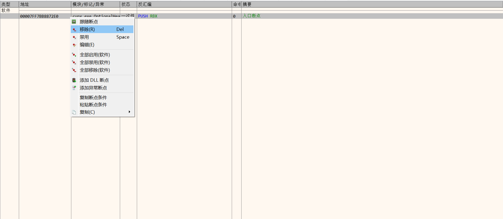

  在“内存映射”窗口给程序的.rsrc段下一次性内存访问断点，F9运行

  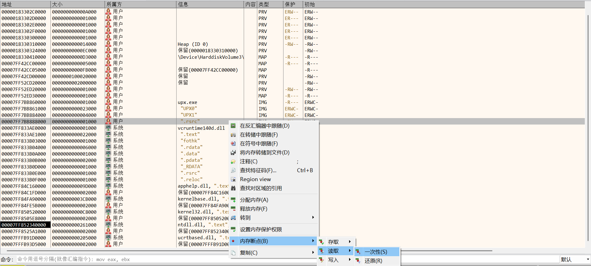

  然后在UPX0段或者UPX1段下一次性内存写入断点，F9运行

  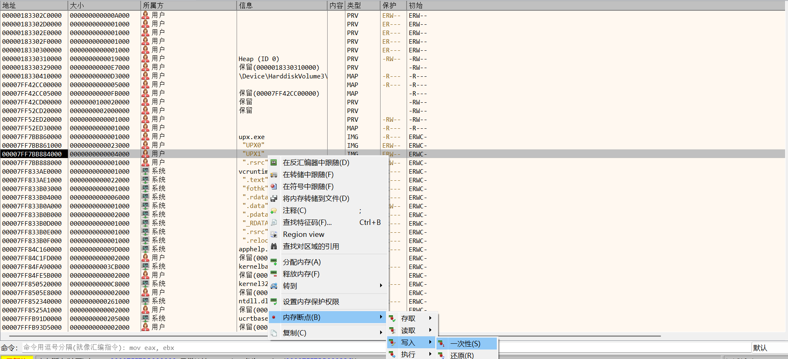

  回到“CPU”窗口，可以看到在RIP不远处有一个大跳（RIP在0x00007FF7BB887423处)

  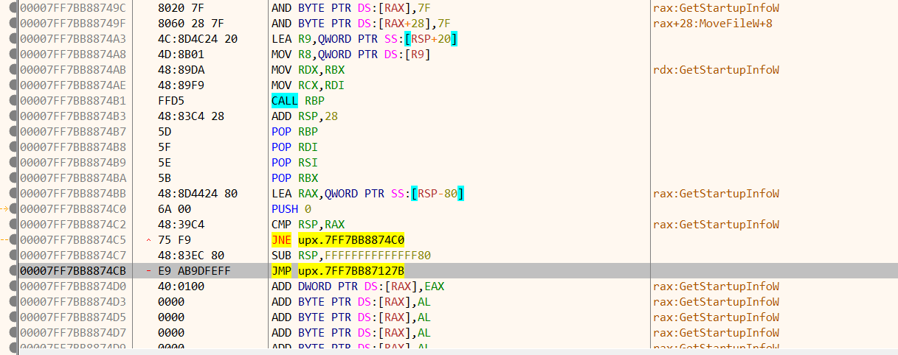

  跟进去，还有个跳转表，继续跟进，可以看到程序的OEP了

  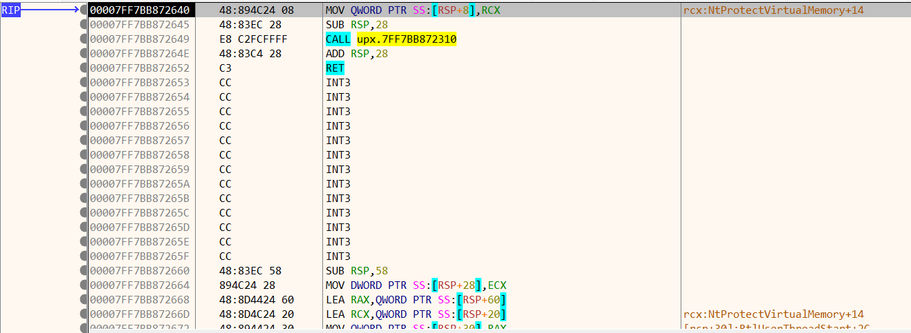

  然后在此处使用scylla dump出程序，并且修复IAT，得到upx_dump_SCY.exe，可以分析了

- 分析main函数，发现对每个输入的字符异或了0x21，而非末位字符还异或了原来的下一位。由于异或有交换律，所以解密逻辑可以是：先对每个处理完的字符异或0x21，然后再从倒数第二位开始和下一位异或，这样就恢复了复原出了flag（但是给的密文少了最后一位，即字符串的结束符。根据最后一位和倒数第二位的关系0x56=125 ^ 0x21 ^ 末位 得出：末位=10，末位^0x21=43，将密文补充完整）

  ```c
  //main函数
  __int64 sub_7FF6FC2718A0()
  {
    char *v0; // rdi
    __int64 i; // rcx
    FILE *Stream; // rax
    _BYTE v4[32]; // [rsp+0h] [rbp-20h] BYREF
    char v5; // [rsp+20h] [rbp+0h] BYREF
    _DWORD cipher[44]; // [rsp+30h] [rbp+10h]
    char flag[132]; // [rsp+E0h] [rbp+C0h] BYREF
    int length; // [rsp+164h] [rbp+144h]
    _BYTE v9[60]; // [rsp+188h] [rbp+168h]
    int j; // [rsp+1C4h] [rbp+1A4h]
    int Char; // [rsp+1E4h] [rbp+1C4h]
    int k; // [rsp+204h] [rbp+1E4h]
  
    v0 = &v5;
    for ( i = 130LL; i; --i )
    {
      *(_DWORD *)v0 = -858993460;
      v0 += 4;
    }
    sub_7FF6FC271375((__int64)&word_7FF6FC28200E);
    cipher[0] = 35;
    cipher[1] = 43;
    cipher[2] = 39;
    cipher[3] = 54;
    cipher[4] = 51;
    cipher[5] = 60;
    cipher[6] = 3;
    cipher[7] = 72;
    cipher[8] = 100;
    cipher[9] = 11;
    cipher[10] = 29;
    cipher[11] = 118;
    cipher[12] = 123;
    cipher[13] = 16;
    cipher[14] = 11;
    cipher[15] = 58;
    cipher[16] = 63;
    cipher[17] = 101;
    cipher[18] = 118;
    cipher[19] = 41;
    cipher[20] = 21;
    cipher[21] = 55;
    cipher[22] = 28;
    cipher[23] = 10;
    cipher[24] = 8;
    cipher[25] = 33;
    cipher[26] = 62;
    cipher[27] = 60;
    cipher[28] = 61;
    cipher[29] = 22;
    cipher[30] = 11;
    cipher[31] = 36;
    cipher[32] = 41;
    cipher[33] = 36;
    cipher[34] = 86;
    sub_7FF6FC27119F((__int64)aPleaseInputYou);   // "please input your flag: "
    Stream = _acrt_iob_func(0);
    fgets(flag, 100, Stream);
    length = j_strlen(flag);
    for ( j = 0; j < length; ++j )
    {
      Char = flag[j] ^ 0x21;
      if ( j < length - 1 )
        Char ^= flag[j + 1];
      v9[j] = Char;
    }
    for ( k = 0; k < 35; ++k )
    {
      if ( (char)v9[k] != cipher[k] )
      {
        sub_7FF6FC27119F((__int64)aYouWillNeverGe);// "you will never get the flag!!!!\n"
        break;
      }
    }
    sub_7FF6FC271311(v4, qword_7FF6FC27AD00);
    return 0LL;
  }
  ```

- 解密脚本：

  ```python
  enc=[
      0x23, 0x2b, 0x27, 0x36, 0x33, 0x3c, 0x03, 0x48,
      0x64, 0x0b, 0x1d, 0x76, 0x7b, 0x10, 0x0b, 0x3a,
      0x3f, 0x65, 0x76, 0x29, 0x15, 0x37, 0x1c, 0x0a,
      0x08, 0x21, 0x3e, 0x3c, 0x3d, 0x16, 0x0b, 0x24,
      0x29, 0x24, 0x56, 43			
  ]
  xored=[]
  for i in range(len(enc)):
      xored.append(enc[i]^0x21)
  #print(xored)
  for i in range(len(xored)-2,-1,-1):
      xored[i]=xored[i]^xored[i+1]
  flag=''.join(chr(i) for i in xored)
  print(flag)
  ```

### maze

- 附件程序main函数逻辑如下，wasd迷宫题，迷宫在函数maze_init中

  ```c
  int __fastcall main(int argc, const char **argv, const char **envp)
  {
    unsigned __int64 count; // rax
    int v4; // ebx
    __int64 index; // r9
    int v6; // r11d
    unsigned __int64 y; // r8
    __int64 x; // r10
    unsigned __int64 n0x37_1; // rdi
    char *Format; // rcx
    _BYTE flag[1008]; // [rsp+20h] [rbp-408h]
  
    maze_init();
    printf(asc_140004138);
    printf(&Format_);
    while ( 1 )
    {
  LABEL_2:
      while ( 1 )
      {
        printf(asc_140004190);
        scanf("%s");
        count = -1LL;
        do
          ++count;
        while ( flag[count] );
        if ( count <= 999 )
          break;
        printf(&Format__0);
      }
      v4 = 1;
      index = 0LL;
      v6 = 1;
      y = 1LL;// 起点y
      x = 1LL;// 起点x
      if ( (int)count > 0 )
        break;
  LABEL_19:
      Format = (char *)&byte_140004118;
  LABEL_20:
      printf(Format);
      printf(&Format__1);
    }
    n0x37_1 = 1LL;
    while ( 1 )
    {
      switch ( flag[index] )
      {
        case 'A':
        case 'a':
          --v4;
          --x;
          --n0x37_1;
          break;
        case 'D':
        case 'd':
          ++v4;
          ++x;
          ++n0x37_1;
          break;
        case 'S':
        case 's':
          ++v6;
          ++y;
          break;
        case 'W':
        case 'w':
          --v6;
          --y;
          break;
        default:
          printf(&Format__2);
          printf(&Format__1);
          goto LABEL_2;
      }
      if ( y > 0x37 || n0x37_1 > 0x37 )
      {
        Format = (char *)&unk_1400040D8;
        goto LABEL_20;
      }
      if ( byte_140005660[56 * y + x] == 49 )
      {
        Format = (char *)&unk_1400040F8;
        goto LABEL_20;
      }
      if ( y == 15 && x == 32 )
        break;
      if ( ++index >= (int)count )
        goto LABEL_19;
    }
    printf(asc_1400041E0);
    printf("moectf{%s}\n");
    return 0;
  }
  ```

  maze_init函数：

  ```c
  __int64 maze_init()
  {
    const char *all_1; // r9
    const char **v1; // rbx
    int n56_2; // r11d
    __int64 v3; // r10
    __int64 n56; // rax
    int v5; // r8d
    __int64 i; // rax
    char v7; // dl
    __int64 v8; // rcx
    _QWORD v9[56]; // [rsp+20h] [rbp-E0h] BYREF
  
    v9[1] = "10100000000000000010000011011101011111111101011100000111";
    all_1 = "11111111111111111111111111111111111111111111111111111111";
    v9[0] = "11111111111111111111111111111111111111111111111111111111";
    v9[2] = "10111010111111111010111011000001000001000001000101110111";
    v9[3] = "10000010000010000010001011011111111101110111011101110111";
    v9[4] = "10111111111011101110111011010000000000010100010001110111";
    v9[5] = "10100000001000101000100011010101111111011101110101110111";
    v9[6] = "10101011111110111011101011010101000001000000010101110111";
    v9[7] = "10101010000010100000101011110101110101111101111111110111";
    v9[8] = "10111010111010101111101011100101000100000101000101110111";
    v9[9] = "10000010001010001000001011001111011111010101011101110111";
    v9[10] = "11111011101011111011111111101000100000101100101001110111";
    v9[11] = "10001010001000100010000010001010011000100010010011000001";
    v9[12] = "10111010111110101010111011011001011111010101011101011101";
    v9[13] = "10001010001000001010001011000101000100000101000101011101";
    v9[14] = "11101011101111111011101011110101110111111101110101011101";
    v9[15] = "10001000101000001010001011000100010100000101000101011101";
    v9[16] = "10111111101011101110111011011111110101110111011101011101";
    v9[17] = "10001000001000100000001011000100000100010000000101011001";
    v9[18] = "11101011111011111111101011110101111101111111110101011011";
    v9[19] = "10101000000010001000101011010100000001000100010101011011";
    v9[20] = "10101111111110101010101011010111111111010101010101011011";
    v9[21] = "10100000000000100010101011010000000000010001010101011011";
    v9[22] = "10111111111111111110111011011111111111111111011101011011";
    v9[23] = "10000000001111000000000011110111010000111100011111011011";
    v9[24] = "11101111100000011011011111111010110111011101100001011011";
    v9[25] = "11101111111111111011011111111101110111101101100001011011";
    v9[26] = "10001000111111000010000011111010110111011101100001011011";
    v9[27] = "10111010111111111010111011110111010000111101100001010011";
    v9[28] = "10000010000010000010001011111111111111111101100001010111";
    v9[29] = "10111111111011101110111011110001000110001101100001010001";
    v9[30] = "10100000001000101000100011110111011101111101100001011101";
    v9[31] = "10101011111110111011101011110001000101111101100001011101";
    v9[32] = "10101010000010100000101011111101011101111101100001011101";
    v9[33] = "10111010111010101111101011110001000110001101100001011101";
    v9[34] = "10000010001010101000001011111111111111111101100001011101";
    v9[35] = "11111011101011111011111110000000000000001101100001011101";
    v9[36] = "10001010001000100010000011111111111111111100110011011101";
    v9[37] = "10111010111110101010111010010000000011111110001111011101";
    v9[38] = "10001010001000001010001010110111000001111110100101011101";
    v9[39] = "11101011101111111011101000110011001111111100110111011101";
    v9[40] = "10001000101000001010001011111111111111111111110111010001";
    v1 = (const char **)v9;
    v9[55] = "11111111111111111111111111111111111111111111111111111111";
    v9[41] = "10111111101011101110111010100001001100000000000011011011";
    n56_2 = 0;
    v9[42] = "10001000001000100000001011111111111101011101111001011011";
    v3 = 0LL;
    v9[43] = "10101011111011111111101011000000000001000100010111011011";
    v9[44] = "10101000000010001000101010010111111111111111111111011011";
    v9[45] = "10101111111110101010101010110111111111111111111101011011";
    v9[46] = "10100000000000100010101011100000000000000000000011011011";
    v9[47] = "10111111111111111110011011111111111111111111111011011011";
    v9[48] = "10000011111111111111000010000000000000000000000000011001";
    v9[49] = "11111011111111111111111111111111111111111111111111111101";
    v9[50] = "11111011100001100110110111000000000000000000000111111101";
    v9[51] = "11111011101111011010000111011111111111111111110111111101";
    v9[52] = "11111011100001000010110110000111111111111111110000000001";
    v9[53] = "11111011101111011010110111101111111111111111111111111111";
    v9[54] = "11110000000000011000110000000000000000000000000000000011";
    while ( 1 )
    {
      n56 = -1LL;
      do
        ++n56;
      while ( all_1[n56] );
      if ( n56 != 56 )
      {
        printf((char *)&Format__3);
        exit(1);
      }
      v5 = 0;
      for ( i = 0LL; i < 56; ++i )
      {
        v7 = all_1[i];
        if ( (unsigned __int8)(v7 - 48) > 1u )
        {
          printf((char *)&Format__4);
          exit(1);
        }
        v8 = v3 + i;
        ++v5;
        byte_140005660[v8] = v7;
      }
      ++n56_2;
      ++v1;
      v3 += 56LL;
      if ( n56_2 >= 56 )
        break;
      all_1 = *v1;
    }
    if ( n48 != 48 )
    {
      printf((char *)&Format);
      exit(1);
    }
    if ( n48_0 != 48 )
    {
      printf((char *)&Format__5);
      exit(1);
    }
    return i;
  }
  ```

- 使用神奇妙妙工具得到迷宫路径：

  ```py
  from mycode import maze
  Maze = [
      "11111111111111111111111111111111111111111111111111111111",
      "10100000000000000010000011011101011111111101011100000111",
      "10111010111111111010111011000001000001000001000101110111",
      "10000010000010000010001011011111111101110111011101110111",
      "10111111111011101110111011010000000000010100010001110111",
      "10100000001000101000100011010101111111011101110101110111",
      "10101011111110111011101011010101000001000000010101110111",
      "10101010000010100000101011110101110101111101111111110111",
      "10111010111010101111101011100101000100000101000101110111",
      "10000010001010001000001011001111011111010101011101110111",
      "11111011101011111011111111101000100000101100101001110111",
      "10001010001000100010000010001010011000100010010011000001",
      "10111010111110101010111011011001011111010101011101011101",
      "10001010001000001010001011000101000100000101000101011101",
      "11101011101111111011101011110101110111111101110101011101",
      "10001000101000001010001011000100010100000101000101011101",
      "10111111101011101110111011011111110101110111011101011101",
      "10001000001000100000001011000100000100010000000101011001",
      "11101011111011111111101011110101111101111111110101011011",
      "10101000000010001000101011010100000001000100010101011011",
      "10101111111110101010101011010111111111010101010101011011",
      "10100000000000100010101011010000000000010001010101011011",
      "10111111111111111110111011011111111111111111011101011011",
      "10000000001111000000000011110111010000111100011111011011",
      "11101111100000011011011111111010110111011101100001011011",
      "11101111111111111011011111111101110111101101100001011011",
      "10001000111111000010000011111010110111011101100001011011",
      "10111010111111111010111011110111010000111101100001010011",
      "10000010000010000010001011111111111111111101100001010111",
      "10111111111011101110111011110001000110001101100001010001",
      "10100000001000101000100011110111011101111101100001011101",
      "10101011111110111011101011110001000101111101100001011101",
      "10101010000010100000101011111101011101111101100001011101",
      "10111010111010101111101011110001000110001101100001011101",
      "10000010001010101000001011111111111111111101100001011101",
      "11111011101011111011111110000000000000001101100001011101",
      "10001010001000100010000011111111111111111100110011011101",
      "10111010111110101010111010010000000011111110001111011101",
      "10001010001000001010001010110111000001111110100101011101",
      "11101011101111111011101000110011001111111100110111011101",
      "10001000101000001010001011111111111111111111110111010001",
      "10111111101011101110111010100001001100000000000011011011",
      "10001000001000100000001011111111111101011101111001011011",
      "10101011111011111111101011000000000001000100010111011011",
      "10101000000010001000101010010111111111111111111111011011",
      "10101111111110101010101010110111111111111111111101011011",
      "10100000000000100010101011100000000000000000000011011011",
      "10111111111111111110011011111111111111111111111011011011",
      "10000011111111111111000010000000000000000000000000011001",
      "11111011111111111111111111111111111111111111111111111101",
      "11111011100001100110110111000000000000000000000111111101",
      "11111011101111011010000111011111111111111111110111111101",
      "11111011100001000010110110000111111111111111110000000001",
      "11111011101111011010110111101111111111111111111111111111",
      "11110000000000011000110000000000000000000000000000000011",
      "11111111111111111111111111111111111111111111111111111111"
  ]
  start=(1,1)
  end=(15,32)
  path=maze.solve(Maze,start,end)
  print(path)
  
  
  #mycode.maze:
  from collections import deque
  
  def solve(maze, start, end, directions=None, wall='1', free='0'):
      """
      参数:
          maze: 二维字符串列表
          start: 起点坐标 (row, col)
          end: 终点坐标 (row, col)
          directions: 自定义方向指令 (默认WASD)
          wall: 墙字符 (默认'1')
          free: 通路字符 (默认'0')
      
      返回:
          移动指令字符串 或 None(无解)
      """
      if directions is None:
          directions = {
              'W': (-1, 0),  # 上
              'A': (0, -1),   # 左
              'S': (1, 0),    # 下
              'D': (0, 1)     # 右
          }
      
      rows, cols = len(maze), len(maze[0])
      
      # 坐标验证
      def is_valid(pos):
          r, c = pos
          return (0 <= r < rows and 0 <= c < cols and maze[r][c] == free)
      
      if not is_valid(start):
          raise ValueError(f"无效起点 {start}")
      if not is_valid(end):
          raise ValueError(f"无效终点 {end}")
  
      # BFS核心（修复了变量名冲突）
      queue = deque([(start[0], start[1], "")])
      visited = set([(start[0], start[1])])
      
      while queue:
          row, col, current_path = queue.popleft()  # 改名为 current_path
          
          if (row, col) == end:
              return current_path
          
          for move, (dr, dc) in directions.items():
              new_row, new_col = row + dr, col + dc
              
              if (0 <= new_row < rows and 0 <= new_col < cols and 
                  maze[new_row][new_col] == free and  # 使用通路字符 free
                  (new_row, new_col) not in visited):
                  
                  visited.add((new_row, new_col))
                  queue.append((new_row, new_col, current_path + move))  # 使用 current_path
      
      return None  # 无解
  ```

### flower

- 附件程序用IDA打开，在汇编界面上下滑动可以找到花指令引起的红色栈帧报错。打开IDA工具栏的“Options”选项的“General”，勾选“Stackpointer”，可以看到栈帧信息

  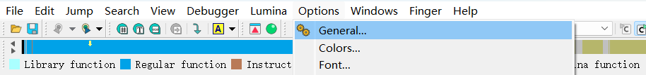

  

  可以看到红色报错的函数栈帧超过了1000，有点反常，找到栈帧发生突变的地方，发现用sub rsp,1000h改变了栈帧，把这条指令nop掉。本题这个类型的花指令占绝大多数，需要耐心的一个一个nop掉。（还有sub rsp,400h的，主要留意栈帧大于100）

  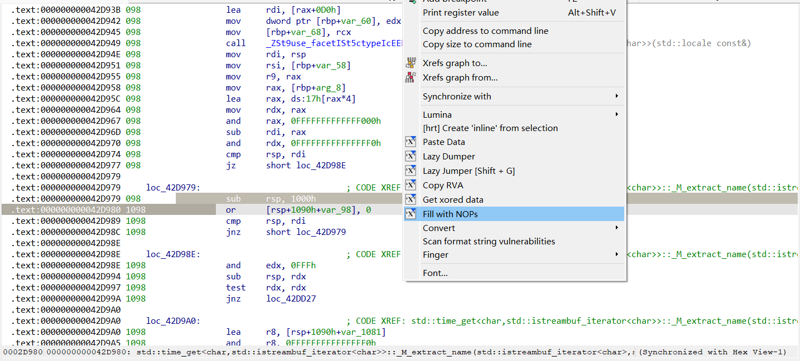

  还有另一种花指令：

  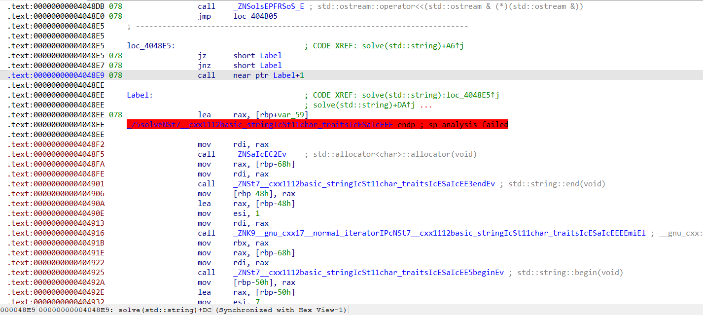

  图中Label+1是0x004048EF，被0x004048EE处的指令覆盖住了，所以undefine一下，IDA就会自动纠错。把没用的指令nop掉

  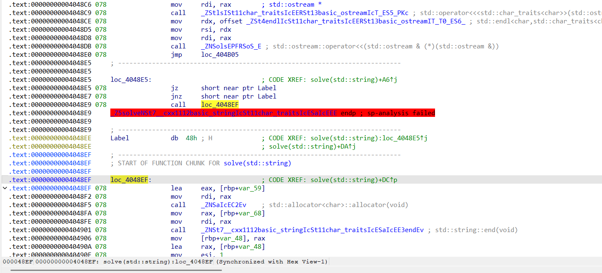

  接下来要做的修改有2点。首先可以看到0x004048E5处有一个恒跳花指令，这个要nop掉。

  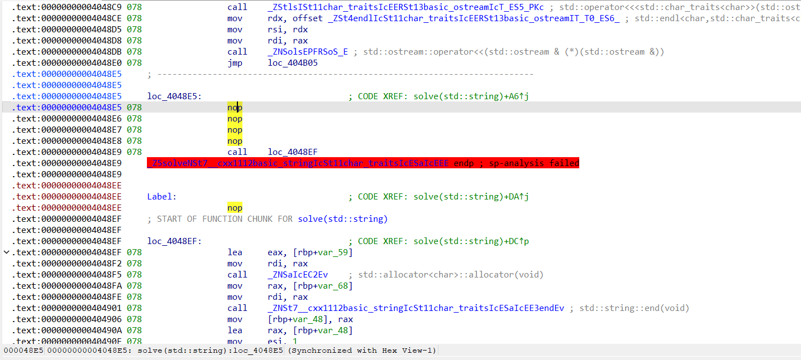

  然后是call loc_4048EF，由于call是会占用栈帧的，更何况call一个标签没有ret恢复栈帧，后面栈帧还是会报错（这里有一个试错过程，不把call改成jmp的话，函数undefine+code+create function后依旧反编译不了）。做法就是工具栏edit->patch program->change byte，把十六进制码E8改成E9

  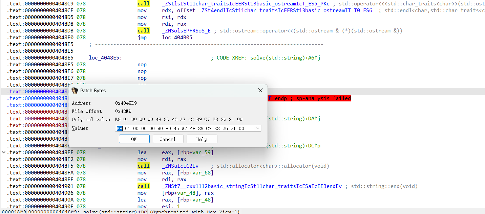

  然后就是选中函数名undefine+code+create function了，就可以正常反编译了

- main函数逻辑主要是把flag掐头去尾，中间部分加密后比对

  ```c
  unsigned __int64 __fastcall solve(_QWORD *flag)
  {
    char v1; // bl
    bool v2; // r12
    __int64 v3; // rax
    __int64 v4; // rbx
    __int64 v5; // rax
    char *flag[i]; // rax
    __int64 v7; // rax
    char v9; // [rsp+17h] [rbp-59h] BYREF
    int i; // [rsp+18h] [rbp-58h]
    int len; // [rsp+1Ch] [rbp-54h]
    __int64 flag_start; // [rsp+20h] [rbp-50h] BYREF
    __int64 flag_end; // [rsp+28h] [rbp-48h] BYREF
    void *fl4g[5]; // [rsp+30h] [rbp-40h] BYREF
    unsigned __int64 v15; // [rsp+58h] [rbp-18h]
    __int64 savedregs; // [rsp+70h] [rbp+0h] BYREF
  
    v15 = __readfsqword(0x28u);
    v1 = 0;
    v2 = 1;
    if ( (unsigned __int64)length((__int64)flag) > 7 )
    {
      substr(fl4g, flag, 0LL, 7uLL);
      v1 = 1;
      if ( !(unsigned __int8)cmp((__int64)fl4g, (__int64)"moectf{") && *(_BYTE *)get_last_str(flag) == 125 )
        v2 = 0;
    }
    if ( v1 )
      std::string::~string(fl4g);
    if ( v2 )
    {
      v3 = cout((std::ostream *)&std::cout);
      out(v3, (__int64 (*)(void))std::endl<char,std::char_traits<char>>);
    }
    else
    {
      std::allocator<char>::allocator((unsigned int)&savedregs - 89);
      flag_end = getEnd(flag);
      v4 = cutTail(&flag_end, 1LL);
      flag_start = getStart((__int64)flag);
      v5 = cutHead(&flag_start, 7LL);
      std::string::basic_string<__gnu_cxx::__normal_iterator<char *,std::string>,void>(fl4g, v5, v4, (__int64)&v9);// 掐头去尾
      std::string::operator=(flag, fl4g);
      std::string::~string(fl4g);
      std::allocator<char>::~allocator();
      len = length((__int64)flag);
      if ( len == 32 )
      {
        for ( i = 0; i < len; ++i )
        {
          flag[i] = (char *)toList(flag, i);      // flag[i]
          if ( (unsigned int)encode(*flag[i]) != enc[i] )
            break;
        }
      }
      v7 = cout((std::ostream *)&std::cout);
      out(v7, (__int64 (*)(void))std::endl<char,std::char_traits<char>>);
    }
    return v15 - __readfsqword(0x28u);
  }
  ```

  加密函数encode如下，就是把flag[i]和key异或，key会递增。需要注意的是，静态分析下得到的key是不正确的（静态分析得到的key是0x23，但是动态调试会发现程序运行到此处key变成0x29），动调得到的key才能解密出flag

  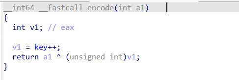

- 解密脚本：

  ```python
  data = [
      0x4F, 0x1A, 0x59, 0x1F, 0x5B, 0x1D, 0x5D, 0x6F, 0x7B, 0x47, 0x7E,
      0x44, 0x6A, 0x07, 0x59, 0x67, 0x0E, 0x52, 0x08, 0x63, 0x5C, 0x1A, 0x52,
      0x1F, 0x20, 0x7B, 0x21, 0x77, 0x70, 0x25, 0x74, 0x2B
  ]
  key=0x29
  result=[]
  for i in range(len(data)):
      plaintext=(data[i]^key)&0xff
      key+=1
      result.append(plaintext)
  flag=''.join(chr(x) for x in result)
  print(flag)
  ```

### tea

- IDA打开附件程序，main函数逻辑是将输入的flag分成10份，每次取两份进行加密，加密出来的数据和enc比较。key和enc已经给定

  ```c
  //main函数
  int __fastcall main(int argc, const char **argv, const char **envp)
  {
    char *v3; // rdi
    __int64 i; // rcx
    _BYTE v6[32]; // [rsp+0h] [rbp-20h] BYREF
    char v7; // [rsp+20h] [rbp+0h] BYREF
    _DWORD key[12]; // [rsp+28h] [rbp+8h] BYREF
    _DWORD enc[20]; // [rsp+58h] [rbp+38h]
    _DWORD fl4g[20]; // [rsp+A8h] [rbp+88h] BYREF
    _DWORD Flag[20]; // [rsp+F8h] [rbp+D8h] BYREF
    char flag[64]; // [rsp+148h] [rbp+128h] BYREF
    size_t length; // [rsp+188h] [rbp+168h]
    int j; // [rsp+1A4h] [rbp+184h]
    unsigned int part1; // [rsp+1C8h] [rbp+1A8h] BYREF
    int part2; // [rsp+1CCh] [rbp+1ACh]
    int v17; // [rsp+1E4h] [rbp+1C4h]
    int k; // [rsp+204h] [rbp+1E4h]
  
    v3 = &v7;
    for ( i = 130LL; i; --i )
    {
      *(_DWORD *)v3 = -858993460;
      v3 += 4;
    }
    sub_7FF6DAA21384(byte_7FF6DAA33015);
    key[0] = 289739801;
    key[1] = 427884820;
    key[2] = 1363251608;
    key[3] = 269567252;
    enc[0] = 2026214571;
    enc[1] = 578894681;
    enc[2] = 1193947460;
    enc[3] = -229306230;
    enc[4] = 73202484;
    enc[5] = 961145356;
    enc[6] = -881456792;
    enc[7] = 358205817;
    enc[8] = -554069347;
    enc[9] = 119347883;
    enc[10] = 0;
    memset(fl4g, 0, 44uLL);
    memset(Flag, 0, 44uLL);
    printf(&You_are_wrong___);
    scanf("%s", flag);
    length = j_strlen(flag);
    j_memcpy(fl4g, flag, length);
    for ( j = 0; j < 5; ++j )
    {
      part1 = fl4g[2 * j];
      part2 = fl4g[2 * j + 1];
      tea(&part1, key);// 这里传的是地址，tea内可以通过part1的地址得到part2
      Flag[2 * j] = part1;
      Flag[2 * j + 1] = part2;
    }
    v17 = 1;
    for ( k = 0; k < 11; ++k )
    {
      if ( Flag[k] != enc[k] )
      {
        v17 = 0;
        printf("You are wrong!!");
        break;
      }
    }
    if ( v17 == 1 )
      printf("Congratulations!!!!");
    sub_7FF6DAA21320(v6, &unk_7FF6DAA2AE60);
    return 0;
  }
  ```

- 加密函数是改动的tea加密

  ```c
  __int64 __fastcall Tea(unsigned int *part1, _DWORD *key)
  {
    __int64 n4; // rax
    int delta; // [rsp+24h] [rbp+4h]
    unsigned int p1; // [rsp+44h] [rbp+24h]
    unsigned int p2; // [rsp+64h] [rbp+44h]
    int i; // [rsp+A4h] [rbp+84h]
  
    sub_7FF6DAA21384((__int64)&byte_7FF6DAA33015);
    delta = 0;
    p1 = *part1;
    p2 = part1[1];
    for ( i = 0; i < 32; ++i )
    {
      delta += 1131796;
      p1 += (key[1] + (p2 >> 5)) ^ (delta + p2) ^ (*key + 16 * p2);
      p2 += (key[3] + (p1 >> 5)) ^ (delta + p1) ^ (key[2] + 16 * p1);
    }
    *part1 = p1;
    n4 = 4LL;
    part1[1] = p2;
    return n4;
  }
  ```

- 解密逻辑：将tea内的p1 p2位置对调，"+"改成"-"，然后delta从最后一轮的值往回递减就可以了。解密脚本：

  ```c
  #include<stdio.h>
  #include<stdint.h>
  void tea_decrypt(uint32_t *a,uint32_t *k) {
  	uint32_t delta = 1131796 * 32;
  	uint32_t p1 = *a;
  	uint32_t p2 = *(a + 1);
  	for (int i = 0; i < 32; i++) {
  		p2 -= ((k[3] + (p1 >> 5)) ^ (delta + p1) ^ (k[2] + 16 * p1));
  		p1 -= ((k[1] + (p2 >> 5)) ^ (delta + p2) ^ (*k + 16 * p2));
  		delta -= 1131796;
  	}
  	*a = p1;
  	*(a+1)= p2;
  }
  int main() {
  	uint32_t key[4];
  	uint32_t enc[11];
  	key[0] = 289739801;
  	key[1] = 427884820;
  	key[2] = 1363251608;
  	key[3] = 269567252;
  	enc[0] = 2026214571;
  	enc[1] = 578894681;
  	enc[2] = 1193947460;
  	enc[3] = -229306230;
  	enc[4] = 73202484;
  	enc[5] = 961145356;
  	enc[6] = -881456792;
  	enc[7] = 358205817;
  	enc[8] = -554069347;
  	enc[9] = 119347883;
  	enc[10] = 0;
  	char flag[45] = { 0 };
  	for (int i = 0; i < 5; i++) {
  		uint32_t block[2] = {enc[2*i],enc[2*i+1]};
  		tea_decrypt(block, key);
  		for (int j = 0; j < 4; j++) {
  			flag[8 * i + j] = (block[0] >> (j * 8)) & 0xff;//右移j个字符，然后取最后一个
  			flag[8 * i + j + 4] = (block[1] >> (j * 8)) & 0xff;
  		}
  	}
  	printf("%s", flag);
  	return 0;
  }
  ```

### ez3

- 附件程序main函数逻辑主要是获取flag，然后掐头去尾，对中间部分进行check。main函数：

  ```c
  int __fastcall main(int argc, const char **argv, const char **envp)
  {
    char v3; // bl
    bool v4; // r12
    __int64 v5; // rbx
    __int64 v6; // rax
    char v8; // [rsp+Fh] [rbp-71h] BYREF
    __int64 Start; // [rsp+10h] [rbp-70h] BYREF
    __int64 end; // [rsp+18h] [rbp-68h] BYREF
    _BYTE flag[32]; // [rsp+20h] [rbp-60h] BYREF
    _QWORD fl4g[8]; // [rsp+40h] [rbp-40h] BYREF
  
    fl4g[5] = __readfsqword(0x28u);
    printf("Input your flag:\n> ", argv, envp);
    fflush(stdout);
    std::string::basic_string(flag);
    cin(&std::cin);
    if ( length(flag) == 42 )
    {
      v3 = 0;
      v4 = 1;
      if ( length(flag) > 7 )
      {
        substr(fl4g, flag, 0LL, 7LL);
        v3 = 1;
        if ( !cmp(fl4g, "moectf{") && *get_last_str(flag) == 125 )
          v4 = 0;
      }
      if ( v3 )
        std::string::~string(fl4g);
      if ( v4 )
      {
        puts("FORMAT ERROR!");
      }
      else
      {
        std::allocator<char>::allocator(&v8);
        end = getEnd(flag);
        v5 = cutTail(&end, 1LL);
        Start = getStart(flag);
        v6 = cutHead(&Start, 7LL);
        std::string::basic_string<__gnu_cxx::__normal_iterator<char *,std::string>,void>(fl4g, v6, v5, &v8);
        strcopy(flag, fl4g);
        std::string::~string(fl4g);
        std::allocator<char>::~allocator(&v8);
        std::string::basic_string(fl4g, flag);
        LOBYTE(v5) = check(fl4g);
        std::string::~string(fl4g);
        if ( v5 )
        {
          puts("OK");
          puts("But I don't know what the true flag is");
        }
        else
        {
          puts("try again~");
        }
      }
    }
    else
    {
      puts("Length error!");
    }
    std::string::~string(flag);
    return 0;
  }
  ```

  check函数：

  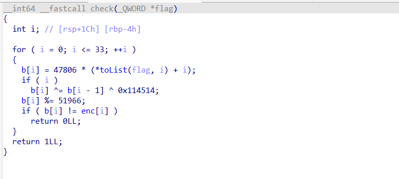

  题目提示了z3，所以使用z3约束求解。思路就是复现check函数逻辑，爆破出flag

- 脚本：

  ```python
  from z3 import *
  
  enc = [
      0x0B1B0, 0x5678, 0x7FF2, 0xA332, 0xA0E8, 0x364C, 0x2BD4,
      0xC8FE, 0x4A7C, 0x18, 0x2BE4, 0x4144, 0x3BA6, 0xBE8C, 0x8F7E,
      0x35F8, 0x61AA, 0x2B4A, 0x6828, 0xB39E, 0xB542, 0x33EC, 0xC7D8,
      0x448C, 0x9310, 0x8808, 0xADD4, 0x3CC2, 0x796, 0xC940, 0x4E32,
      0x4E2E, 0x924A, 0x5B5C
  ]
  
  s=Solver()
  flag=[BitVec(f'flag_{i}',32)for i in range(34)]
  b=[BitVec(f'b_{i}',32)for i in range(34)]
  
  for i in range(34):
      s.add(flag[i]>=32,flag[i]<=126)
  for i in range(34):
      if i==0:
          s.add(b[0]==(47806*flag[0])%51966)
      else:
          b_value=47806*(flag[i]+i)
          b_xored=b_value^(b[i-1]^0x114514)
          s.add(b[i]==b_xored%51966)
      s.add(b[i]==enc[i])
  print("solutions found:")
  while s.check()==sat:
      model=s.model()
      solution=''.join([chr(model[flag[i]].as_long())for i in range(34)])
      print(solution)
      exception=Or([flag[i]!=model[flag[i]]for i in range(34)])#避免重复情况
      s.add(exception)
  ```

### 逆向工程入门指北

- IDA打开附件程序，在字符串窗口可以直接看到flag

  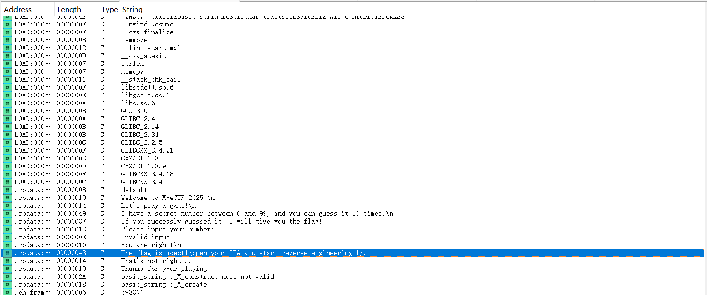

## week2

### base

- 运行附件程序，直接让输入flag。IDA打开分析main函数，发现使用了标准base64加密，并且密文直接给了。cyberchef一把梭

  ```c
  //main函数
  int __fastcall main(int argc, const char **argv, const char **envp)
  {
    FILE *Stream; // rax
    __int64 v4; // rdx
    __int64 length; // rax
    unsigned __int64 n; // rax
    char *Str1; // rbx
    int v8; // eax
    char *Format; // rcx
    char v11[16]; // [rsp+20h] [rbp-98h] BYREF
    char flag[112]; // [rsp+30h] [rbp-88h] BYREF
  
    printf(::Format);
    printf((char *)&Format_);
    Stream = _acrt_iob_func(0);
    fgets(flag, 100, Stream);
    v4 = -1LL;
    length = -1LL;
    do
      ++length;
    while ( flag[length] );
    if ( length && v11[length + 15] == 10 )
    {
      n = length - 1;
      if ( n >= 0x64 )
        _report_securityfailure_(flag);
      flag[n] = 0;
    }
    do
      ++v4;
    while ( flag[v4] );
    Str1 = (char *)baseEncode(flag, v4, v11);// 标准base64加密
    v8 = strcmp(Str1, "bW9lY3Rme1kwdV9DNG5fRzAwZF9BdF9CNDVlNjQhIX0=");
    Format = (char *)&unk_140003300;
    if ( v8 )
      Format = (char *)&byte_140003318;
    printf(Format);
    free(Str1);
    return 0;
  }
  ```

  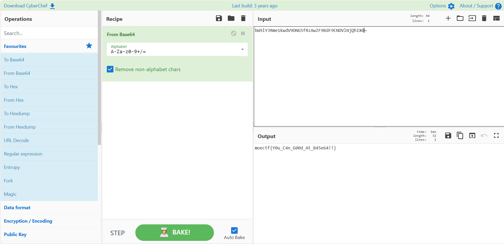

### speed

- 附件程序运行出现一道黑影，看不清。IDA分析main函数，发现使用了WNDCLASSA结构体（详细信息见：[WNDCLASSA （winuser.h） - Win32 apps | Microsoft Learn](https://learn.microsoft.com/zh-cn/windows/win32/api/winuser/ns-winuser-wndclassa)），主要逻辑是创建窗口，关键部分是窗口结构体变量lpfnWndProc，它指向了窗口的逻辑（即代码中的WndProc函数）

  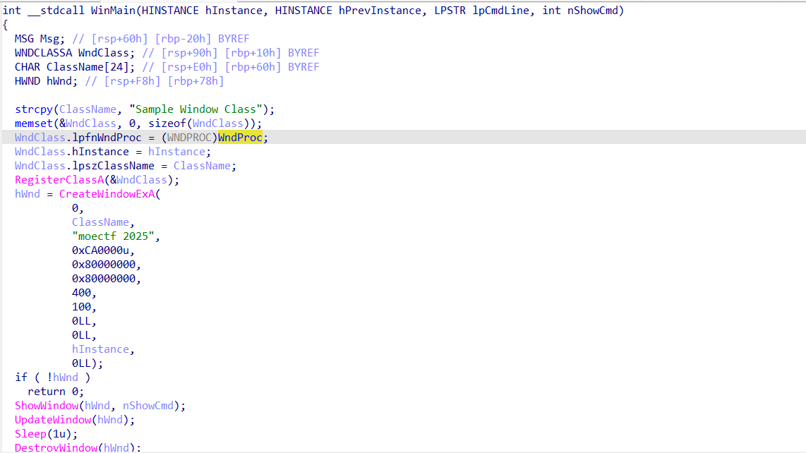

- 分析WndProc函数发现，窗口似乎直接输出flag。于是下断点，动态调试

  ```c
  //WndProc函数
  LRESULT __fastcall WndProc(HWND hWnd, UINT Msg, WPARAM wParam, LPARAM lParam)
  {
    tagPAINTSTRUCT Paint; // [rsp+30h] [rbp-50h] BYREF
    char Destination[14]; // [rsp+80h] [rbp+0h] BYREF
    __int16 v7; // [rsp+8Eh] [rbp+Eh]
    __int64 v8; // [rsp+90h] [rbp+10h]
    __int64 v9; // [rsp+98h] [rbp+18h]
    __int64 v10; // [rsp+A0h] [rbp+20h]
    __int64 v11; // [rsp+A8h] [rbp+28h]
    __int64 v12; // [rsp+B0h] [rbp+30h]
    __int64 v13; // [rsp+B8h] [rbp+38h]
    __int64 v14; // [rsp+C0h] [rbp+40h]
    __int64 v15; // [rsp+C8h] [rbp+48h]
    __int64 v16; // [rsp+D0h] [rbp+50h]
    __int64 v17; // [rsp+D8h] [rbp+58h]
    __int64 v18; // [rsp+E0h] [rbp+60h]
    __int64 v19; // [rsp+E8h] [rbp+68h]
    __int64 v20; // [rsp+F0h] [rbp+70h]
    __int64 v21; // [rsp+F8h] [rbp+78h]
    struct tagRECT Rect; // [rsp+100h] [rbp+80h] BYREF
    char mylittlepony[13]; // [rsp+113h] [rbp+93h] BYREF
    char Source[8]; // [rsp+120h] [rbp+A0h] BYREF
    __int64 v25; // [rsp+128h] [rbp+A8h]
    _QWORD v26[2]; // [rsp+130h] [rbp+B0h]
    int i; // [rsp+140h] [rbp+C0h]
    int n12; // [rsp+144h] [rbp+C4h]
    HDC hdc; // [rsp+148h] [rbp+C8h]
  
    if ( Msg == 2 )
    {
      PostQuitMessage(0);
      return 0LL;
    }
    else if ( Msg == 15 )
    {
      hdc = BeginPaint(hWnd, &Paint);
      strcpy(Destination, "Your flag is ");
      v7 = 0;
      v8 = 0LL;
      v9 = 0LL;
      v10 = 0LL;
      v11 = 0LL;
      v12 = 0LL;
      v13 = 0LL;
      v14 = 0LL;
      v15 = 0LL;
      v16 = 0LL;
      v17 = 0LL;
      v18 = 0LL;
      v19 = 0LL;
      v20 = 0LL;
      v21 = 0LL;
      *(_QWORD *)Source = 0x7F1B3E885EF9160LL;
      v25 = 0x2CD336BCB0464A89LL;
      v26[0] = 0xEF5FC91642917EE1uLL;
      *(_QWORD *)((char *)v26 + 6) = 0x739D40A4E356EF5FLL;
      strcpy(mylittlepony, "mylittlepony");
      n12 = 12;
      i = strlen(Source);
      RC4Crypt((unsigned __int8 *)Source, i, (const unsigned __int8 *)mylittlepony, 12);
      strcat(Destination, Source);
      GetClientRect(hWnd, &Rect);
      DrawTextA(hdc, Destination, -1, &Rect, 0x40005u);
      EndPaint(hWnd, &Paint);
      return 0LL;
    }
    else
    {
      return DefWindowProcA(hWnd, Msg, wParam, lParam);
    }
  }
  ```

  动态调试结果如图：

  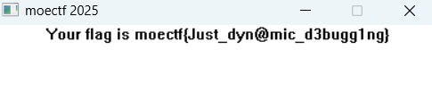

### ezpy

- 使用decompyle3反编译得到：

  ```python
  def caesar_cipher_encrypt(text, shift):
      result = []
      for char in text:
          if char.isalpha():
              if char.islower():
                  new_char = chr((ord(char) - ord("a") + shift) % 26 + ord("a"))
              elif char.isupper():
                  new_char = chr((ord(char) - ord("A") + shift) % 26 + ord("A"))
              result.append(new_char)
          else:
              result.append(char)
  
      return "".join(result)
  
  
  user_input = input("please input your flag：")
  a = 1
  if a != 1:
      plaintext = user_input
      shift = 114514
      encrypted_text = caesar_cipher_encrypt(plaintext, shift)
      if encrypted_text == "wyomdp{I0e_Ux0G_zim}":
          print("Correct!!!!")
  ```

- 可以看出实现了一个凯撒加密，分析逻辑可以看出实际上是给每个字母移位了10（ascii码+10），所以给字母减10就ok了，可以基于源码进行微小改动得到解密脚本：

  ```python
  def caesar_cipher_decrypt(text, shift):
      result = []
      for char in text:
          if char.isalpha():
              if char.islower():
                  new_char = chr((ord(char) - ord("a") - shift) % 26 + ord("a"))#'+'改为-"
              elif char.isupper():
                  new_char = chr((ord(char) - ord("A") - shift) % 26 + ord("A"))
              result.append(new_char)
          else:
              result.append(char)
  
      return "".join(result)
  enc="wyomdp{I0e_Ux0G_zim}"
  flag=caesar_cipher_decrypt(enc,114514)
  print(flag)
  ```


### catch

- 先看main函数反编译结果，发现只有简单的两个函数，其中solve函数有更复杂的逻辑：

  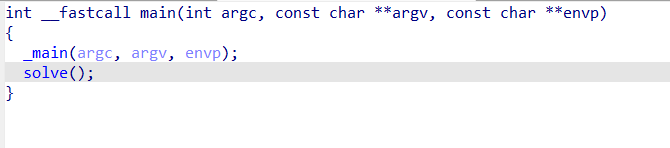

- 然而solve函数并不能看出什么有用的逻辑出来，sub_114514出现了flag字样，但是动调发现没有用处

  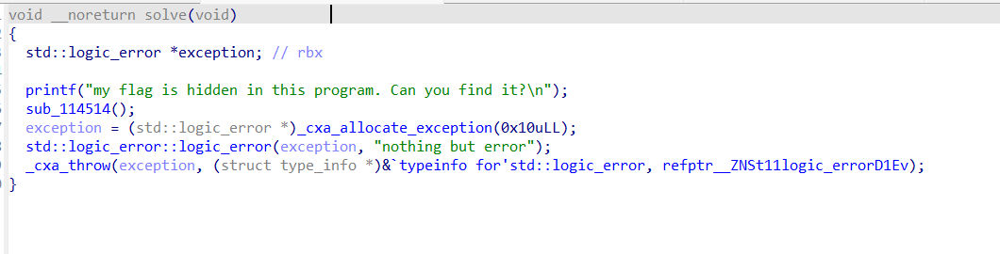

- 结合题目提示try catch不能被正确反编译，于是直接查看汇编代码。在汇编代码里看到一个类似flag格式的字符串，分析后续逻辑发现对这个字符串进行了处理，分析发现处理结果就是flag

  ```x86asm
  .text:00000001400014D6 ; =============== S U B R O U T I N E =======================================
  .text:00000001400014D6
  .text:00000001400014D6 ; Attributes: bp-based frame fpd=10h
  .text:00000001400014D6
  .text:00000001400014D6 ; void __noreturn solve(void)
  .text:00000001400014D6                 public _Z5solvev
  .text:00000001400014D6 _Z5solvev       proc near               ; CODE XREF: main+D↓p
  .text:00000001400014D6                                         ; DATA XREF: .pdata:000000014002D078↓o ...
  .text:00000001400014D6
  .text:00000001400014D6 length          = dword ptr -1Ch
  .text:00000001400014D6 C               = dword ptr -18h
  .text:00000001400014D6 count           = dword ptr -14h
  .text:00000001400014D6
  .text:00000001400014D6 ; __unwind { // __gxx_personality_seh0
  .text:00000001400014D6                 push    rbp
  .text:00000001400014D7                 push    rsi
  .text:00000001400014D8                 push    rbx
  .text:00000001400014D9                 sub     rsp, 30h
  .text:00000001400014DD                 lea     rbp, [rsp+30h]
  .text:00000001400014E2                 lea     rax, aMyFlagIsHidden ; "my flag is hidden in this program. Can "...
  .text:00000001400014E9                 mov     rcx, rax        ; char *
  .text:00000001400014EC                 call    print
  .text:00000001400014F1 ;   try {
  .text:00000001400014F1                 call    _Z10sub_114514v ; sub_114514(void)
  .text:00000001400014F1 ;   } // starts at 1400014F1
  .text:00000001400014F6                 mov     ecx, 10h        ; thrown_size
  .text:00000001400014FB                 call    __cxa_allocate_exception
  .text:0000000140001500                 mov     rbx, rax
  .text:0000000140001503                 lea     rax, aNothingButErro ; "nothing but error"
  .text:000000014000150A                 mov     rdx, rax        ; char *
  .text:000000014000150D                 mov     rcx, rbx        ; this
  .text:0000000140001510 ;   try {
  .text:0000000140001510                 call    _ZNSt11logic_errorC1EPKc ; std::logic_error::logic_error(char const*)
  .text:0000000140001510 ;   } // starts at 140001510
  .text:0000000140001515                 mov     r8, cs:_refptr__ZNSt11logic_errorD1Ev ; void (*)(void *)
  .text:000000014000151C                 lea     rax, _ZTISt11logic_error ; `typeinfo for'std::logic_error
  .text:0000000140001523                 mov     rdx, rax        ; lptinfo
  .text:0000000140001526                 mov     rcx, rbx        ; void *
  .text:0000000140001529 ;   try {
  .text:0000000140001529                 call    __cxa_throw
  .text:0000000140001529 ;   } // starts at 140001529
  .text:000000014000152E ; ---------------------------------------------------------------------------
  .text:000000014000152E ;   cleanup() // owned by 140001510
  .text:000000014000152E                 mov     rsi, rax
  .text:0000000140001531                 mov     rcx, rbx        ; void *
  .text:0000000140001534                 call    __cxa_free_exception
  .text:0000000140001539                 mov     rax, rsi
  .text:000000014000153C                 jmp     short $+2
  .text:000000014000153E ; ---------------------------------------------------------------------------
  .text:000000014000153E
  .text:000000014000153E loc_14000153E:                          ; CODE XREF: solve(void)+66↑j
  .text:000000014000153E ;   catch(...) // owned by 1400014F1    ; void *
  .text:000000014000153E ;   catch(...) // owned by 140001529
  .text:000000014000153E                 mov     rcx, rax
  .text:0000000140001541                 call    __cxa_begin_catch
  .text:0000000140001546                 lea     rax, enc        ; "zbrpgs{F4z3_Ge1px_jvgu_@sybjre_qrfhjn}"
  .text:000000014000154D                 mov     rcx, rax        ; Str
  .text:0000000140001550                 call    strlen
  .text:0000000140001555                 mov     [rbp+10h+length], eax
  .text:0000000140001558                 mov     [rbp+10h+count], 0
  .text:000000014000155F                 jmp     loc_14000160E
  .text:0000000140001564 ; ---------------------------------------------------------------------------
  .text:0000000140001564
  .text:0000000140001564 loc_140001564:                          ; CODE XREF: solve(void)+13E↓j
  .text:0000000140001564                 mov     eax, [rbp+10h+count]
  .text:0000000140001567                 cdqe
  .text:0000000140001569                 lea     rdx, enc        ; "zbrpgs{F4z3_Ge1px_jvgu_@sybjre_qrfhjn}"
  .text:0000000140001570                 movzx   eax, byte ptr [rax+rdx]
  .text:0000000140001574                 movzx   eax, al
  .text:0000000140001577                 mov     [rbp+10h+C], eax
  .text:000000014000157A                 mov     eax, [rbp+10h+C]
  .text:000000014000157D                 mov     ecx, eax        ; C
  .text:000000014000157F                 mov     rax, cs:__imp_islower
  .text:0000000140001586                 call    rax ; __imp_islower ; 判断字母大小写
  .text:0000000140001588                 test    eax, eax
  .text:000000014000158A                 jz      short loc_1400015B9 ; 大写字母跳转
  .text:000000014000158C                 mov     eax, [rbp+10h+C] ; enc[count]
  .text:000000014000158F                 lea     edx, [rax-54h]  ; enc[count]-0x54
  .text:0000000140001592                 movsxd  rax, edx
  .text:0000000140001595                 imul    rax, 4EC4EC4Fh  ; 从这里开始
  .text:000000014000159C                 shr     rax, 20h
  .text:00000001400015A0                 sar     eax, 3
  .text:00000001400015A3                 mov     ecx, edx
  .text:00000001400015A5                 sar     ecx, 1Fh
  .text:00000001400015A8                 sub     eax, ecx
  .text:00000001400015AA                 imul    ecx, eax, 1Ah
  .text:00000001400015AD                 mov     eax, edx
  .text:00000001400015AF                 sub     eax, ecx        ; 到这里结束，实现的是除以26
  .text:00000001400015B1                 add     eax, 61h ; 'a'  ; 加上0x61
  .text:00000001400015B4                 mov     [rbp+10h+C], eax
  .text:00000001400015B7                 jmp     short loc_1400015F6
  .text:00000001400015B9 ; ---------------------------------------------------------------------------
  .text:00000001400015B9
  .text:00000001400015B9 loc_1400015B9:                          ; CODE XREF: solve(void)+B4↑j
  .text:00000001400015B9                 mov     eax, [rbp+10h+C]
  .text:00000001400015BC                 mov     ecx, eax        ; C
  .text:00000001400015BE                 mov     rax, cs:__imp_isupper
  .text:00000001400015C5                 call    rax ; __imp_isupper ; 判断字母大小写
  .text:00000001400015C7                 test    eax, eax
  .text:00000001400015C9                 jz      short loc_1400015F6 ; 非字母跳转
  .text:00000001400015CB                 mov     eax, [rbp+10h+C] ; enc[count]
  .text:00000001400015CE                 lea     edx, [rax-34h]  ; enc[count]-0x34
  .text:00000001400015D1                 movsxd  rax, edx
  .text:00000001400015D4                 imul    rax, 4EC4EC4Fh  ; 从这里开始
  .text:00000001400015DB                 shr     rax, 20h
  .text:00000001400015DF                 sar     eax, 3
  .text:00000001400015E2                 mov     ecx, edx
  .text:00000001400015E4                 sar     ecx, 1Fh
  .text:00000001400015E7                 sub     eax, ecx
  .text:00000001400015E9                 imul    ecx, eax, 1Ah
  .text:00000001400015EC                 mov     eax, edx
  .text:00000001400015EE                 sub     eax, ecx        ; 到这里结束，实现的是除以26
  .text:00000001400015F0                 add     eax, 41h ; 'A'  ; 加上0x41
  .text:00000001400015F3                 mov     [rbp+10h+C], eax
  .text:00000001400015F6
  .text:00000001400015F6 loc_1400015F6:                          ; CODE XREF: solve(void)+E1↑j
  .text:00000001400015F6                                         ; solve(void)+F3↑j
  .text:00000001400015F6                 mov     eax, [rbp+10h+C]
  .text:00000001400015F9                 mov     ecx, eax
  .text:00000001400015FB                 mov     eax, [rbp+10h+count]
  .text:00000001400015FE                 cdqe
  .text:0000000140001600                 lea     rdx, enc        ; "zbrpgs{F4z3_Ge1px_jvgu_@sybjre_qrfhjn}"
  .text:0000000140001607                 mov     [rax+rdx], cl
  .text:000000014000160A                 add     [rbp+10h+count], 1
  .text:000000014000160E
  .text:000000014000160E loc_14000160E:                          ; CODE XREF: solve(void)+89↑j
  .text:000000014000160E                 mov     eax, [rbp+10h+count]
  .text:0000000140001611                 cmp     eax, [rbp+10h+length]
  .text:0000000140001614                 jl      loc_140001564
  .text:000000014000161A                 lea     rax, aSoYouDidnTCatc ; "so you didn't catch me?\n"
  .text:0000000140001621                 mov     rcx, rax        ; char *
  .text:0000000140001624 ;   try {
  .text:0000000140001624                 call    print
  .text:0000000140001624 ;   } // starts at 140001624
  .text:0000000140001629                 call    __cxa_end_catch
  .text:000000014000162E                 jmp     short loc_140001644
  .text:0000000140001630 ; ---------------------------------------------------------------------------
  .text:0000000140001630 ;   cleanup() // owned by 140001624
  .text:0000000140001630                 mov     rbx, rax
  .text:0000000140001633                 call    __cxa_end_catch
  .text:0000000140001638                 mov     rax, rbx
  .text:000000014000163B                 mov     rcx, rax        ; gcc_exc
  .text:000000014000163E                 call    _Unwind_Resume
  .text:000000014000163E ; ---------------------------------------------------------------------------
  .text:0000000140001643                 align 4
  .text:0000000140001644
  .text:0000000140001644 loc_140001644:                          ; CODE XREF: solve(void)+158↑j
  .text:0000000140001644                 add     rsp, 30h
  .text:0000000140001648                 pop     rbx
  .text:0000000140001649                 pop     rsi
  .text:000000014000164A                 pop     rbp
  .text:000000014000164B                 retn
  .text:000000014000164B ; } // starts at 1400014D6
  .text:000000014000164B _Z5solvev       endp
  ```

- 解密脚本：

  ```python
  def decode(s):
      result = []
      for char in s:
          #小写字母
          if 'a' <= char <= 'z':
              new_char = chr((ord(char) - 0x54) % 26 + 0x61)
              result.append(new_char)
          #大写字母
          elif 'A' <= char <= 'Z':
              new_char = chr((ord(char) - 0x34) % 26 + 0x41)
              result.append(new_char)
          #非字母
          else:
              result.append(char)
      return ''.join(result)
  
  enc = "zbrpgs{F4z3_Ge1px_jvgu_@sybjre_qrfhjn}"
  flag = decode(enc)
  print(flag)
  ```

### upx_revenge

- 附件程序运行不了，如图：

  

  题目提示upx特征段魔改，但是自己尝试后发现魔改特征段不会导致程序运行不了

  后来琢磨了半天，拷打~~(bushi~~了一下出题人，才发现这个程序缺了bytes（第一张图是week1_upx的十六进制码，第二张图是本题的）

  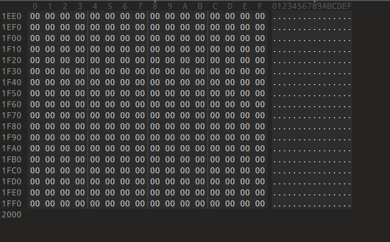

  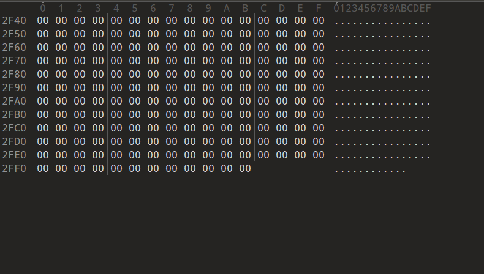

  缺少的地方在upx特征段，可以发现upx1段开头的四个字节错位了，错位到upx特征段上了，所以要给特征段插入四个字节（第一张图是week1_upx的，第二张图是本题的）

  

  

  用010editor在49 01 00 C3后面按Ctrl+shift+I插入4bytes（默认填充为0），会发现程序可以运行了

  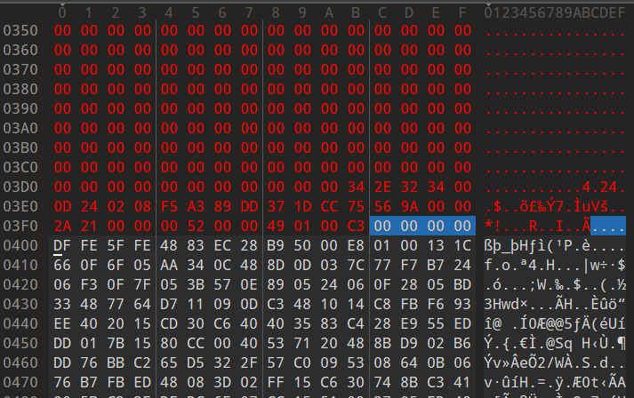

  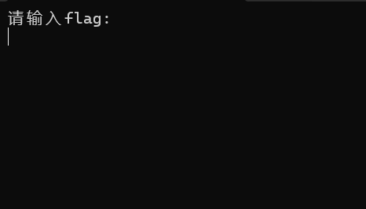

- 采用手动脱壳的办法。具体操作可以参考week1_upx的解法或者看看[Day9:壳与脱壳（一）](http://sydzi.github.io/2025/07/29/Day9-壳/)和[Day10:壳与脱壳（二）](http://sydzi.github.io/2025/07/30/Day10-壳与脱壳（二）/)~~（王婆卖瓜这一块~~，这里从找到OEP开始：

  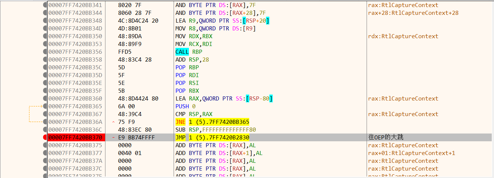

  下断点F9运行到上图这个大跳，然后F7步入

  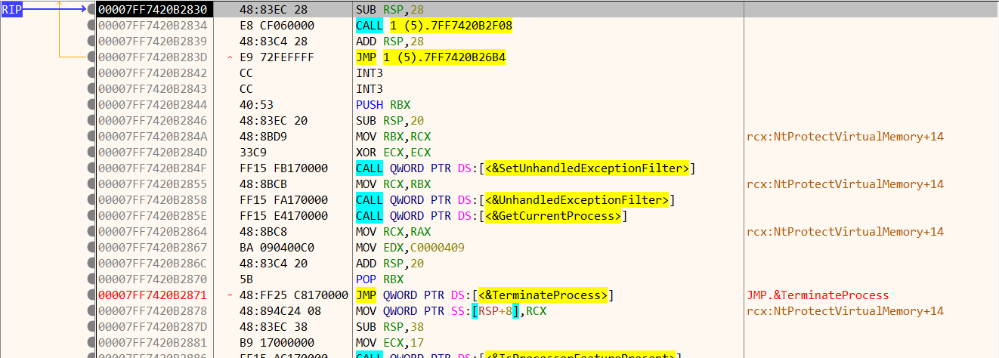

  RIP指向此处时，打开scylla进行转储和IAT重建修复转储。这里需要注意，IAT搜索出来的结果里有一个损坏的导入，需要把它删掉

  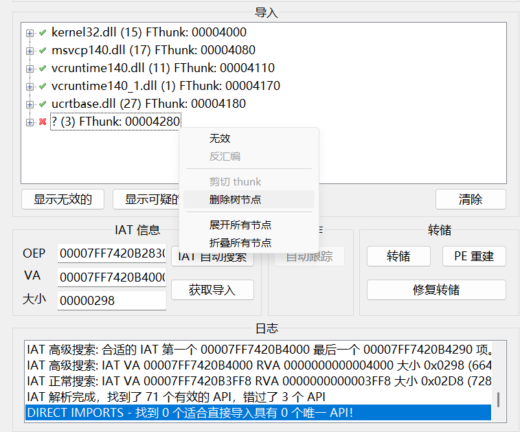

  脱壳后的_dump_SCY.exe文件就可以用IDA打开正常分析了

- 首先查看字符串表，可以发现可疑的的提示"correct"

  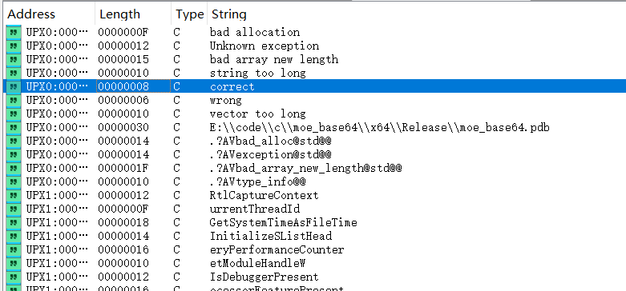

- 跟踪correct可以找到main函数。下面是优化后的main函数和相关的函数

  ```c++
  // Hidden C++ exception states: #wind=5
  int __fastcall main(int argc, const char **argv, const char **envp)
  {
    __int64 v3; // rax
    __int64 v4; // rdx
    unsigned __int8 v5; // al
    __int64 v6; // r8
    void **v7; // rdx
    void **v8; // rsi
    size_t length; // rdi
    void *v10; // rax
    void *v11; // rcx
    _QWORD *newBuffer; // rax
    char *v13; // rbx
    char *enc; // rax
    char *v15; // rbx
    void **encryptedFlag; // rcx
    int v17; // eax
    char *outString; // rdx
    __int64 v19; // rax
    void *v20; // rcx
    void *v21; // rcx
    void *v22; // rcx
    void *v23; // rcx
    void *CopiedFlag[2]; // [rsp+28h] [rbp-51h] BYREF
    char *bufferEnd; // [rsp+38h] [rbp-41h]
    void *flag[2]; // [rsp+40h] [rbp-39h] BYREF
    __m128i si128; // [rsp+50h] [rbp-29h]
    void *encodeResult[2]; // [rsp+60h] [rbp-19h] BYREF
    size_t Size; // [rsp+70h] [rbp-9h]
    unsigned __int64 v31; // [rsp+78h] [rbp-1h]
    void *modifiedBaseTable[2]; // [rsp+80h] [rbp+7h] BYREF
    __m128i v33; // [rsp+90h] [rbp+17h]
    __int128 v34; // [rsp+A0h] [rbp+27h]
    __int64 v35; // [rsp+B0h] [rbp+37h]
    __int64 v36; // [rsp+B8h] [rbp+3Fh]
  
    v3 = output(std::cout, pleaseEnterYourFlag);
    std::istream::operator>>(v3, out_flush);
    *flag = 0LL;
    si128 = _mm_load_si128(&xmmword_7FF7420B44B0);
    LOBYTE(flag[0]) = 0;
    LOBYTE(v4) = 10;
    v5 = std::ios::widen(&std::cin + *(std::cin + 4LL), v4);
    input(std::cin, flag, v5);
    v7 = flag;
    if ( si128.m128i_i64[1] > 0xFuLL )            // si128.m128i_i64[1]是输入的flag的长度
      v7 = flag[0];
    v8 = flag;
    if ( si128.m128i_i64[1] > 0xFuLL )
      v8 = flag[0];
    *CopiedFlag = 0LL;
    bufferEnd = 0LL;
    length = v7 + si128.m128i_i64[0] - v8;
    if ( length )
    {
      if ( length > 0x7FFFFFFFFFFFFFFFLL )
        lengthError();
      if ( length < 0x1000 )
      {
        newBuffer = operator new(length);
      }
      else
      {
        if ( length + 39 < length )
          sub_7FF7420B1170();
        v10 = operator new(length + 39);
        v11 = v10;
        if ( !v10 )
  LABEL_31:
          invalid_parameter_noinfo_noreturn();
        newBuffer = ((v10 + 39) & 0xFFFFFFFFFFFFFFE0uLL);
        *(newBuffer - 1) = v11;
      }
      CopiedFlag[0] = newBuffer;
      v13 = newBuffer + length;
      bufferEnd = newBuffer + length;
      memmove(newBuffer, v8, length);
      CopiedFlag[1] = v13;
    }
    XORencrypt(modifiedBaseTable, v7, v6);        // 魔改base64的编码表
    baseEncode(encodeResult, CopiedFlag, modifiedBaseTable);// base64编码
    v34 = 0LL;
    enc = operator new(0x30uLL);
    v15 = enc;
    *&v34 = enc;
    v35 = 44LL;
    v36 = 47LL;
    strcpy(enc, "lY7bW=\\ck?eyjX7]TZ\\}CVbh\\tOyTH6>jH7XmFifG]H7");
    encryptedFlag = encodeResult;
    if ( v31 > 0xF )
      encryptedFlag = encodeResult[0];
    if ( Size != 44 || (v17 = memcmp(encryptedFlag, enc, 0x2CuLL), outString = aCorrect, v17) )
      outString = aWrong;
    v19 = output(std::cout, outString);
    std::istream::operator>>(v19, out_flush);
    j_j_free(v15);
    if ( v31 > 0xF )
    {
      v20 = encodeResult[0];
      if ( v31 + 1 >= 0x1000 )
      {
        v20 = *(encodeResult[0] - 1);
        if ( (encodeResult[0] - v20 - 8) > 0x1F )
          invalid_parameter_noinfo_noreturn();
      }
      j_j_free(v20);
    }
    Size = 0LL;
    v31 = 15LL;
    LOBYTE(encodeResult[0]) = 0;
    if ( v33.m128i_i64[1] > 0xFuLL )
    {
      v21 = modifiedBaseTable[0];
      if ( (v33.m128i_i64[1] + 1) >= 0x1000 )
      {
        v21 = *(modifiedBaseTable[0] - 1);
        if ( (modifiedBaseTable[0] - v21 - 8) > 0x1F )
          invalid_parameter_noinfo_noreturn();
      }
      j_j_free(v21);
    }
    v33 = _mm_load_si128(&xmmword_7FF7420B44B0);
    LOBYTE(modifiedBaseTable[0]) = 0;
    v22 = CopiedFlag[0];
    if ( CopiedFlag[0] )
    {
      if ( (bufferEnd - CopiedFlag[0]) >= 0x1000 )
      {
        v22 = *(CopiedFlag[0] - 1);
        if ( (CopiedFlag[0] - v22 - 8) > 0x1F )
          goto LABEL_31;
      }
      j_j_free(v22);
    }
    if ( si128.m128i_i64[1] > 0xFuLL )
    {
      v23 = flag[0];
      if ( (si128.m128i_i64[1] + 1) >= 0x1000 )
      {
        v23 = *(flag[0] - 1);
        if ( (flag[0] - v23 - 8) > 0x1F )
          invalid_parameter_noinfo_noreturn();
      }
      j_j_free(v23);
    }
    return 0;
  }
  
  // Hidden C++ exception states: #wind=5
  _QWORD *__fastcall XORencrypt(_QWORD *modifiedTable, __int64 a2, __int64 a3)
  {
    void **pTableStart; // rdx
    void **pCurrentPos; // rdi
    void **i; // rsi
    char xored; // r9
    unsigned __int64 cucrrentSize; // rcx
    unsigned __int64 capacity; // rdx
    _QWORD *Table; // rax
  
    *modifiedTable = 0LL;
    modifiedTable[2] = 0LL;
    modifiedTable[3] = 15LL;
    *modifiedTable = 0;
    pTableStart = &oriTable;
    pCurrentPos = &oriTable;
    if ( *(&xmmword_7FF7420B6760 + 1) > 0xFuLL )
    {
      pCurrentPos = oriTable;                     // oriTable是原始的base64编码表
      pTableStart = oriTable;
    }
    for ( i = (pTableStart + xmmword_7FF7420B6760); pCurrentPos != i; pCurrentPos = (pCurrentPos + 1) )
    {
      xored = *pCurrentPos ^ 0xE;                 // 遍历Table并异或0xE，创建一个魔改的编码表
      cucrrentSize = modifiedTable[2];
      capacity = modifiedTable[3];
      if ( cucrrentSize >= capacity )
      {
        needExpand(modifiedTable, capacity, a3, xored);
      }
      else
      {
        modifiedTable[2] = cucrrentSize + 1;      // 此处开始写入xor处理后的table字符
        Table = modifiedTable;
        if ( capacity > 0xF )
          Table = *modifiedTable;
        *(Table + cucrrentSize) = xored;
        *(Table + cucrrentSize + 1) = 0;
      }
    }
    return modifiedTable;
  }
  ```

- 可以看出逻辑就是先魔改base64的编码表，然后再用魔改的编码表对flag进行base64编码，最后和给定的密文比较。可以先对enc进行异或，然后再base64解码

  ```python
  enc = "lY7bW=\\ck?eyjX7]TZ\\}CVbh\\tOyTH6>jH7XmFifG]H7"
  data = ""
  
  for char in enc:
      data += chr(ord(char) ^ 0xE)
  print(data)
  #bW9lY3Rme1kwdV9SZTRsMXlfRzAwZF80dF9VcHghISF9
  ```

  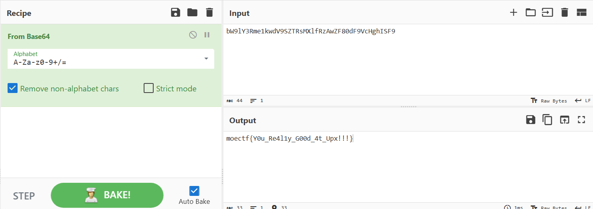

### Two cups of tea

- 反编译的代码分析优化后大概是这样：

  ```c++
  //main函数部分
  int __fastcall main(int argc, const char **argv, const char **envp)
  {
    __int64 n; // rbx
    FILE *Stream; // rax
    size_t length; // rax
    __int64 v6; // rdx
    __int64 count; // rax
    unsigned __int64 tmp4key; // [rsp+20h] [rbp-E0h] BYREF
    char key_2; // [rsp+28h] [rbp-D8h]
    __int64 key_1; // [rsp+30h] [rbp-D0h] BYREF
    int key_3; // [rsp+38h] [rbp-C8h]
    int key_4; // [rsp+3Ch] [rbp-C4h]
    _DWORD enc[10]; // [rsp+40h] [rbp-C0h]
    _OWORD flag[2]; // [rsp+68h] [rbp-98h] BYREF
    __int64 v16; // [rsp+88h] [rbp-78h]
    char Buffer[16]; // [rsp+90h] [rbp-70h] BYREF
    __int128 v18; // [rsp+A0h] [rbp-60h]
    __int64 v19; // [rsp+B0h] [rbp-50h]
  
    n = 0LL;
    key_1 = 2LL;
    key_2 = 0;
    key_3 = 2;
    key_4 = 5;
    enc[0] = 0x5D624C34;
    enc[1] = 0x8629FEAD;
    enc[2] = 0x9D11379B;
    enc[3] = 0xFCD53211;
    enc[4] = 0x460F63CE;
    enc[5] = 0xC5816E68;
    enc[6] = 0xFE5300AD;
    enc[7] = 0xA0015EE;
    enc[8] = 0x9806DBBB;
    enc[9] = 0xEF4A2648;
    tmp4key = 0xD0FCC6A7B8941CAFuLL;
    key_init(*&argc, &tmp4key, &key_1);// 这里初始化了key,不必理会具体实现，可以动调得到结果
    printf(&pleaseEnterYourFlag);
    Stream = _acrt_iob_func(0);
    fgets(Buffer, 100, Stream);
    length = strcspn(Buffer, "\n");// 获取flag的长度
    if ( length >= 0x64 )
      _report_securityfailure_();
    Buffer[length] = 0;
    flag[0] = *Buffer;
    key_1 = tmp4key;
    v16 = v19;
    flag[1] = v18;
    key_3 = 0x12345678;
    key_4 = 0x9ABCDEF0;
    modefiedTea(flag, v6, &key_1);// 魔改的tea，加密flag以便比对验证
    count = -1LL;
    do
      ++count;
    while ( Buffer[count] );// 确认flag长度
    if ( count == 40 )
    {
      while ( *(flag + n * 4) == enc[n] )// 比对验证
      {
        if ( ++n >= 10 )
        {
          printf(right);
          return 0;
        }
      }
      printf(wrong);
    }
    else
    {
      printf(Format_0);
    }
    return 0;
  }
  
  
  //魔改tea部分
  __int64 __fastcall modefiedTea(unsigned int *flag, __int64 a2, __int64 key)
  {
    unsigned int flag_9; // r9d
    int delta; // r11d
    unsigned int flag_eight; // edx
    unsigned int flag_1; // esi
    unsigned int flag_2; // ebp
    unsigned int flag_3; // r14d
    unsigned int flag_4; // r15d
    unsigned int flag_5; // r12d
    unsigned int flag_6; // r13d
    int flag_o; // ebx
    unsigned int flag_7; // ecx
    int key_0; // edi
    int key_1; // ebx
    __int64 key_3; // r10
    int key_2; // r11d
    int v18; // eax
    bool Count; // zf
    __int64 flag_seven; // rax
    unsigned int flag_0; // [rsp+0h] [rbp-58h]
    unsigned int flag_nine; // [rsp+4h] [rbp-54h]
    int count; // [rsp+8h] [rbp-50h]
    int delta_1; // [rsp+68h] [rbp+10h]
    __int64 Key; // [rsp+70h] [rbp+18h]
    unsigned int flag_8; // [rsp+78h] [rbp+20h]
  
    Key = key;
    flag_9 = flag[9];
    delta = 0;
    flag_eight = flag[8];
    flag_1 = flag[1];
    flag_2 = flag[2];
    flag_3 = flag[3];
    flag_4 = flag[4];
    flag_5 = flag[5];
    flag_6 = flag[6];
    flag_o = *flag;
    flag_7 = flag[7];
    flag_8 = flag_eight;
    flag_nine = flag_9;
    count = 11;
    while ( 1 )
    {
      delta_1 = delta - 1640531527;
      key_0 = *(key + 4LL * (((delta - 1640531527) >> 2) & 3));
      flag_0 = flag_o
             + ((((16 * flag_9) ^ (flag_1 >> 3)) + ((flag_9 >> 5) ^ (4 * flag_1))) ^ (((delta - 1640531527) ^ flag_1)
                                                                                    + (key_0 ^ flag_9)));
      key_1 = *(Key + 4 * (((delta - 1640531527) >> 2) & 3 ^ 1LL));
      flag_1 += ((flag_0 ^ key_1) + ((delta - 1640531527) ^ flag_2)) ^ (((16 * flag_0) ^ (flag_2 >> 3))
                                                                      + ((flag_0 >> 5) ^ (4 * flag_2)));
      key_3 = ((delta - 1640531527) >> 2) & 3 ^ 3LL;
      key_2 = *(Key + 4 * (((delta - 1640531527) >> 2) & 3 ^ 2LL));
      flag_2 += ((flag_1 ^ key_2) + (delta_1 ^ flag_3)) ^ (((16 * flag_1) ^ (flag_3 >> 3)) + ((flag_1 >> 5) ^ (4 * flag_3)));
      flag_3 += ((delta_1 ^ flag_4) + (flag_2 ^ *(Key + 4 * key_3))) ^ (((16 * flag_2) ^ (flag_4 >> 3))
                                                                      + ((flag_2 >> 5) ^ (4 * flag_4)));
      flag_4 += ((flag_3 ^ key_0) + (delta_1 ^ flag_5)) ^ (((16 * flag_3) ^ (flag_5 >> 3)) + ((flag_3 >> 5) ^ (4 * flag_5)));
      flag_5 += ((flag_4 ^ key_1) + (delta_1 ^ flag_6)) ^ (((16 * flag_4) ^ (flag_6 >> 3)) + ((flag_4 >> 5) ^ (4 * flag_6)));
      v18 = (flag_5 ^ key_2) + (delta_1 ^ flag_7);
      delta = delta_1;
      flag_6 += v18 ^ (((16 * flag_5) ^ (flag_7 >> 3)) + ((flag_5 >> 5) ^ (4 * flag_7)));
      flag_7 += ((flag_6 ^ *(Key + 4 * key_3)) + (delta_1 ^ flag_8)) ^ (((16 * flag_6) ^ (flag_8 >> 3))
                                                                      + ((flag_6 >> 5) ^ (4 * flag_8)));
      flag_8 += ((flag_7 ^ key_0) + (delta_1 ^ flag_nine)) ^ (((16 * flag_7) ^ (flag_nine >> 3))
                                                            + ((flag_7 >> 5) ^ (4 * flag_nine)));
      flag_9 = (((flag_8 ^ key_1) + (delta_1 ^ flag_0)) ^ (((16 * flag_8) ^ (flag_0 >> 3)) + ((flag_8 >> 5) ^ (4 * flag_0))))
             + flag_nine;
      key = Key;
      Count = count-- == 1;
      flag_nine = flag_9;
      if ( Count )
        break;
      flag_o = flag_0;
    }
    flag_seven = flag_7;
    flag[1] = flag_1;
    flag[2] = flag_2;
    flag[3] = flag_3;
    flag[4] = flag_4;
    flag[5] = flag_5;
    flag[6] = flag_6;
    flag[7] = flag_7;
    flag[8] = flag_8;
    flag[9] = flag_9;
    *flag = flag_0;
    return flag_seven;
  }
  ```

- 由于加密主要依赖的是异或，只要复原出加密时的环境（相关变量），就可以再次加密实现复原。下图是AI给的加密逻辑分析。首先每轮加密的密钥不同，其次每个字符块的加密都依赖前一块和后一块。突破口：对于flag9而言，它的前一块和后一块都是经过本轮加密的，也就是说在最后一轮，flag9依赖的是最终密文的flag0和flag8，可以利用最终密文直接解密。解密出最后一轮的未加密flag9后，就可以往回解密flag8-flag0，就这样11轮解密回去。

  ```
  ┌─────────────────────────────────────────────────────────────────────────┐
  │               修改版TEA加密（10块Feistel结构，11轮）                        │
  └─────────────────────────────────────────────────────────────────────────┘
  
  输入: flag[0]...flag[9] (10个32位字), key[0]...key[3] (128位密钥)
  
  初始化:
     delta = 0
     count = 11
  
  开始循环（11轮）:
     delta_1 = delta - 0x61C88647  (无符号减法，1640531527的十六进制)
  
     密钥调度:
          k0 = key[(delta_1>>2) & 3]
          k1 = key[((delta_1>>2) & 3) ^ 1]
          k2 = key[((delta_1>>2) & 3) ^ 2]
          k3 = key[((delta_1>>2) & 3) ^ 3]
  
     加密链（每轮更新所有10个字，顺序依赖）:
          flag0 += F(flag9, flag1, delta_1, k0)
          flag1 += F(flag0, flag2, delta_1, k1)
          flag2 += F(flag1, flag3, delta_1, k2)
          flag3 += F(flag2, flag4, delta_1, k3)
          flag4 += F(flag3, flag5, delta_1, k0)
          flag5 += F(flag4, flag6, delta_1, k1)
          flag6 += F(flag5, flag7, delta_1, k2)
          flag7 += F(flag6, flag8, delta_1, k3)
          flag8 += F(flag7, flag9, delta_1, k0)
          flag9 += F(flag8, flag0, delta_1, k1)
  
     其中 F(a, b, delta, k) = 
          ((16*a) ^ (b>>3)) + ((a>>5) ^ (4*b))) ^ ( (delta ^ b) + (k ^ a) )
  
     更新delta = delta_1
  
  循环结束（count减至1）
  
  输出: 加密后的flag[0]...flag[9]
  ```

- 解密脚本：

  ```c++
  #include <stdio.h>
  #include <stdint.h>
  
  void modefiedTea_decrypt(uint32_t* flag, uint32_t* key) {
      int32_t deltas[11];
      int32_t delta = 0;
      for (int i = 0; i < 11; i++) {
          delta -= 1640531527; 
          deltas[i] = delta;
      }
  
      for (int round = 10; round >= 0; round--) {
          uint32_t delta_1 = deltas[round];
  
          uint32_t k0 = key[((delta_1 >> 2) & 3)];
          uint32_t k1 = key[((delta_1 >> 2) & 3) ^ 1];
          uint32_t k2 = key[((delta_1 >> 2) & 3) ^ 2];
          uint32_t k3 = key[((delta_1 >> 2) & 3) ^ 3];
  
          flag[9] -= ((flag[8] ^ k1) + (delta_1 ^ flag[0])) ^ (((16 * flag[8]) ^ (flag[0] >> 3)) + ((flag[8] >> 5) ^ (4 * flag[0])));
          flag[8] -= ((flag[7] ^ k0) + (delta_1 ^ flag[9])) ^ (((16 * flag[7]) ^ (flag[9] >> 3)) + ((flag[7] >> 5) ^ (4 * flag[9])));
          flag[7] -= ((flag[6] ^ k3) + (delta_1 ^ flag[8])) ^ (((16 * flag[6]) ^ (flag[8] >> 3)) + ((flag[6] >> 5) ^ (4 * flag[8])));
          flag[6] -= ((flag[5] ^ k2) + (delta_1 ^ flag[7])) ^ (((16 * flag[5]) ^ (flag[7] >> 3)) + ((flag[5] >> 5) ^ (4 * flag[7])));
          flag[5] -= ((flag[4] ^ k1) + (delta_1 ^ flag[6])) ^ (((16 * flag[4]) ^ (flag[6] >> 3)) + ((flag[4] >> 5) ^ (4 * flag[6])));
          flag[4] -= ((flag[3] ^ k0) + (delta_1 ^ flag[5])) ^ (((16 * flag[3]) ^ (flag[5] >> 3)) + ((flag[3] >> 5) ^ (4 * flag[5])));
          flag[3] -= ((flag[2] ^ k3) + (delta_1 ^ flag[4])) ^ (((16 * flag[2]) ^ (flag[4] >> 3)) + ((flag[2] >> 5) ^ (4 * flag[4])));
          flag[2] -= ((flag[1] ^ k2) + (delta_1 ^ flag[3])) ^ (((16 * flag[1]) ^ (flag[3] >> 3)) + ((flag[1] >> 5) ^ (4 * flag[3])));
          flag[1] -= ((flag[0] ^ k1) + (delta_1 ^ flag[2])) ^ (((16 * flag[0]) ^ (flag[2] >> 3)) + ((flag[0] >> 5) ^ (4 * flag[2])));
          flag[0] -= ((flag[9] ^ k0) + (delta_1 ^ flag[1])) ^ (((16 * flag[9]) ^ (flag[1] >> 3)) + ((flag[9] >> 5) ^ (4 * flag[1])));
      }
  }
  
  int main() {
      uint32_t enc[10] = {
          0x5D624C34, 0x8629FEAD, 0x9D11379B, 0xFCD53211,
          0x460F63CE, 0xC5816E68, 0xFE5300AD, 0x0A0015EE,
          0x9806DBBB, 0xEF4A2648
      };
      uint32_t key[4] = {
          0x63656F6D, 0x21216674, 0x12345678, 0x9ABCDEF0
      };
  
      modefiedTea_decrypt(enc, key);
      unsigned char* flag_str = (unsigned char*)enc;
      for (int i = 0; i < 40; i++) {
          if (flag_str[i] >= 32 && flag_str[i] <= 126) {
              printf("%c", flag_str[i]);
          }
          else {
              printf("\\x%02X", flag_str[i]);
          }
      }
      printf("\n");
  
      return 0;
  }
  ```

## week3

### have_fun

- 附件是一个Windows GUI程序，界面如图。工具栏的“交互”实现flag的验证。

  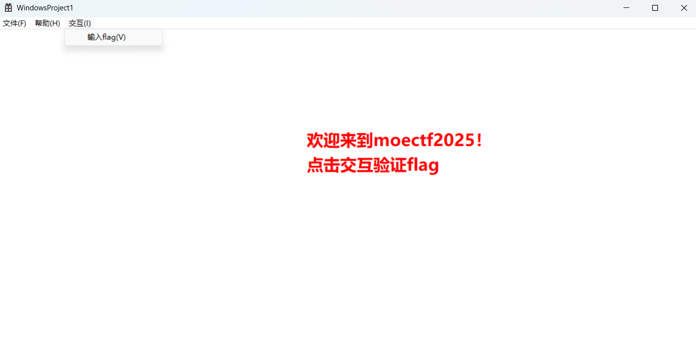

- main函数主要实现的是创建窗口，涉及到WNDCLASSEXW结构体（详细信息见：[WNDCLASSEXW （winuser.h） - Win32 apps | Microsoft Learn](https://learn.microsoft.com/zh-cn/windows/win32/api/winuser/ns-winuser-wndclassexw)）。其中，结构体变量lpfnWndProc涉及窗口过程的实现，所以flag验证的相关逻辑在lpfnWndProc指向的函数中查看（图中重命名为ToolBar）

  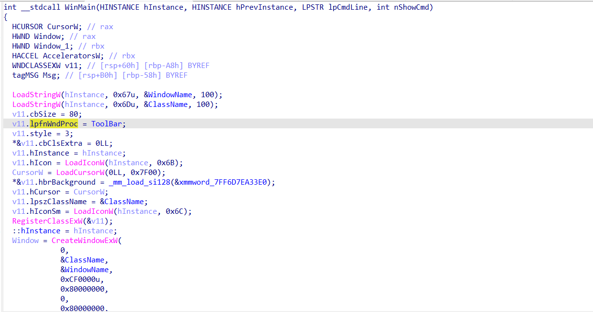

- ToolBar中，实现了工具栏三个选项的交互逻辑，其中，DialogBoxParamW实现的是”交互“选项（因为参数DialogFunc看着最复杂，最像flag验证逻辑）

  ```c
  //ToolBar函数
  LRESULT __fastcall ToolBar(HWND hWnd, UINT Msg, WPARAM wParam, LPARAM lParam)
  {
    HDC hdc; // rsi
    HFONT FontW; // rdi
    HGDIOBJ h; // rbx
    tagPAINTSTRUCT Paint; // [rsp+70h] [rbp-88h] BYREF
  
    switch ( Msg )
    {
      case 2u:
        PostQuitMessage(0);
        break;
      case 0xFu:
        hdc = BeginPaint(hWnd, &Paint);
        SetTextColor(hdc, 0xFFu);
        SetBkMode(hdc, 1);
        FontW = CreateFontW(36, 0, 0, 0, 700, 0, 0, 0, 1u, 0, 0, 0, 0x20u, &pszFaceName);
        h = SelectObject(hdc, FontW);
        TextOutW(hdc, 500, 160, &String, 15);
        TextOutW(hdc, 500, 200, &word_7FF6D7EA3350, 10);
        SelectObject(hdc, h);
        DeleteObject(FontW);
        EndPaint(hWnd, &Paint);
        break;
      case 0x111u:
        switch ( wParam )
        {
          case 0x68u:
            DialogBoxParamW(hInstance, 0x67, hWnd, sub_7FF6D7EA1420, 0LL);
            break;
          case 0x69u:
            DestroyWindow(hWnd);
            break;
          case 0x9C42u:
            DialogBoxParamW(hInstance, 0x66, hWnd, DialogFunc, 0LL);//“交互”选项
            break;
          default:
            return DefWindowProcW(hWnd, Msg, wParam, lParam);
        }
        break;
      default:
        return DefWindowProcW(hWnd, Msg, wParam, lParam);
    }
    return 0LL;
  }
  ```

- DialogFunc函数：

  ```c
  INT_PTR __fastcall DialogFunc(HWND hDlg, int a2, unsigned __int16 n1003)
  {
    HWND hDlg_1; // rbx
    int v4; // edx
    __int64 length; // rax
    int n32_2; // r8d
    __m128 si128; // xmm2
    __int64 v8; // rdx
    unsigned __int64 v9; // rcx
    __m128 v10; // xmm0
    __m128 v11; // xmm1
    __m128 v12; // xmm0
    __m128 v13; // xmm1
    __int64 count; // rdx
    unsigned __int16 *currentChar; // rdx
    int currentEnc; // r8d
    int judgeNumber; // r9d
    const WCHAR *PrintText; // r8
    _OWORD v20[2]; // [rsp+0h] [rbp-1D8h] BYREF
    WCHAR flag[8]; // [rsp+20h] [rbp-1B8h] BYREF
    _OWORD v22[12]; // [rsp+30h] [rbp-1A8h] BYREF
    _WORD flag_xored[104]; // [rsp+F0h] [rbp-E8h] BYREF
  
    hDlg_1 = hDlg;
    v4 = a2 - 272;
    if ( !v4 )
    {
      PrintText = &word_7FF6D7EA3368;
  LABEL_22:
      SetDlgItemTextW(hDlg, 1002, PrintText);
      return 1LL;
    }
    if ( v4 != 1 )
      return 0LL;
    if ( (n1003 - 1) > 1u )
    {
      if ( n1003 == 1003 )
      {
        GetDlgItemTextW(hDlg, 1001, flag, 100);
        length = -1LL;
        do
          ++length;
        while ( flag[length] );
        n32_2 = 0;
        if ( length >= 32 )// flag长度大于32的情况（实际上不能是这种情况）
        {
          si128 = _mm_load_si128(&xmmword_7FF6D7EA33F0);
          v8 = 0LL;
          v9 = 0LL;
          do
          {
            v10 = _mm_loadu_si128(&flag[v9 / 2]);
            n32_2 += 32;
            v8 += 32LL;
            v11 = _mm_loadu_si128(&v22[v9 / 0x10]);
            v9 += 64LL;
            v22[v9 / 0x10 + 8] = _mm_xor_ps(v10, si128);
            v12 = _mm_loadu_si128(&v20[v9 / 0x10]);
            v22[v9 / 0x10 + 9] = _mm_xor_ps(v11, si128);
            v13 = _mm_loadu_si128(&v20[v9 / 0x10 + 1]);
            v22[v9 / 0x10 + 10] = _mm_xor_ps(v12, si128);
            v22[v9 / 0x10 + 11] = _mm_xor_ps(v13, si128);
          }
          while ( v8 < (length - (length & 31)) );
        }
        count = n32_2;// 上述情况应不成立，因此n32_2为0
        if ( n32_2 < length )
        {
          do
          {
            flag_xored[count] = flag[count] ^ 0x2A;
            ++count;
          }
          while ( count < length );
        }
        flag_xored[length] = 0;
        currentChar = flag_xored;
        do
        {
          currentEnc = *(currentChar + &enc - flag_xored);// enc[currentChar-flag_xored]
          judgeNumber = *currentChar - currentEnc;
          if ( judgeNumber )
            break;
          ++currentChar;
        }
        while ( currentEnc );
        if ( judgeNumber || (PrintText = &right, length != 16) )// flag长度由此处得出
          PrintText = &wrong;
        hDlg = hDlg_1;
        goto LABEL_22;
      }
      return 0LL;
    }
    EndDialog(hDlg, n1003);
    return 1LL;
  }
  ```

- 逻辑很明显，遍历flag，每个字符异或0x2A，然后和enc比较。解密脚本：

  ```python
  enc = [
      0x0047, 0x0045, 0x004F, 0x0049, 0x005E, 0x004C, 0x0051, 0x0062, 0x006A, 0x005C, 0x001E, 0x0075, 0x004C, 0x007F, 0x0044, 0x0057
  ]
  flag = ''.join(chr(b ^ 0x2A) for b in enc)
  print(flag)
  ```

### guess

- 附件程序是一个猜数字游戏，用IDA打开，通过字符串表的关键数据"You are right!\n"可以快速定位到main函数的位置

  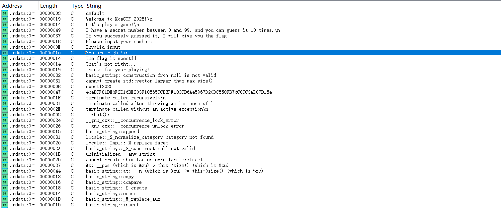

- main函数F5反编译不了，sp value报错，说明有花指令。把栈指针勾选上，会发现栈帧突变的位置：

  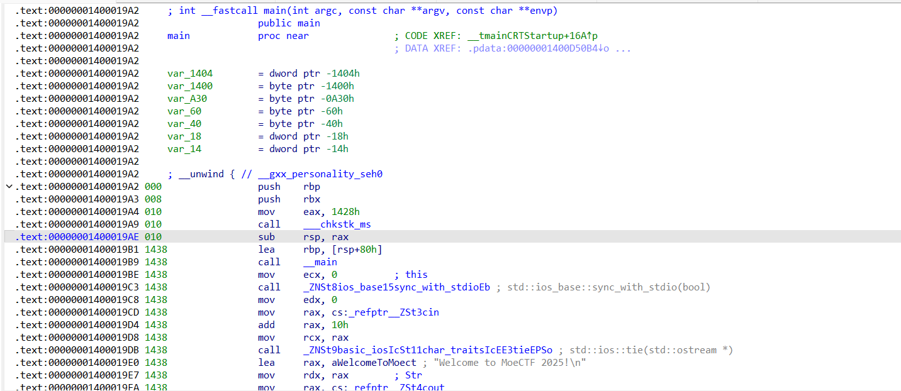

  栈帧改变太多，明显不对，把sub rsp, rax给nop掉。然后可以发现函数末尾栈帧会有点问题：

  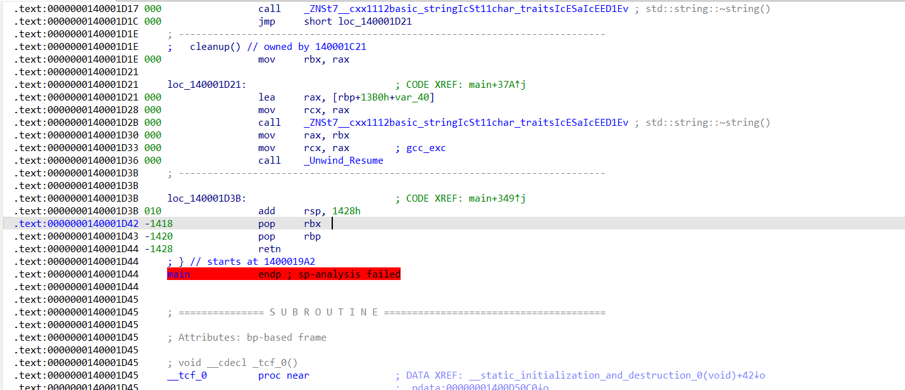

  把add rsp, 1428h也给nop掉，这样main函数基本上可以反编译了

  ```c++
  //优化后的main函数
  // bad sp value at call has been detected, the output may be wrong!
  int __fastcall main(int argc, const char **argv, const char **envp)
  {
    bool v3; // dl
    std::ostream *v4; // rax
    unsigned int v5; // eax
    _QWORD *v6; // rax
    std::ostream *v8; // rax
    __int64 v9; // rax
    __int64 v10; // rbx
    std::ostream *v11; // rax
    std::ostream *v12; // rax
    std::ostream *v13; // rax
    std::ostream *v14; // rax
    unsigned int n0x64; // [rsp+2Ch] [rbp-54h]
    _BYTE v17[2512]; // [rsp+30h] [rbp-50h] BYREF
    _BYTE v18[2512]; // [rsp+A00h] [rbp+980h] BYREF
    _BYTE v19[32]; // [rsp+13D0h] [rbp+1350h] BYREF
    _BYTE v20[40]; // [rsp+13F0h] [rbp+1370h] BYREF
    unsigned int n0x64_1; // [rsp+1418h] [rbp+1398h]
    int i; // [rsp+141Ch] [rbp+139Ch]
  
    _main(argc, argv, envp);
    std::ios_base::sync_with_stdio(0LL, v3);
    std::ios::tie((char *)in + 16, 0LL);
    cout(out, "Welcome to MoeCTF 2025!\n");
    cout(out, "Let's play a game!\n");
    cout(out, "I have a secret number between 0 and 99, and you can guess it 10 times.\n");
    v4 = (std::ostream *)cout(out, "If you successly guessed it, I will give you the flag!");
    endl(v4);
    random_device((std::random_device *)v18);
    v5 = random_operator(v18);
    mersenne_twister_engine(v17, v5);
    std::random_device::~random_device((std::random_device *)v18);
    n0x64_1 = (unsigned int)mersenne_twister_engine_operator(v17) % 0x64;
    for ( i = 0; i <= 9; ++i )
    {
      cout(out, "Please input your number: ");
      std::ostream::flush(out);
      v6 = (_QWORD *)cin(in);
      if ( (unsigned __int8)std::ios::operator!((char *)v6 + *(_QWORD *)(*v6 - 24LL)) || n0x64 >= 0x64 )
      {
        v8 = (std::ostream *)cout(out, "Invalid input");
        endl(v8);
        std::ios::clear((char *)in + 16, 0LL);
        v9 = std::numeric_limits<long long>::max();
        std::istream::ignore(in, v9, 10);
      }
      else
      {
        if ( n0x64_1 == n0x64 )
        {
          cout(out, "You are right!\n");
          v10 = cout(out, "The flag is moectf{");
          hex_to_binary(v20, &enc[abi:cxx11]);
          rc4_decrypt(v19, v20, &key[abi:cxx11]);
          v11 = (std::ostream *)std::operator<<<char>(v10, v19);
          v12 = (std::ostream *)cout(v11, "}.");
          endl(v12);
          std::string::~string(v19);
          std::string::~string(v20);
          break;
        }
        v13 = (std::ostream *)cout(out, "That's not right...");
        endl(v13);
      }
    }
    v14 = (std::ostream *)cout(out, "Thanks for your playing!");
    endl(v14);
    return 0;
  }
  ```

- 可以看出，main函数的逻辑是先获取一个数字输入，然后经过和随机数有关的各种操作来判断是否符合条件，符合条件就输出flag。既然可以直接输出flag，不妨就动调改变判断结果直接得到flag。找到和输出有关的判断逻辑的位置：

  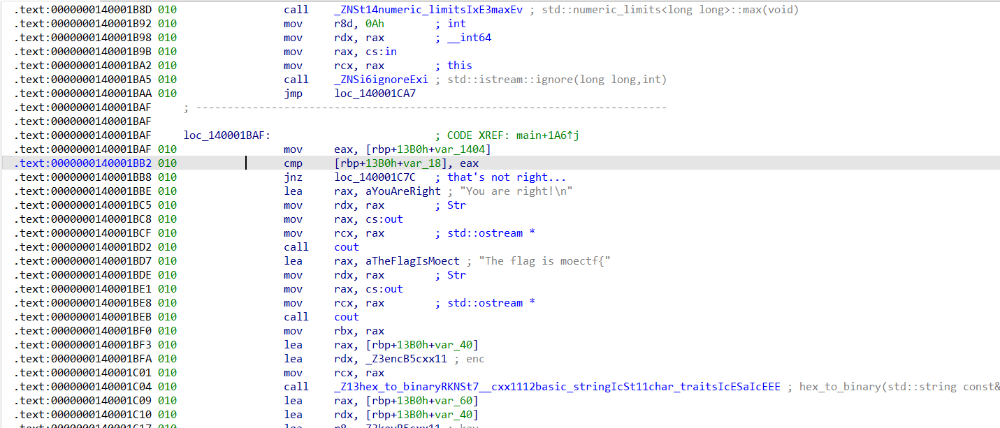

  动调程序步过此处后，改一下ZF即可让程序跳到"You are right!\n"处获得flag输出。好在本题没有给动调挖坑，可以直接得到flag：

  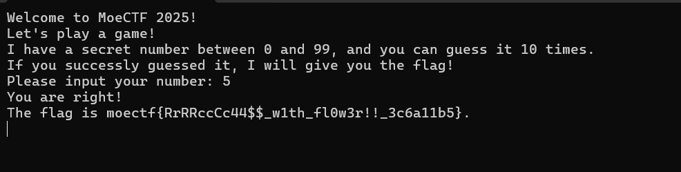

### rusty_sudoku

- rust语言的数独游戏。运行附件程序，提示逆向分析程序找到数独并求解。用IDA打开，结合AI辅助优化后main函数长这样：

  ```c++
  __int64 __fastcall rusty_sudoku::main(__int64 a1, __int64 a2, __int64 a3)
  {
    __int128 *md5_ctx_prt; // rdi
    __int64 temp; // rdx
    size_t cupy_size; // rdx
    unsigned __int8 *input_end; // rcx
    unsigned __int8 *trimmed_length; // rsi
    unsigned __int8 *trimmed_start; // r9
    unsigned __int8 *input_ptr; // r8
    char is_whitespace; // r11
    unsigned __int8 *current_ptr; // rbx
    unsigned __int8 *trimmed_count; // rax
    unsigned int codepoint; // r11d
    int v14; // r9d
    int temp_val1; // r14d
    int temp_val2; // ebp
    unsigned int high_byte; // ebx
    __int64 alloc_result; // rbx
    char is_whitespace2; // bl
    unsigned __int8 *end_ptr; // r11
    unsigned int codepoint2; // esi
    char byte1; // bl
    char byte2; // bp
    int temp_val3; // ebp
    int temp_val4; // ebx
    unsigned int high_byte2; // ebx
    size_t actual_size; // r15
    __int64 alloc_size; // r14
    __int64 allocated_mem; // rax
    __int64 expected_char; // r9
    __int64 input_data; // rdx
    __int64 index; // rax
    int user_char; // ecx
    int v34; // edx
    int temp_val5; // r8d
    __int64 result; // rax
    __int64 user_index; // rax
    __int64 sudoku_index; // rdx
    int user_codepointer; // r8d
    int v40; // r9d
    int temp_val6; // r11d
    int temp_val7; // r10d
    int v43; // r10d
    int temp_val8; // ebp
    int temp_val9; // r11d
    __int64 temp_arg1; // rdx
    __int64 temp_arg2; // rdx
    __int64 temp_arg3; // rdx
    _BYTE buf[88]; // [rsp+30h] [rbp-178h] BYREF
    __int128 fmt_arg1; // [rsp+90h] [rbp-118h] BYREF
    __int128 fmt_arg2; // [rsp+A0h] [rbp-108h]
    __int128 fmt_arg3; // [rsp+B0h] [rbp-F8h]
    __int128 fmt_arg4; // [rsp+C0h] [rbp-E8h]
    __int128 fmt_arg5; // [rsp+D0h] [rbp-D8h]
    __int64 fmt_arg6; // [rsp+E0h] [rbp-C8h]
    _OWORD stdin_handle[5]; // [rsp+F0h] [rbp-B8h] BYREF
    char board_data; // [rsp+140h] [rbp-68h]
    _BYTE md5_hash[16]; // [rsp+150h] [rbp-58h] BYREF
  
    *buf = &welcome;                              // "Welcome to MoeCTF 2025!\nPlease **find** my sudoku and fill it correctly.\nAnd then I will give you the flag.\nInput your answer in one line (without spaces).\nfor example, 854219763397865421261473985785126394649538172132947856926384517513792648478651239 represents:\n854|219|763\n397|865|421\n261|473|985\n-----------\n785|126|394\n649|538|172\n132|947|856\n-----------\n926|384|517\n513|792|648\n478|651|239\n\nYour answer:\n"
    *&buf[8] = 1LL;
    *&buf[16] = 8LL;
    *&buf[24] = 0LL;
    std::io::stdio::_print(a1, a2, a3, buf);
    *buf = 0LL;
    *&buf[8] = 1LL;
    *&buf[16] = 0LL;
    *&stdin_handle[0] = std::io::stdio::stdin();
    md5_ctx_prt = stdin_handle;
    if ( (std::io::stdio::Stdin::read_line(stdin_handle, a2, buf, stdin_handle) & 1) != 0 )
    {
      *&fmt_arg1 = temp;
      core::result::unwrap_failed(stdin_handle, a2, 14, "Invalid input.src\\main.rs", &fmt_arg1, &off_7FF6BF752050);
    }
    cupy_size = *&buf[8];
    input_end = (*&buf[8] + *&buf[16]);
    if ( *&buf[16] )
    {
      trimmed_length = 0LL;
      trimmed_start = 0LL;
      input_ptr = *&buf[8];
      while ( 1 )
      {
        current_ptr = input_ptr;
        trimmed_count = trimmed_start;
        codepoint = *input_ptr;
        if ( (codepoint & 0x80u) != 0 )
        {
          v14 = codepoint & 0x1F;
          temp_val1 = input_ptr[1] & 0x3F;
          if ( codepoint <= 0xDFu )
          {
            input_ptr += 2;
            codepoint = temp_val1 | (v14 << 6);
          }
          else
          {
            temp_val2 = (temp_val1 << 6) | input_ptr[2] & 0x3F;
            if ( codepoint < 0xF0u )
            {
              input_ptr += 3;
              codepoint = (v14 << 12) | temp_val2;
            }
            else
            {
              input_ptr += 4;
              codepoint = ((codepoint & 7) << 18) | (temp_val2 << 6) | current_ptr[3] & 0x3F;
            }
          }
        }
        else
        {
          ++input_ptr;
        }
        trimmed_start = &trimmed_count[input_ptr - current_ptr];
        if ( codepoint - 9 >= 5 && codepoint != 32 )
        {
          if ( codepoint < 0x80 )
            goto LABEL_27;
          high_byte = codepoint >> 8;
          if ( codepoint >> 8 > 0x1F )
          {
            if ( high_byte == 32 )
            {
              is_whitespace = *(core::unicode::unicode_data::white_space::WHITESPACE_MAP + codepoint) >> 1;
            }
            else
            {
              if ( high_byte != 48 )
                goto LABEL_27;
              is_whitespace = codepoint == 12288;
            }
          }
          else if ( high_byte )
          {
            if ( high_byte != 22 )
              goto LABEL_27;
            is_whitespace = codepoint == 5760;
          }
          else
          {
            is_whitespace = *(core::unicode::unicode_data::white_space::WHITESPACE_MAP + codepoint);
          }
          if ( (is_whitespace & 1) == 0 )
            goto LABEL_27;
        }
        if ( input_ptr == input_end )
        {
          alloc_result = 1LL;
          goto LABEL_58;
        }
      }
    }
    trimmed_start = 0LL;
    input_ptr = *&buf[8];
    trimmed_count = 0LL;
  LABEL_27:
    if ( input_ptr == input_end )
      goto LABEL_53;
    while ( 1 )
    {
      end_ptr = input_end;
      codepoint2 = *(input_end - 1);
      if ( (codepoint2 & 0x80000000) != 0 )
      {
        byte1 = *(input_end - 2);
        if ( byte1 >= -64 )
        {
          input_end -= 2;
          temp_val4 = byte1 & 0x1F;
        }
        else
        {
          byte2 = *(input_end - 3);
          if ( byte2 >= -64 )
          {
            input_end -= 3;
            temp_val3 = byte2 & 0xF;
          }
          else
          {
            input_end -= 4;
            temp_val3 = ((*(end_ptr - 4) & 7) << 6) | byte2 & 0x3F;
          }
          temp_val4 = (temp_val3 << 6) | byte1 & 0x3F;
        }
        codepoint2 = (temp_val4 << 6) | codepoint2 & 0x3F;
        if ( codepoint2 - 9 < 5 )
          goto LABEL_31;
      }
      else
      {
        --input_end;
        if ( codepoint2 - 9 < 5 )
          goto LABEL_31;
      }
      if ( codepoint2 == 32 )
        goto LABEL_31;
      if ( codepoint2 < 0x80 )
        break;
      high_byte2 = codepoint2 >> 8;
      if ( codepoint2 >> 8 <= 0x1F )
      {
        if ( high_byte2 )
        {
          if ( high_byte2 != 22 )
            break;
          is_whitespace2 = codepoint2 == 5760;
        }
        else
        {
          is_whitespace2 = *(core::unicode::unicode_data::white_space::WHITESPACE_MAP + codepoint2);
        }
        goto LABEL_30;
      }
      if ( high_byte2 == 32 )
      {
        is_whitespace2 = *(core::unicode::unicode_data::white_space::WHITESPACE_MAP + codepoint2) >> 1;
        goto LABEL_30;
      }
      if ( high_byte2 != 48 )
        break;
      is_whitespace2 = codepoint2 == 12288;
  LABEL_30:
      if ( (is_whitespace2 & 1) == 0 )
        break;
  LABEL_31:
      if ( input_ptr == input_end )
        goto LABEL_53;
    }
    trimmed_start = &end_ptr[trimmed_start - input_ptr];
  LABEL_53:
    trimmed_length = (trimmed_start - trimmed_count);
    if ( trimmed_start - trimmed_count < 0 )
    {
      alloc_size = 0LL;
      goto LABEL_110;
    }
    cupy_size = &trimmed_count[*&buf[8]];
    if ( trimmed_start == trimmed_count )
    {
      alloc_result = 1LL;
      trimmed_length = 0LL;
      goto LABEL_58;
    }
    actual_size = &trimmed_count[*&buf[8]];
    RNvCs73fAdSrgOJL_7___rustc35___rust_no_alloc_shim_is_unstable_v2(stdin_handle, trimmed_length);
    alloc_size = 1LL;
    allocated_mem = __rustc::__rust_alloc(stdin_handle, trimmed_length, 1LL, trimmed_length);
    if ( !allocated_mem )
  LABEL_110:
      alloc::raw_vec::handle_error(stdin_handle, trimmed_length, trimmed_length, alloc_size, &off_7FF6BF7521D8);// "/rustc/29483883eed69d5fb4db01964cdf2af4d86e9cb2\\library\\alloc\\src\\slice.rs"
    alloc_result = allocated_mem;
    cupy_size = actual_size;
  LABEL_58:
    memcpy(stdin_handle, trimmed_length, cupy_size);
    input_data = *buf;
    if ( *buf )
      __rustc::__rust_dealloc(stdin_handle, trimmed_length, *buf, *&buf[8], 1LL);
    if ( trimmed_length == 81 )
    {
      index = 0LL;
      while ( index != 81 )
      {
        user_char = *(alloc_result + index);
        if ( (user_char & 0x80u) == 0 )
        {
          ++index;
        }
        else
        {
          v34 = user_char & 0x1F;
          expected_char = *(alloc_result + index + 1) & 0x3F;
          if ( user_char <= 0xDFu )
          {
            index += 2LL;
            input_data = expected_char | (v34 << 6);
            user_char = input_data;
          }
          else
          {
            expected_char = (expected_char << 6);
            temp_val5 = expected_char | *(alloc_result + index + 2) & 0x3F;
            if ( user_char < 0xF0u )
            {
              index += 3LL;
              input_data = (v34 << 12);
              user_char = input_data | temp_val5;
            }
            else
            {
              input_data = (user_char & 7) << 18;
              user_char = input_data | (temp_val5 << 6) | *(alloc_result + index + 3) & 0x3F;
              if ( user_char == 1114112 )
                break;
              index += 4LL;
            }
          }
        }
        if ( (user_char - 58) < 0xFFFFFFF6 )
          goto LABEL_72;
      }
      user_index = 0LL;
      sudoku_index = 0LL;
      while ( user_index != 81 )
      {
        user_codepointer = *(alloc_result + user_index);
        if ( (user_codepointer & 0x80u) != 0 )
        {
          v40 = user_codepointer & 0x1F;
          temp_val6 = *(alloc_result + user_index + 1) & 0x3F;
          if ( user_codepointer <= 0xDFu )
          {
            user_index += 2LL;
            expected_char = temp_val6 | (v40 << 6);
            user_codepointer = expected_char;
            if ( sudoku_index == 81 )
              break;
          }
          else
          {
            temp_val7 = (temp_val6 << 6) | *(alloc_result + user_index + 2) & 0x3F;
            if ( user_codepointer < 0xF0u )
            {
              user_index += 3LL;
              expected_char = (v40 << 12);
              user_codepointer = expected_char | temp_val7;
              if ( sudoku_index == 81 )
                break;
            }
            else
            {
              expected_char = (user_codepointer & 7) << 18;
              user_codepointer = expected_char | (temp_val7 << 6) | *(alloc_result + user_index + 3) & 0x3F;
              if ( user_codepointer == 1114112 )
                break;
              user_index += 4LL;
              if ( sudoku_index == 81 )
                break;
            }
          }
        }
        else
        {
          ++user_index;
          if ( sudoku_index == 81 )
            break;
        }
        expected_char = sudoku[sudoku_index];
        if ( (expected_char & 0x80u) != 0LL )
        {
          v43 = expected_char & 0x1F;
          temp_val8 = sudoku[sudoku_index + 1] & 0x3F;
          if ( expected_char <= 0xDFu )
          {
            sudoku_index += 2LL;
            expected_char = temp_val8 | (v43 << 6);
            if ( user_codepointer == 1114112 )
              break;
          }
          else
          {
            temp_val9 = (temp_val8 << 6) | sudoku[sudoku_index + 2] & 0x3F;
            if ( expected_char < 0xF0u )
            {
              sudoku_index += 3LL;
              expected_char = (v43 << 12) | temp_val9;
              if ( user_codepointer == 1114112 )
                break;
            }
            else
            {
              expected_char = ((expected_char & 7) << 18) | (temp_val9 << 6) | sudoku[sudoku_index + 3] & 0x3Fu;
              if ( expected_char == 1114112 )
                break;
              sudoku_index += 4LL;
              if ( user_codepointer == 1114112 )
                break;
            }
          }
        }
        else
        {
          ++sudoku_index;
          if ( user_codepointer == 1114112 )
            break;
        }
        if ( expected_char != 46 && user_codepointer != expected_char )
        {
          *&stdin_handle[0] = aYouShouldNotCh;
          *(&stdin_handle[0] + 1) = 32LL;
          *&fmt_arg1 = stdin_handle;
          *(&fmt_arg1 + 1) = <&T_as_core::fmt::Display>::fmt;
          *buf = &unk_7FF6BF7524E0;
          *&buf[8] = 2LL;
          *&buf[32] = 0LL;
          *&buf[16] = &fmt_arg1;
          *&buf[24] = 1LL;
          result = std::io::stdio::_print(stdin_handle, 81LL, sudoku_index, buf);
          goto LABEL_73;
        }
      }
      sudoku::board::sudoku::Sudoku::from_str_line(stdin_handle, 81LL, alloc_result, buf, 81LL, expected_char);
      if ( buf[0] == 1 )
      {
        *&fmt_arg1 = *&buf[4];
        core::result::unwrap_failed(
          stdin_handle,
          81,
          43,
          "called `Result::unwrap()` on an `Err` value",
          &fmt_arg1,
          &unk_7FF6BF752070);
      }
      board_data = buf[81];
      stdin_handle[4] = *&buf[65];
      stdin_handle[3] = *&buf[49];
      stdin_handle[2] = *&buf[33];
      stdin_handle[1] = *&buf[17];
      stdin_handle[0] = *&buf[1];
      if ( sudoku::board::sudoku::Sudoku::is_solved(stdin_handle, 81LL, temp_arg1, stdin_handle) )
      {
        *buf = &off_7FF6BF752490;                 // "Congratulation!\n"
        *&buf[8] = 1LL;
        *&buf[16] = 8LL;
        *&buf[24] = 0LL;
        std::io::stdio::_print(stdin_handle, 81LL, temp_arg2, buf);
        fmt_arg4 = 0LL;
        fmt_arg3 = 0LL;
        fmt_arg2 = 0LL;
        fmt_arg1 = 0LL;
        fmt_arg6 = 0LL;
        fmt_arg5 = ::fmt_arg5;
        md5_ctx_prt = &fmt_arg1;
        md5::consume(&fmt_arg1, 81LL, alloc_result, &fmt_arg1, 81LL);
        *&buf[80] = fmt_arg6;
        *&buf[64] = fmt_arg5;
        *&buf[48] = fmt_arg4;
        *&buf[32] = fmt_arg3;
        *&buf[16] = fmt_arg2;
        *buf = fmt_arg1;
        md5::Context::finalize(&fmt_arg1, 81LL, buf, md5_hash);
        *&fmt_arg1 = md5_hash;
        *(&fmt_arg1 + 1) = <md5::Digest_as_core::fmt::LowerHex>::fmt;
        *buf = &YourFlagIs;                       // "Your flag is moectf{"
        *&buf[8] = 2LL;
        *&buf[32] = 0LL;
        *&buf[16] = &fmt_arg1;
        *&buf[24] = 1LL;
        result = std::io::stdio::_print(&fmt_arg1, 81LL, temp_arg3, buf);
      }
      else
      {
        *buf = &TryAgain;                         // "try again~\n"
        *&buf[8] = 1LL;
        *&buf[16] = 8LL;
        *&buf[24] = 0LL;
        result = std::io::stdio::_print(stdin_handle, 81LL, temp_arg2, buf);
      }
    }
    else
    {
  LABEL_72:
      *buf = &Invalid;                            // "Invalid Solution.\n"
      *&buf[8] = 1LL;
      *&buf[16] = 8LL;
      *&buf[24] = 0LL;
      result = std::io::stdio::_print(stdin_handle, trimmed_length, input_data, buf);
    }
  LABEL_73:
    if ( trimmed_length )
      return __rustc::__rust_dealloc(md5_ctx_prt, trimmed_length, trimmed_length, alloc_result, 1LL);
    return result;
  }
  ```

- rust逆向的伪代码不好分析，但是作为数独游戏，只需要找到数独就可以了，可以shift+F12在字符串表窗口找到可疑的数据：

  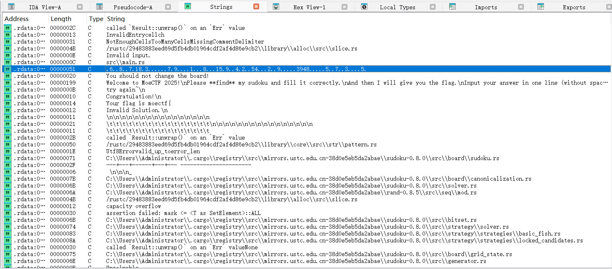

- 结合伪代码，可以分析出程序接受用户输入的已求解的数独后会进行检验，若数独正确且求解成功，会输出flag，flag是md5加密后的数独。所以直接利用程序得到flag即可。网上找一个数独求解工具求解：[数独求解器 - 免费在线数独方案解题工具](https://sudoku.vc/zh-CN/sudoku-solver)（建议不要直接把数独复制给AI求解，因为AI会乱改数据，笔者卡在求解这一步好久😅）

  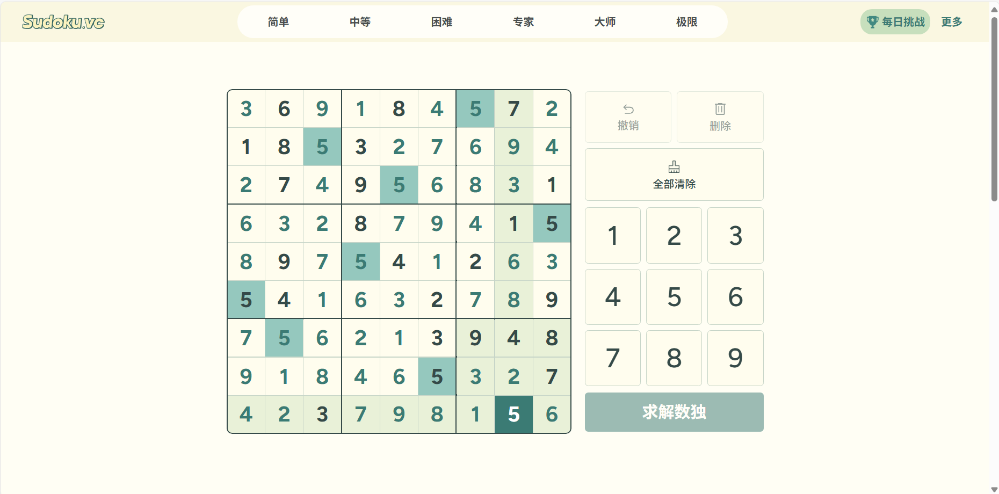

- IDA动态调试（直接运行程序输入正确数独貌似会闪退），把解出来的数独按提示的顺序输入，就可以得到flag：

  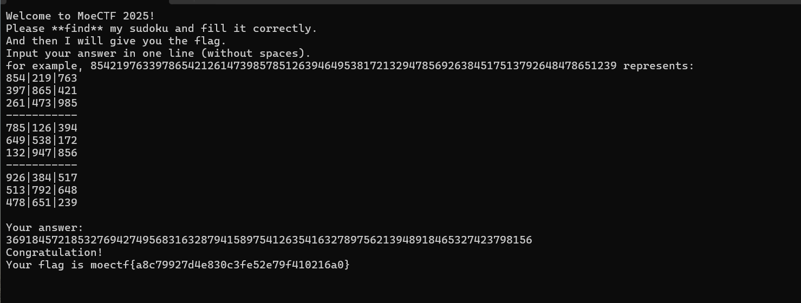

## week4

### ezandroid

- 附件apk用JEB打开，发现逻辑主要是将输入的文本base64加密后进行比较

  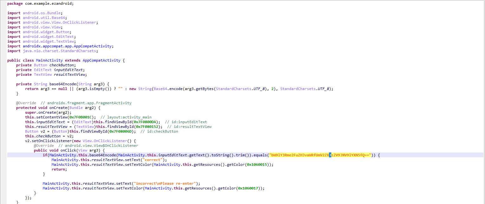

- cyberchef一把梭

  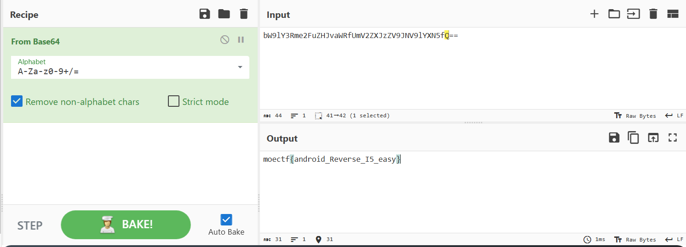

### ezandroid.pro

- 附件apk用JEB打开，可以发现使用了一个从native层ezandroidpro库载入的函数check，由check判断输入是否正确

  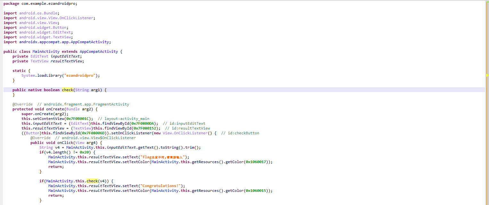

- 把apk解压，在IDA中打开lib/armeabi-v7a/libezandroidpro.so，在Exports界面找到Java_com_example_ezandroidpro_MainActivity_check函数，即apk载入的check函数

  ```c++
  bool __fastcall Java_com_example_ezandroidpro_MainActivity_check(int JENV, int a2, int a3)
  {
    _BOOL4 ret; // r5
    const char *flag; // r0
    const char *src; // r4
    size_t length; // r0
    size_t n; // r5
    char *dest; // r9
    unsigned int v11; // r10
    char *str; // r4
    int n96; // r2
    int v14; // r0
    unsigned __int8 *v15; // r2
    int v16; // r1
    char *_str; // r3
    void *s1_1; // r6
    unsigned __int8 v20; // [sp+4h] [bp-44h] BYREF
    _BYTE v21[7]; // [sp+5h] [bp-43h] BYREF
    void *s1; // [sp+Ch] [bp-3Ch]
    _DWORD v23[2]; // [sp+10h] [bp-38h] BYREF
    void *key; // [sp+18h] [bp-30h]
    _DWORD v25[2]; // [sp+1Ch] [bp-2Ch] BYREF
    void *dest_1; // [sp+24h] [bp-24h]
  
    ret = 0;
    flag = (const char *)(*(int (__fastcall **)(int, int, _DWORD))(*(_DWORD *)JENV + 676))(JENV, a3, 0);
    if ( !flag )
      return ret;
    src = flag;
    length = strlen(flag);
    if ( length >= 0xFFFFFFF0 )
      std::__basic_string_common<true>::__throw_length_error(v25);
    n = length;
    if ( length >= 0xB )
    {
      v11 = (length + 16) & 0xFFFFFFF0;
      dest = (char *)operator new(v11);
      v25[1] = n;
      dest_1 = dest;
      v25[0] = v11 + 1;
      goto LABEL_7;
    }
    LOBYTE(v25[0]) = 2 * length;
    dest = (char *)v25 + 1;
    if ( length )
  LABEL_7:
      j_memcpy(dest, src, n);
    dest[n] = 0;
    (*(void (__fastcall **)(int, int, const char *))(*(_DWORD *)JENV + 680))(JENV, a3, src);
    key = (void *)operator new(0x20u);
    strcpy((char *)key, "moectf2025!!!!!!");
    v23[1] = 16;
    v23[0] = 33;
    str = (char *)operator new(0x70u);
    strcpy(str, "4EEB1EEF2914D79BFA8C5006332097ED2EF06C4A59CAE31C827A08D45CC649C0B971BF2EFBCB160E531A646DF7A6AC0B");
    sm4Encrypt((int)&v20, (int)v25, (int)v23);
    n96 = *(_DWORD *)&v21[3];
    v14 = v20 & 1;
    if ( !v14 )
      n96 = v20 >> 1;
    if ( n96 == 96 )
    {
      if ( v14 )
      {
        s1_1 = s1;
        ret = memcmp(s1, str, 0x60u) == 0;
        goto LABEL_20;
      }
      v15 = v21;
      v16 = v20 >> 1;
      _str = str;
      do
      {
        ret = *v15 == (unsigned __int8)*_str;
        if ( *v15 != (unsigned __int8)*_str )
          break;
        ++_str;
        ++v15;
        --v16;
      }
      while ( v16 );
    }
    else
    {
      ret = 0;
    }
    if ( v14 )
    {
      s1_1 = s1;
  LABEL_20:
      operator delete(s1_1);
    }
    operator delete(str);
    if ( LOBYTE(v23[0]) << 31 )
      operator delete(key);
    if ( LOBYTE(v25[0]) << 31 )
      operator delete(dest_1);
    return ret;
  }
  ```

- 可以看到，check函数使用了sm4加密，密钥可能是“moectf2025!!!!!!”，还需要知道加密模式。借助AI分析具体加密函数知道采用ECB加密模式，cyberchef一把梭：

  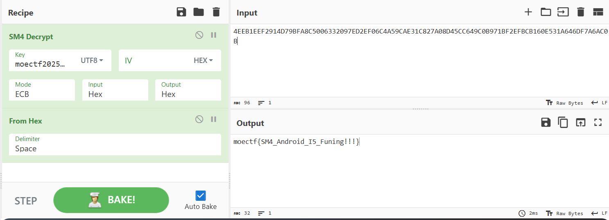

### A simple program

- 附件程序main函数反编译出来大概是这样：

  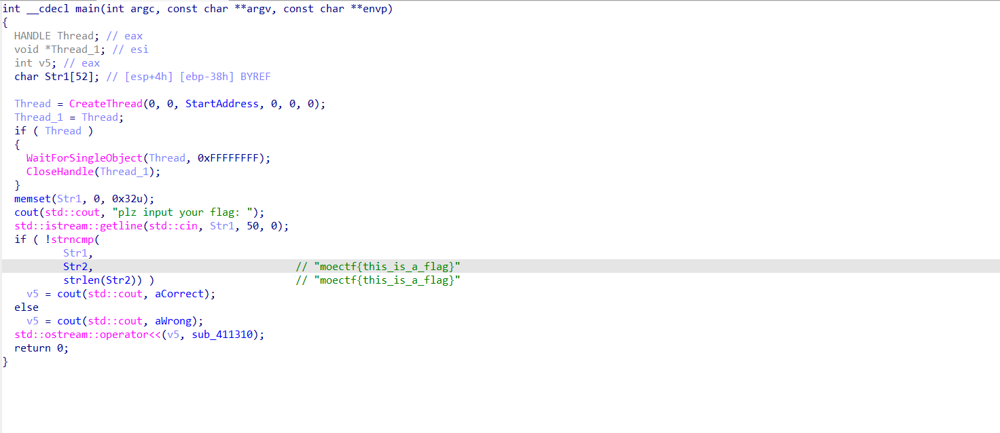

  但是Str2这个像模像样的flag是假的，提交会显示错误。结合题目提示，flag应该藏在其他地方。

- IDA看不出有什么套路在里面，但是在X32Dbg，strncmp是可以点进去的（在IDA中，strncmp是粉色的导入函数，点击函数没有详细内容），点进去会发现，里面还有一个strncmp

  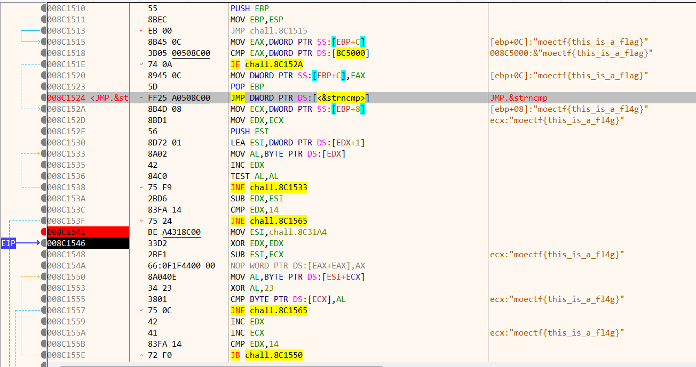

  加上注释：

  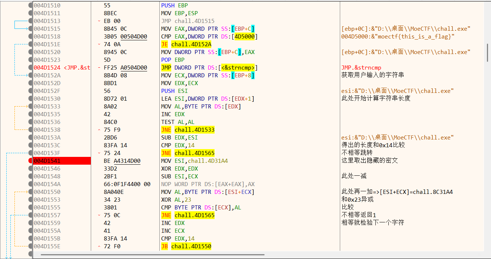

- 所以真正的检验逻辑在strncmp里，程序从chall.4D31A4取出真正的密文，然后把输入的flag进行异或处理再比较。在转储中跟随4D31A4可以获得密文：

  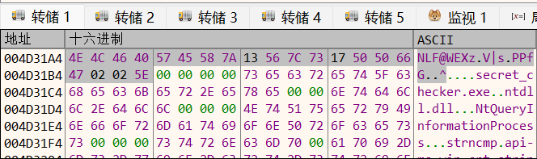

- 解密脚本：

  ```python
  enc=[0x4E, 0x4C, 0x46, 0x40, 0x57, 0x45, 0x58, 0x7A, 0x13, 0x56, 0x7C, 0x73, 0x17, 0x50, 0x50, 0x66, 0x47, 0x02, 0x02, 0x5E]
  flag=""
  for i in enc:
      flag+=chr(i^0x23)
  print(flag)
  ```


## week5

### 2048_master_re

- 附件程序是一个2048小游戏，通过方向键来操作数字整体移动。根据游戏窗口可以推测这也是一个GUI程序。

  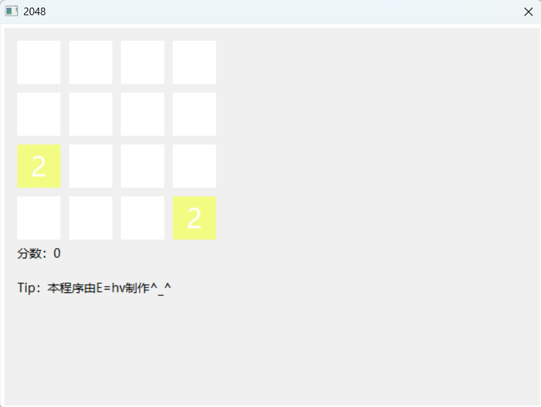

- 用IDA打开附件程序，shift+F12可以在字符串窗口看见一些蛛丝马迹（因为是MFC GUI程序，也可以直接找WinMain函数，然后再从中找出和flag检验有关的逻辑）：

  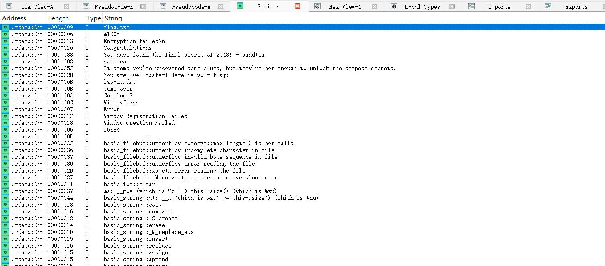

- 跟踪flag.txt可以发现一个疑似的关键函数：

  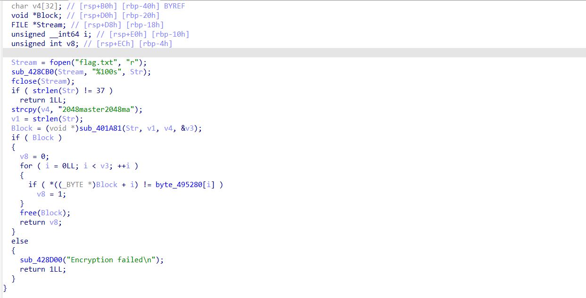

  通过粗略分析可以推测程序从flag.txt里读取数据，然后进行检验。但是此处没有直接的和flag相关的提示，跟踪到上级函数看看。选中函数名按X查找交叉引用，跳转到上一级函数：

  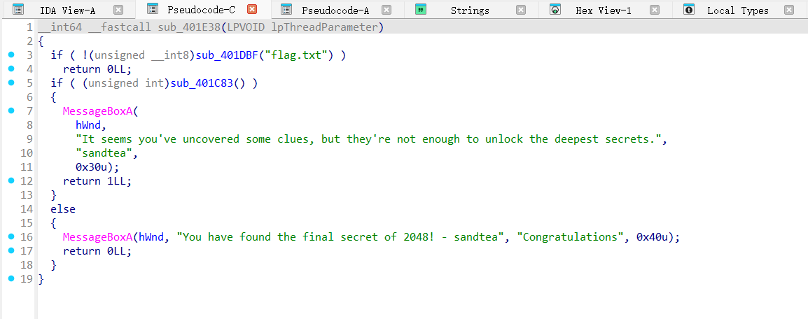

  出题人根据可疑函数的返回值设置了提示，看来flag检验逻辑在此没错了。回到可疑函数，可以看到函数后半部分是对Block的检验，所以推测sub_401A81是一个加密函数。跟踪进去可以找到一个魔改xxtea函数和一个疑似数据格式转换的函数。这是优化后的样子：

  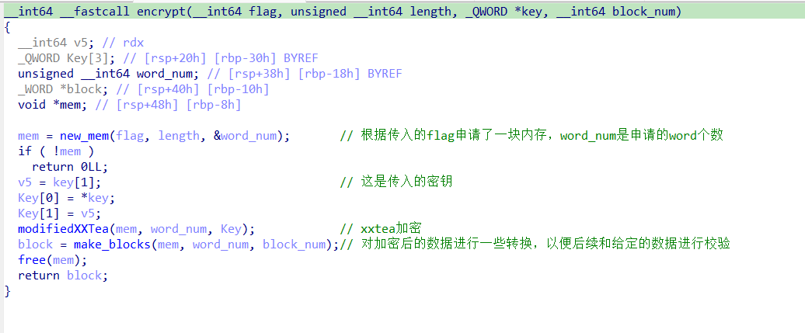

  到这里大概掌握了一些信息了。但还是要完整分析一下程序的整体逻辑，继续找上级函数，回溯到WinMain函数。下面是沿着正向调用逻辑的分析：

  ```c++
  int __stdcall WinMain(HINSTANCE hInstance, HINSTANCE hPrevInstance, LPSTR lpCmdLine, int nShowCmd)
  {
    MSG Msg; // [rsp+60h] [rbp-90h] BYREF
    WNDCLASSEXA v6; // [rsp+90h] [rbp-60h] BYREF
  
    memset(&v6, 0, sizeof(v6));
    v6.cbSize = 80;
    v6.lpfnWndProc = check_2048;                  // 游戏的检验逻辑
    v6.hInstance = hInstance;
    v6.hCursor = LoadCursorA(0LL, 0x7F00);
    v6.hbrBackground = 5;
    v6.lpszClassName = "WindowClass";
    v6.hIcon = LoadIconA(0LL, 0x7F00);
    v6.hIconSm = LoadIconA(0LL, 0x7F00);
    if ( RegisterClassExA(&v6) )
    {
      if ( CreateWindowExA(
             0x200u,
             "WindowClass",
             "2048",
             0x10CF0000u,
             0x80000000,
             0x80000000,
             640,
             480,
             0LL,
             0LL,
             hInstance,
             0LL) )
      {
        while ( GetMessageA(&Msg, 0LL, 0, 0) > 0 )
        {
          TranslateMessage(&Msg);
          DispatchMessageA(&Msg);
        }
        return Msg.wParam;
      }
      else
      {
        MessageBoxA(0LL, "Window Creation Failed!", "Error!", 0x30u);
        return 0;
      }
    }
    else
    {
      MessageBoxA(0LL, "Window Registration Failed!", "Error!", 0x30u);
      return 0;
    }
  }
  
  //游戏检验函数
  LRESULT __fastcall check_2048(HWND hWnd, UINT n20, WPARAM wParam, LPARAM lParam)
  {
    unsigned int v4; // eax
    tagPAINTSTRUCT Paint; // [rsp+50h] [rbp-30h] BYREF
    struct tagRECT Rect; // [rsp+230h] [rbp+1B0h] BYREF
    HGDIOBJ h; // [rsp+248h] [rbp+1C8h]
    HDC hdcSrc; // [rsp+250h] [rbp+1D0h]
    HDC hdc; // [rsp+258h] [rbp+1D8h]
    LONG dwNewLong; // [rsp+264h] [rbp+1E4h]
    HMENU SystemMenu; // [rsp+268h] [rbp+1E8h]
    int i2; // [rsp+274h] [rbp+1F4h]
    int i1; // [rsp+278h] [rbp+1F8h]
    int nn; // [rsp+27Ch] [rbp+1FCh]
    int mm; // [rsp+280h] [rbp+200h]
    int kk; // [rsp+284h] [rbp+204h]
    int v18; // [rsp+288h] [rbp+208h]
    int jj; // [rsp+28Ch] [rbp+20Ch]
    int i14; // [rsp+290h] [rbp+210h]
    int i13; // [rsp+294h] [rbp+214h]
    int i12; // [rsp+298h] [rbp+218h]
    int i11; // [rsp+29Ch] [rbp+21Ch]
    int i10; // [rsp+2A0h] [rbp+220h]
    int v25; // [rsp+2A4h] [rbp+224h]
    int i9; // [rsp+2A8h] [rbp+228h]
    int i8; // [rsp+2ACh] [rbp+22Ch]
    int i7; // [rsp+2B0h] [rbp+230h]
    int i6; // [rsp+2B4h] [rbp+234h]
    int i5; // [rsp+2B8h] [rbp+238h]
    int i4; // [rsp+2BCh] [rbp+23Ch]
    int v32; // [rsp+2C0h] [rbp+240h]
    int i3; // [rsp+2C4h] [rbp+244h]
    int ii; // [rsp+2C8h] [rbp+248h]
    int n; // [rsp+2CCh] [rbp+24Ch]
    int m; // [rsp+2D0h] [rbp+250h]
    int k; // [rsp+2D4h] [rbp+254h]
    int j; // [rsp+2D8h] [rbp+258h]
    int v39; // [rsp+2DCh] [rbp+25Ch]
    int i; // [rsp+2E0h] [rbp+260h]
    char v41; // [rsp+2E7h] [rbp+267h]
    int i16; // [rsp+2E8h] [rbp+268h]
    int i15; // [rsp+2ECh] [rbp+26Ch]
  
    if ( n20 == 15 )                              // 下面开始是一大串的检验操作
    {
      hdc = BeginPaint(hWnd, &Paint);
      hdcSrc = CreateCompatibleDC(hdc);
      GetClientRect(hWnd, &Rect);
      h = CreateCompatibleBitmap(hdc, Rect.right, Rect.bottom);
      SelectObject(hdcSrc, h);
      sub_4022AF(hdcSrc);
      BitBlt(hdc, 0, 0, Rect.right, Rect.bottom, hdcSrc, 0, 0, 0xCC0020u);
      DeleteObject(h);
      DeleteDC(hdcSrc);
      EndPaint(hWnd, &Paint);
    }
    else if ( n20 > 0xF )
    {
  	//...此处省略
    }
    else if ( n20 == 1 )
    {
      SystemMenu = GetSystemMenu(hWnd, 0);
      dwNewLong = GetWindowLongA(hWnd, -16) & 0xFFF8FFFF;
      SetWindowLongA(hWnd, -16, dwNewLong);
      SetWindowPos(hWnd, 0LL, 0, 0, 0, 0, 3u);
      ShowWindow(hWnd, 1);
      v4 = time64(0LL);
      srand(v4);
      hThread = CreateThread(0LL, 0LL, StartAddress, 0LL, 0, 0LL);
      CreateThread(0LL, 0LL, check_flag, 0LL, 0, 0LL);// 这里创建了线程，而flag的检验函数就在这个线程里
      if ( sub_401DBF("layout.dat") )
      {
        sub_4645D0(&Paint, "layout.dat", 8);
        for ( i15 = 1; i15 <= 4; ++i15 )
        {
          for ( i16 = 1; i16 <= 4; ++i16 )
            sub_453880(&Paint, &dword_4B6040[5 * i15 + i16]);
        }
        sub_453880(&Paint, &dword_4B60A4);
        sub_464580(&Paint);
        if ( MessageBoxA(0LL, "Continue?", "E=hv", 4u) == 7 )
        {
          memset(dword_4B6040, 0, sizeof(dword_4B6040));
          check();
          check();
          InvalidateRect(hWnd, 0LL, 1);
          dword_4B60A4 = 0;
        }
        sub_464C70(&Paint);
      }
      else
      {
        check();
        check();
        dword_4B60A4 = 0;
      }
    }
    else
    {
      if ( n20 != 2 )
        return DefWindowProcA(hWnd, n20, wParam, lParam);
      TerminateThread(hThread, 0);
      PostQuitMessage(0);
    }
    return 0LL;
  }
  
  //flag的检验函数
  __int64 __fastcall check_flag(LPVOID lpThreadParameter)
  {
    if ( !sub_401DBF("flag.txt") )
      return 0LL;
    if ( get_check_flag() )                       // 获取并检验flag
    {
      MessageBoxA(
        hWnd,
        "It seems you've uncovered some clues, but they're not enough to unlock the deepest secrets.",
        "sandtea",
        0x30u);
      return 1LL;
    }
    else
    {
      MessageBoxA(hWnd, "You have found the final secret of 2048! - sandtea", "Congratulations", 0x40u);
      return 0LL;
    }
  }
  
  //获取并检验flag的函数
  __int64 get_check_flag()
  {
    size_t length; // rax
    char flag[136]; // [rsp+20h] [rbp-D0h] BYREF
    unsigned __int64 block_num; // [rsp+A8h] [rbp-48h] BYREF
    char key[32]; // [rsp+B0h] [rbp-40h] BYREF
    void *Block; // [rsp+D0h] [rbp-20h]
    FILE *FILE; // [rsp+D8h] [rbp-18h]
    unsigned __int64 i; // [rsp+E0h] [rbp-10h]
    unsigned int v8; // [rsp+ECh] [rbp-4h]
  
    FILE = fopen("flag.txt", "r");
    file_read(FILE, "%100s", flag);
    fclose(FILE);
    if ( strlen(flag) != 37 )
      return 1LL;
    strcpy(key, "2048master2048ma");
    length = strlen(flag);
    Block = encrypt(flag, length, key, &block_num);
    if ( Block )
    {
      v8 = 0;
      for ( i = 0LL; i < block_num; ++i )
      {
        if ( *(Block + i) != byte_495280[i] )
          v8 = 1;
      }
      free(Block);
      return v8;
    }
    else
    {
      sub_428D00("Encryption failed\n");
      return 1LL;
    }
  }
  
  //加密函数
  __int64 __fastcall encrypt(__int64 flag, unsigned __int64 length, _QWORD *key, __int64 block_num)
  {
    __int64 v5; // rdx
    _QWORD Key[3]; // [rsp+20h] [rbp-30h] BYREF
    unsigned __int64 word_num; // [rsp+38h] [rbp-18h] BYREF
    _WORD *block; // [rsp+40h] [rbp-10h]
    void *mem; // [rsp+48h] [rbp-8h]
  
    mem = new_mem(flag, length, &word_num);       // 根据传入的flag申请了一块内存，word_num是申请的word个数
    if ( !mem )
      return 0LL;
    v5 = key[1];                                  // 这是传入的密钥
    Key[0] = *key;
    Key[1] = v5;
    modifiedXXTea(mem, word_num, Key);            // xxtea加密
    block = make_blocks(mem, word_num, block_num);// 对加密后的数据进行一些转换，以便后续和给定的数据进行校验
    free(mem);
    return block;
  }
  
  //申请内存的函数
  _DWORD *__fastcall new_mem(__int64 flag, unsigned __int64 length, unsigned __int64 *word_num)
  {
    _DWORD *mem; // [rsp+28h] [rbp-18h]
    unsigned __int64 Word_num; // [rsp+30h] [rbp-10h]
    unsigned __int64 i; // [rsp+38h] [rbp-8h]
  
    Word_num = (length + 3) >> 2;                 // 10
    mem = calloc(Word_num, 4uLL);                 // 10*4字节的内存空间
    if ( !mem )
      return 0LL;
    for ( i = 0LL; i < length; ++i )
      mem[i >> 2] |= *(flag + i) << (8 * (i & 3));
  
    *word_num = Word_num;
    return mem;
  }
  
  //魔改xxtea函数
  bool __fastcall modifiedXXTea(unsigned int *block, int word_num, __int64 key)
  {
    unsigned int *p1; // rax
    unsigned int *last_one1; // rax
    bool result; // al
    unsigned int *v6; // rax
    int v7; // [rsp+8h] [rbp-18h]
    unsigned int v8; // [rsp+8h] [rbp-18h]
    int round; // [rsp+Ch] [rbp-14h]
    int v10; // [rsp+Ch] [rbp-14h]
    unsigned int j; // [rsp+10h] [rbp-10h]
    int i; // [rsp+10h] [rbp-10h]
    unsigned int delta; // [rsp+14h] [rbp-Ch]
    unsigned int delta1; // [rsp+14h] [rbp-Ch]
    unsigned int last_one; // [rsp+18h] [rbp-8h]
    unsigned int v16; // [rsp+18h] [rbp-8h]
    unsigned int v17; // [rsp+18h] [rbp-8h]
    unsigned int p2; // [rsp+1Ch] [rbp-4h]
    unsigned int v19; // [rsp+1Ch] [rbp-4h]
    int v20; // [rsp+38h] [rbp+18h]
  
    if ( word_num <= 1 )
    {
      if ( word_num < -1 )
      {
        v20 = -word_num;
        v10 = 52 / -word_num + 6;
        delta1 = 0x3E9779B9 * v10;
        v19 = *block;
        do
        {
          v8 = (delta1 >> 2) & 3;
          for ( i = v20 - 1; i; --i )
          {
            v16 = block[i - 1];
            v6 = &block[i];
            *v6 -= (((4 * v19) ^ (v16 >> 5)) + ((v19 >> 3) ^ (16 * v16))) ^ ((v19 ^ delta1)
                                                                           + (v16 ^ *(4LL * (v8 ^ i & 3) + key)));
            v19 = *v6;
          }
          v17 = block[v20 - 1];
          *block -= (((4 * v19) ^ (v17 >> 5)) + ((v19 >> 3) ^ (16 * v17))) ^ ((v19 ^ delta1) + (v17 ^ *(4LL * v8 + key)));
          v19 = *block;
          delta1 -= 0x3E9779B9;
          result = --v10 != 0;
        }
        while ( v10 );
      }
    }
    else
    {
      round = 52 / word_num + 6;
      delta = 0;
      last_one = block[word_num - 1];
      do
      {
        delta += 0x3E9779B9;
        v7 = (delta >> 2) & 3;
        for ( j = 0; word_num - 1 > j; ++j )
        {
          p2 = block[j + 1];
          p1 = &block[j];
          *p1 += (((4 * p2) ^ (last_one >> 5)) + ((p2 >> 3) ^ (16 * last_one))) ^ ((p2 ^ delta)
                                                                                 + (last_one ^ *(4LL * (v7 ^ j & 3) + key)));
          last_one = *p1;
        }
        last_one1 = &block[word_num - 1];
        *last_one1 += (((4 * *block) ^ (last_one >> 5)) + ((*block >> 3) ^ (16 * last_one))) ^ ((*block ^ delta)
                                                                                              + (last_one ^ *(4LL * (v7 ^ j & 3) + key)));
        last_one = *last_one1;
        result = --round != 0;
      }
      while ( round );
    }
    return result;
  }
  
  //数据格式转换函数
  _WORD *__fastcall make_blocks(__int64 mem, unsigned __int64 num_word, size_t *block_num)
  {
    _WORD *block; // [rsp+20h] [rbp-10h]
    unsigned __int64 i; // [rsp+28h] [rbp-8h]
  
    *block_num = 4 * num_word; 
    block = malloc(*block_num);
    if ( !block )
      return 0LL;
    for ( i = 0LL; i < num_word; ++i )
    {
      block[2 * i] = *(4 * i + mem);
      LOBYTE(block[2 * i + 1]) = BYTE2(*(4 * i + mem));
      HIBYTE(block[2 * i + 1]) = HIBYTE(*(4 * i + mem));
    }
    return block;
  }
  ```

- 所以要解出flag，就需要逆向这个xxtea加密。把这个任务交给AI，可以得到解密脚本：

  ```C
  #include <stdio.h>
  #include <stdlib.h>
  #include <string.h>
  #include <stdint.h>
  
  // 加密数据（make_blocks的输出）
  uint8_t encrypted_data[40] = {
      0x35, 0x79, 0x77, 0xCC, 0x1B, 0x13, 0x41, 0x34, 0xF9, 0xFF,
      0x9F, 0x91, 0xFF, 0x5B, 0x94, 0x78, 0x86, 0x2A, 0xAF, 0xAE,
      0xD7, 0x9E, 0x31, 0x4D, 0x7A, 0xC4, 0xA5, 0x51, 0xD1, 0xD9,
      0x6E, 0x44, 0x18, 0x52, 0x86, 0x1B, 0x42, 0x8A, 0xC9, 0x63
  };
  
  // 密钥
  char key[17] = "2048master2048ma";
  
  // 逆make_blocks：将_WORD数组转换回DWORD数组
  uint32_t* unmake_blocks(uint8_t* blocks, size_t block_bytes, size_t* num_dwords) {
      *num_dwords = block_bytes / 4;
      uint32_t* dwords = (uint32_t*)malloc(*num_dwords * 4);
  
      for (size_t i = 0; i < *num_dwords; i++) {
          // 将两个WORD合并为一个DWORD
          uint16_t low_word = *(uint16_t*)&blocks[4 * i];
          uint16_t high_word = *(uint16_t*)&blocks[4 * i + 2];
          dwords[i] = (high_word << 16) | low_word;
      }
  
      return dwords;
  }
  
  // 逆modifiedXXTea解密
  void decrypt_tea(uint32_t* data, int num_dwords, uint32_t* tea_key) {
      if (num_dwords <= 1) return;
  
      int rounds = 52 / num_dwords + 6;
      uint32_t delta = 0x3E9779B9 * rounds; // 1050114489
  
      uint32_t sum = delta;
      uint32_t y = data[0];
  
      for (int i = 0; i < rounds; i++) {
          uint32_t e = (sum >> 2) & 3;
  
          for (int j = num_dwords - 1; j > 0; j--) {
              uint32_t z = data[j - 1];
              data[j] -= (((z >> 5) ^ (y << 2)) + ((y >> 3) ^ (z << 4))) ^ ((sum ^ y) + (tea_key[(j ^ e) & 3] ^ z));
              y = data[j];
          }
  
          uint32_t z = data[num_dwords - 1];
          data[0] -= (((z >> 5) ^ (y << 2)) + ((y >> 3) ^ (z << 4))) ^ ((sum ^ y) + (tea_key[e] ^ z));
          y = data[0];
  
          sum -= 0x3E9779B9;
      }
  }
  
  // 从DWORD数组提取字符串
  char* extract_string(uint32_t* dwords, size_t num_dwords, size_t original_len) {
      char* str =(char*) malloc(original_len + 1);
      memset(str, 0, original_len + 1);
  
      for (size_t i = 0; i < original_len; i++) {
          uint32_t dword = dwords[i >> 2];
          str[i] = (dword >> (8 * (i & 3))) & 0xFF;
      }
  
      return str;
  }
  
  int main() {
      // 步骤1: 逆make_blocks
      size_t num_dwords;
      uint32_t* tea_encrypted = unmake_blocks(encrypted_data, 40, &num_dwords);
  
      printf("After unmake_blocks (%zu DWORDs):\n", num_dwords);
      for (size_t i = 0; i < num_dwords; i++) {
          printf("0x%08X ", tea_encrypted[i]);
      }
      printf("\n\n");
  
      // 步骤2: 准备TEA密钥（将字符串转换为4个32位整数）
      uint32_t tea_key[4];
      memcpy(tea_key, key, 16);
  
      printf("TEA Key:\n");
      for (int i = 0; i < 4; i++) {
          printf("0x%08X ", tea_key[i]);
      }
      printf("\n\n");
  
      // 步骤3: 逆modifiedXXTea解密
      decrypt_tea(tea_encrypted, num_dwords, tea_key);
  
      printf("After TEA decryption:\n");
      for (size_t i = 0; i < num_dwords; i++) {
          printf("0x%08X ", tea_encrypted[i]);
      }
      printf("\n\n");
  
      // 步骤4: 提取flag字符串（原始长度37字节）
      char* flag = extract_string(tea_encrypted, num_dwords, 37);
      printf("Decrypted flag: %s\n", flag);
  
      // 清理
      free(tea_encrypted);
      free(flag);
  
      return 0;
  }
  ```


  

